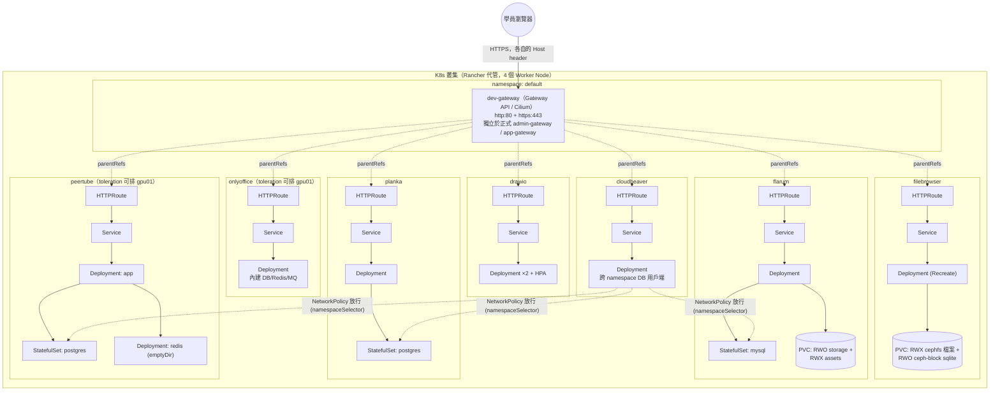

# k8s-training — Kubernetes 企業實戰教育訓練教材

以 7 個真實可用的開源應用（draw.io、filebrowser、flarum、planka、onlyoffice、
peertube、cloudbeaver）為教材，實際部署在一座 Rancher 代管的正式 K8s 叢集上，
每個產品各自示範一組核心 K8s 概念，難度隨產品順序遞增。所有 manifest 都經過
**實際部署到真實叢集並驗證**（Pod Running、Service 有 endpoints、HTTPRoute
Accepted+ResolvedRefs、實際 curl 拿到應用真實內容），不是紙上談兵的範例。

## 目錄

1. [叢集架構](#叢集架構)
2. [每個產品目錄的慣例結構](#每個產品目錄的慣例結構)
3. [產品清單與難度排序](#產品清單與難度排序)
4. [各產品使用的 K8s 元件對照表](#各產品使用的-k8s-元件對照表)
5. [快速開始](#快速開始)
6. [延伸文件](#延伸文件)

---

## 叢集架構

這座叢集是 Rancher 代管的實體叢集（`kubernetes-admin@kubernetes`），**不是**
kind/minikube 之類的本機叢集，也**沒有**傳統 Ingress Controller，對外流量統一
走 **Gateway API**（Cilium 實作，`GatewayClass: cilium`）。

* 如不支援顯示 mermaid 圖，僅顯示程式碼，可用 [Mermaid Live Editor](https://mermaid.live/) 並貼上此程式顯示此架構圖


**關鍵事實**（詳見各產品 `manifest/` 內的教學註解）：

- **一產品一 namespace**：`drawio`、`filebrowser`、`flarum`、`planka`、
  `onlyoffice`、`peertube`、`cloudbeaver`，彼此預設用 NetworkPolicy 隔離。
- **對外一律走共用的 `dev-gateway`**（[dev-gateway.yaml](dev-gateway.yaml)，
  `namespace: default`）：跟叢集本身正式的 `admin-gateway`/`app-gateway`
  分開，避免學員操作誤觸正式服務，course 結束也能靠刪這一個 Gateway 一次收尾。
  TLS 用自簽萬用憑證（`*.nexai.org.com`），瀏覽器會顯示不受信任警告（預期行為，
  可藉機教 TLS 憑證鏈）。
- **沒有 cluster-default StorageClass**，每個 PVC 都要明確指定：
  `rook-ceph-block`（Ceph RBD，**RWO** 單寫，資料庫類使用）與
  `rook-cephfs`（CephFS，**RWX** 多寫共享，檔案類使用）。
- **4 個 Worker Node**：`k8s01`～`k8s03`（記憶體長期 81～91% 使用率）+
  `gpu01`（帶 `nvidia.com/gpu=true:NoSchedule` taint、記憶體較空）。資源最重的
  onlyoffice、peertube（以及 flarum/planka 的資料庫）都加上 `toleration`，
  讓 Scheduler「可以」排到 `gpu01` 但不指定節點（`nodeSelector` 已註解保留，
  排不進去時再取消註解釘到 `gpu01`），是 taint/toleration 教學的實例。

---

## 每個產品目錄的慣例結構

`apps/<product>/` 底下每個產品都提供**三種平行形式 + 一組練習**，內容彼此
同步（`manifest/` 拆分版與 `all-in-one.yaml` 合併版逐 byte 一致），教學情境
不同時可以互換使用：

| 路徑 | 用途 |
|---|---|
| `manifest/` | 拆成多支編號 yaml（`00-namespace.yaml`、`01-...`…），一支一支 apply，逐步講解每個資源的作用——**教學主線** |
| `<product>-all-in-one.yaml` | 內容與 `manifest/` 完全一致的合併版，快速重建環境或 demo 用 |
| `chart/` | 同一組資源的 Helm Chart 版本，`values.yaml` 參數化，教完純 yaml 後接著教「重複部署怎麼簡化」 |
| `exercises/` | 學員練習：`manifest-incomplete/`（填空題）+ `manifest-buggy/`（除錯題）+ 架構圖，正解就是上一層的 `manifest/` |

深度層級統一抓「進階款」：Namespace + ResourceQuota + LimitRange + Deployment
（resources/probes/securityContext）+ Service + HTTPRoute + NetworkPolicy，
按產品需要再疊加 HPA / StatefulSet / initContainer / ConfigMap。所有 yaml
內都用繁體中文寫教學註解，解釋「為什麼」而不只是「做了什麼」。

---

## 產品清單與難度排序

依「課程實際教學順序」排列，前四個涵蓋全教材**所有首次出現的新概念**，適合
老師逐一深講；後三個是既有概念的變化型，適合讓學員照著正解自己重做：

| # | 產品 | 難度 | 定位 | 這一站新出現的概念 |
|---|---|---|---|---|
| 1 | **[draw.io](apps/draw.io/)** | ★☆☆☆☆ 入門 | 起點 | 純前端無狀態應用，不碰儲存、不碰資料庫；建立 Namespace / Deployment / Service / HTTPRoute / HPA / NetworkPolicy 的基本框架 |
| 2 | **[filebrowser](apps/filebrowser/)** | ★★☆☆☆ | 第一個有狀態範例 | PVC + StorageClass（RWX cephfs vs RWO ceph-block 的差異）、ConfigMap；示範「單副本 + Recreate」什麼時候該用、HPA 什麼時候不該用 |
| 3 | **[flarum](apps/flarum/)** | ★★★☆☆ | 踩坑最多、最完整的單一產品教學 | StatefulSet（mysql）、**initContainer**（全教材唯一）、2 個 Secret 互相 `secretKeyRef` 引用、httpGet/tcpSocket/exec 三種 probe 都出現 |
| 4 | **[planka](apps/planka/)** | ★★★☆☆ | 與 flarum 的對照組 | 同樣是「App + 專屬 DB 同 namespace」架構，但換成 PostgreSQL；官方映像本身非 root，**不需要** cap-drop、**不需要** initContainer，跟 flarum 並排看最有效 |
| 5 | **[onlyoffice](apps/onlyoffice/)** | ★★★★☆ | 資源與排程 | 全教材資源需求最重的單體應用（內建 DB/Redis/MQ）；**toleration**（搭配註解保留的 nodeSelector）首次出現，教「共用叢集資源緊繃時怎麼安排重工作負載」 |
| 6 | **[peertube](apps/peertube/)** | ★★★★★ | 全教材最複雜的整合範例 | 3 個元件（PostgreSQL StatefulSet + Redis Deployment/emptyDir + App）在同一 namespace 協作，NetworkPolicy 規則數最多（7 條），PVC vs emptyDir 取捨、reverse-proxy 設定 vs 容器內部 port 的差異 |
| 7 | **[cloudbeaver](apps/cloudbeaver/)** | ★★★★☆ | 收尾概念 | 全教材唯一「跨 namespace 存取」案例：作為 flarum/planka/peertube 三個資料庫的共用用戶端，NetworkPolicy 改用 `namespaceSelector`，跟前面所有 same-namespace `podSelector` 案例形成對照 |

> 難度星等綜合「結構複雜度」（PVC/Secret/Service/NetworkPolicy 數量、
> StatefulSet 是否存在）與「概念新穎度」評定，不是嚴格線性——onlyoffice
> 結構本身不複雜，但排錯/資源規劃的難度不低於 peertube。

---

## 各產品使用的 K8s 元件對照表

依實際 manifest 內容盤點（非憑印象），僅列各產品用了哪些 K8s 項目：

| 產品 | Workload | 儲存 (PVC) | 設定/密鑰 | 網路 | HPA | NetworkPolicy | 進階排程 | 獨有亮點 |
|---|---|---|---|---|---|---|---|---|
| draw.io | Deployment ×2（無狀態） | 無 | 無 | Service + HTTPRoute | ✓ 全教材唯一 | 3 條 | 無 | securityContext 全套（`capabilities.drop: [ALL]`）示範起點 |
| filebrowser | Deployment（`replicas:1` + `Recreate`） | 2 個：RWX cephfs（檔案）+ RWO ceph-block（sqlite） | ConfigMap | Service + HTTPRoute | ✗（刻意不做） | 4 條 | 無 | RWX vs RWO 對照組 |
| flarum | Deployment + **StatefulSet**（mysql） | 2 個：storage RWO + assets RWX | **2 個 Secret 互相引用** | 2 組 Service + HTTPRoute | 無 | 6 條（same-ns podSelector） | 無 | **initContainer**、`enableServiceLinks:false` 實戰踩坑 |
| planka | Deployment + **StatefulSet**（postgres） | 1 個 RWO | 2 個 Secret | 2 組 Service + HTTPRoute | 無 | 6 條（same-ns podSelector-to-podSelector） | 無 | 映像非 root，免 cap-drop / initContainer 對照組 |
| onlyoffice | Deployment（單體、內建 DB/Redis/MQ） | 1 個 RWO（其餘 emptyDir） | Secret | Service + HTTPRoute | 無 | 4 條 | ✓ toleration（可排 GPU 節點；nodeSelector 註解保留） | NetworkPolicy 阻斷出網導致 CPU loop 的除錯案例 |
| peertube | **2 個 Deployment**（redis/app）+ **StatefulSet**（postgres） | 1 個 RWO（redis 刻意用 emptyDir） | 2 個 Secret，ConfigMap（initdb 擴充 SQL） | **3 組 Service** + HTTPRoute | 無 | **7 條**（最多） | ✓ 全部元件 toleration（可排 GPU 節點） | 全課程最複雜整合 |
| cloudbeaver | Deployment | 1 個 RWO | 無（本身是用戶端，不存密碼） | Service + HTTPRoute | 無 | 4 條，**唯一用 `namespaceSelector` 跨 namespace** | 無 | 唯一跨 namespace 存取案例 |

跨產品共通的叢集層級教學點：**StorageClass 沒有 default**（每個 PVC 都要明確
指定）、**Gateway API 取代傳統 Ingress**（全部產品都是 HTTPRoute，沒有
NodePort/Ingress 範例）、**probes 三種機制**（httpGet 全產品都有；
tcpSocket/exec 集中在 flarum/planka/peertube 的資料庫元件）、
**RBAC（ServiceAccount/Role/ClusterRole）這 7 個產品本身都用預設
ServiceAccount，沒有自訂 RBAC**——獨立的教學範例見 [docs/rbac](docs/rbac/)。

---

## 快速開始

```bash
# 1. 套用一次共用的教學 Gateway（所有產品的 HTTPRoute 都掛在這上面）
kubectl apply -f dev-gateway.yaml

# 2. 依難度順序，逐一部署每個產品（以 draw.io 為例，拆分教學版）
kubectl apply -f apps/draw.io/manifest/

# 或用合併版快速重建 / demo
kubectl apply -f apps/draw.io/drawio-all-in-one.yaml

# 或用 Helm Chart（教完 yaml 之後）
helm install drawio apps/draw.io/chart/ -n drawio --create-namespace
```

其餘產品依 [產品清單與難度排序](#產品清單與難度排序) 的順序，重複同樣的三步驟
（`manifest/` → `all-in-one.yaml` → `chart/`）即可；各產品自己的 `README.md`
有該產品特有的前置條件（例如 flarum 的 DB 密碼、peertube 的 root 帳號從
首次啟動 log 取得）。

## 延伸文件

- [docs/helm-chart/README.md](docs/helm-chart/) — Helm 通用概念教學，搭配各
  產品 `chart/` 一起看
- [docs/resources/README.md](docs/resources/) — resources requests/limits
  怎麼抓（理論估算 + k6 實測工具）的通用方法
- [docs/hpa/README.md](docs/hpa/) — 水平自動擴縮的概念，搭配 draw.io 唯一的
  HPA 範例實測一次真實 scale-up/down
- [docs/networkpolicy/README.md](docs/networkpolicy/) — 零信任網路怎麼設計，
  搭配 7 個產品的 NetworkPolicy 對照表 + 真實 allow/deny 連線測試
- [docs/rbac/README.md](docs/rbac/) — ServiceAccount/Role/ClusterRole 怎麼寫，
  獨立的 `rbac-demo` namespace + 真實 exec 進 Pod 驗證權限
- [dr/README.md](dr/) — **備份、復原與災難復原演練**：Velero（外部 SeaweedFS、
  UI 備份/還原、5 個實測重現的「有備份卻救不回來」陷阱）、etcd snapshot 策略與
  還原 runbook、整座叢集重建 runbook、每日備份檢查與自動 Restore Test
- 每個產品自己的 `README.md`／`exercises/README.md` — 該產品的背景介紹、
  已知踩坑、練習題與驗收標準
