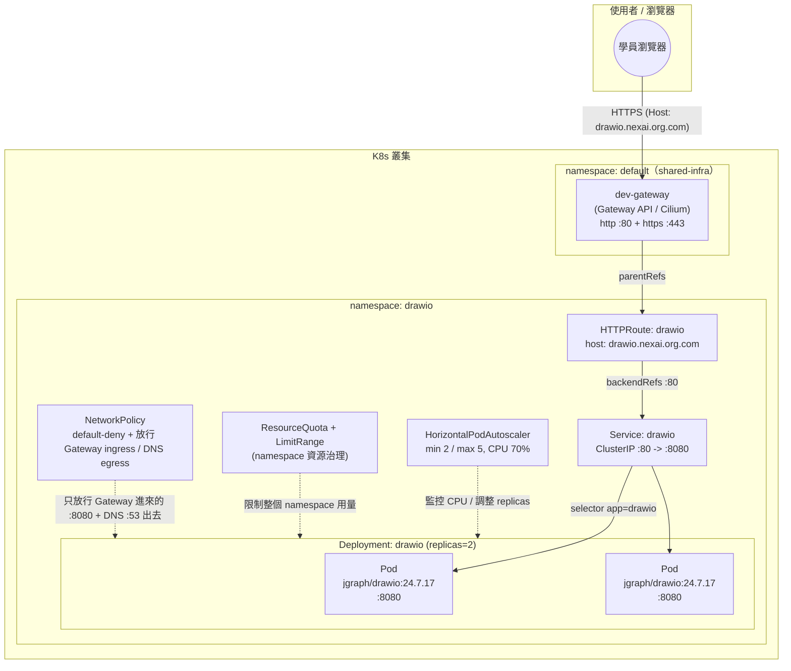

# draw.io（Diagrams.net）— 學員練習

## 產品說明

[draw.io](https://www.drawio.com/)（又稱 diagrams.net）是開源的圖表繪製工具，
可用於繪製架構圖、流程圖、心智圖等，本身是純前端的無狀態 Web 應用（`jgraph/drawio`
映像），不需要資料庫、不需要任何持久化儲存。因為完全無狀態，是整套 K8s 教學課程
的第一個範例，用來介紹 Namespace / ResourceQuota / LimitRange / Deployment /
Service / Gateway API（HTTPRoute）/ HPA / NetworkPolicy 等基礎與進階概念，之後
其他產品（filebrowser、flarum…）才會陸續疊加儲存、資料庫、跨 namespace 等更複雜
的主題。

完整、已驗證可用的正解在上一層的 [../manifest/](../manifest/)（拆分版）與
[../drawio-all-in-one.yaml](../drawio-all-in-one.yaml)（合併版）——**本目錄下的
所有題目都以 `../manifest/` 為標準答案／驗收依據**，寫完或修完後可直接跟正解
`diff` 對照。

## 架構圖

* 用 [drawio](https://www.drawio.com/) 開啟 `architecture.drawio` 檔
* 如不支援顯示 mermaid 圖，僅顯示程式碼，可用 [Mermaid Live Editor](https://mermaid.live/) 並貼上此程式顯示此架構圖


也提供 draw.io 原生格式的同一張圖：[architecture.drawio](architecture.drawio)
（可直接用 draw.io 本人打開、編輯 —— 拿本產品當自己的架構圖工具，剛好呼應教材）。

---

## 資源（CPU / Memory）該給多少？判斷方法

填 `__FILL_ME_3__`～`__FILL_ME_5__` 之前，先建立這個概念：資源設定分成
**Pod/Container 層**（Deployment 裡的 `requests`/`limits`）和 **Namespace 層**
（`ResourceQuota`/`LimitRange`），兩層要互相對得上：

```text
LimitRange.min
  ≤  
Container.requests
  ≤  
Container.limits
  ≤  
LimitRange.max
Σ(replicas × 每個 Pod 的 requests)
  ≤  
ResourceQuota.hard.requests
Σ(replicas × 每個 Pod 的 limits)
  ≤  
ResourceQuota.hard.limits
```

### 1. Container 的 `requests`（本例已固定：cpu 100m / memory 256Mi）

`requests` 代表這個容器「平常穩定執行」大概需要的量，是**排程器**用來決定
把 Pod 排到哪個節點的依據（節點剩餘可分配資源必須 ≥ requests 才會被排進去）。
判斷依據通常是：官方文件建議的最低需求、或先用預估值上線後拿
`kubectl top pod` 觀察一段時間的實際用量再回頭調整，不是憑空亂猜。

### 2. Container 的 `limits`（本例已固定：cpu 500m / memory 512Mi）

`limits` 是允許這個容器「尖峰時最多」能用到的量，通常抓 `requests` 的
**2～5 倍**當緩衝，但 CPU 跟 Memory 要分開想，因為超用後果不同：

- **CPU 是可壓縮資源**：超過 `limits` 只會被「節流（throttle）」變慢，不會被殺，
  所以 CPU 的 limit/request 比例可以抓寬一點（本例 500m / 100m = 5 倍）。
- **Memory 是不可壓縮資源**：超過 `limits` 會直接被 **OOMKilled**，所以 Memory
  的 limit/request 比例要抓保守一點（本例 512Mi / 256Mi = 2 倍）。

### 3. `LimitRange.max` / `min`（`__FILL_ME_4__`、`__FILL_ME_5__` 要填的）

這兩個值是幫**整個 namespace**訂「單一容器」的天花板與地板，不是針對某一個
Deployment，所以要抓得比目前已知的工作負載再留一點空間：

- `max`：namespace 裡任何一個容器最多能要多少，必須 **≥** 目前 Deployment
  實際填的 `limits`（本例 Deployment 的 `limits.cpu: 500m` ≤ `max.cpu`），
  否則 Pod 會被 LimitRange 直接擋掉、連 Pending 都排不進去。
- `min`：namespace 裡任何一個容器最少要 request 多少，必須 **≤** 目前
  Deployment 實際填的 `requests`（本例 `requests.cpu: 100m` ≥ `min.cpu`）。
  抓太高會擋掉合理的輕量容器（本教材在幫 cloudbeaver 加 Adminer 時真的
  踩過這個坑），一般抓「這個 namespace 裡預期最小的合理容器」的量即可。
- `default`/`defaultRequest`（本例已寫好 cpu 250m/500m、memory 256Mi/128Mi）：
  使用者忘記寫 `requests`/`limits` 時的自動預設值，通常設在「最常見工作負載」
  的量附近，跟上面 `max`/`min` 的天花板/地板是兩件事，別搞混。

### 4. `ResourceQuota.hard.requests.cpu`（`__FILL_ME_3__` 要填的）

Namespace 總量配額，計算基準是**這個 namespace 裡所有 Pod 的 `requests`
加總**（不是 `limits`），公式：

```text
Σ(每個 Deployment/StatefulSet 的 replicas × 每個 Pod 的 requests)  ≤  ResourceQuota.hard.requests
```

本例：`replicas: 2`、每個 Pod `requests.cpu: 100m`，目前用量 = 2 × 100m =
200m。配額不能只填剛好 200m——要留擴容餘裕，尤其這個產品還有 HPA
（`maxReplicas: 5`）：若真的擴到 5 個 Pod，requests 總量會變成 5 × 100m =
500m，所以配額至少要 ≥ 500m，再抓一點安全邊界即可（正解用 `"1"` 即
1000m，等於還留了一倍餘裕給未來調整）。`limits.cpu`/`limits.memory` 那兩格
（本例已固定為 `"2"`/`2Gi`）同理，但要注意 `limits` 加總是「上限承諾」，
實務上很少要求每個 Pod 都真的同時吃滿 limit，屬於合理的超額訂閱
（overcommit），不必要求 quota 的 limits 總量能同時滿足所有 Pod 都吃到頂。

**檢查你填的數字時，問自己這三個問題**：
1. 這個配額能同時容納 Deployment 目前的 `replicas` 嗎？（不能只算 1 個 Pod）
2. 如果 HPA 真的擴容到 `maxReplicas`，配額還夠嗎？
3. LimitRange 的 `max`/`min` 有沒有把 Deployment 實際的 `requests`/`limits`
   包在中間，而不是卡在外面？

---

## 題目一：半成品 YAML 填空

檔案在 [manifest-incomplete/](manifest-incomplete/)，內容跟正解 `../manifest/`
完全一樣，只有標記 `__FILL_ME_n__` 的地方被挖空。請照著編號填入正確的值，
7 個檔案填完後依序 `kubectl apply`（或自行合併），目標是重現與 `../manifest/`
完全等價（語意上）的部署。

| 編號 | 檔案 | 題目 | 挖空欄位 | 提示 |
|---|---|---|---|---|
| `__FILL_ME_1__` | 00-namespace.yaml | 幫這個 namespace 取名字 | `metadata.name` | 這個值之後每個檔案的 `namespace:` 都要跟它一致，README 標題已經告訴你這個產品叫什麼 |
| `__FILL_ME_2__` | 00-namespace.yaml | 幫這個 namespace 加上分類標籤 | `labels.training/product` | 跟 `__FILL_ME_1__` 填同一個值即可（本教材慣例：label 值＝namespace 名稱） |
| `__FILL_ME_3__` | 01-resourcequota-limitrange.yaml | 設定整個 namespace 最多能同時 request 多少 CPU 總量 | `ResourceQuota.hard.requests.cpu` | Deployment 會開 2 個 replica，每個 request 100m cpu；這個配額至少要能同時容納這兩個 Pod，且要跟同檔案裡的 `limits.cpu: "2"` 級距相稱（進階提示：太小會讓第二個 Pod 卡在 Pending，可對照 `manifest-buggy/` 的除錯題感受這個症狀） |
| `__FILL_ME_4__` | 01-resourcequota-limitrange.yaml | 設定單一容器最多能要多少 CPU（上限） | `LimitRange.max.cpu` | 必須 ≥ Deployment 裡容器實際填的 `limits.cpu`，否則 Pod 會被 LimitRange 擋掉 |
| `__FILL_ME_5__` | 01-resourcequota-limitrange.yaml | 設定單一容器最少要 request 多少記憶體（下限） | `LimitRange.min.memory` | 必須 ≤ Deployment 裡容器實際填的 `requests.memory`，否則 Pod 會被 LimitRange 擋掉（下限擋掉輕量容器是本教材真的踩過的坑） |
| `__FILL_ME_6__` | 02-deployment.yaml | 這個 Deployment 要開幾個 Pod 副本 | `spec.replicas` | 要跟 HPA 的 `minReplicas` 搭配得上，架構圖上畫了幾個 Pod？ |
| `__FILL_ME_7__` | 02-deployment.yaml | 填入 draw.io 官方容器映像的名稱與版本 | `containers[0].image` | draw.io 的官方 Docker Hub 映像名稱 + 版本 tag，架構圖與本檔案上方教學註解都有寫 |
| `__FILL_ME_8__` | 02-deployment.yaml | 填入容器內部應用程式實際監聽的 port | `containers[0].ports[0].containerPort` | 跟 Service 的 `targetPort: http` 這個 named port 要對得上 |
| `__FILL_ME_9__` | 02-deployment.yaml | 設定 readiness 探測要打哪個 port | `readinessProbe.httpGet.port` | 這裡可以直接引用上面 `ports` 陣列裡取的 name，不用重複寫數字（跟 `livenessProbe` 那組保持一致寫法） |
| `__FILL_ME_10__` | 02-deployment.yaml | 設定要捨棄全部 Linux capability | `securityContext.capabilities.drop` | Linux capability 的「全部捨棄」該怎麼寫？（提示：全大寫的一個字） |
| `__FILL_ME_11__` | 03-service.yaml | 設定這個 Service 要選中哪些 Pod | `spec.selector.app` | 跟 Deployment 的 `template.metadata.labels.app` 必須完全一致，否則 Service 找不到任何 Endpoint（`manifest-buggy/` 的除錯題就是在考這個） |
| `__FILL_ME_12__` | 03-service.yaml | 設定 Service 要把流量轉去 Pod 的哪個 port | `spec.ports[0].targetPort` | 對應到 Pod 上 named port 的名稱，不是數字 |
| `__FILL_ME_13__` | 04-httproute.yaml | 設定這個 HTTPRoute 要掛在哪個 Gateway 底下 | `parentRefs[0].name` | 看 `../../shared-infra/` 底下那份共用資源叫什麼名字 |
| `__FILL_ME_14__` | 04-httproute.yaml | 設定對外存取這個服務要用的網域名稱 | `hostnames[0]` | 沿用叢集網域慣例：`<product>.nexai.org.com`，這個 product 是什麼？ |
| `__FILL_ME_15__` | 04-httproute.yaml | 設定 HTTPRoute 要把流量轉去 Service 的哪個 port | `backendRefs[0].port` | 看 03-service.yaml 裡 Service 對外開的是幾號 port（不是 containerPort） |
| `__FILL_ME_16__` | 05-hpa.yaml | 設定 HPA 要控制哪個 Deployment | `scaleTargetRef.name` | HPA 要控制哪個 Deployment？ |
| `__FILL_ME_17__` | 05-hpa.yaml | 設定 HPA 最多能擴到幾個 Pod | `maxReplicas` | 架構圖標了 HPA 的擴縮範圍，上限是多少？ |
| `__FILL_ME_18__` | 05-hpa.yaml | 設定 CPU 使用率超過多少百分比要觸發擴容 | `metrics[0].resource.target.averageUtilization` | 架構圖上有寫 |
| `__FILL_ME_19__` | 06-networkpolicy.yaml | 設定這條 NetworkPolicy 要保護哪些 Pod | `allow-ingress-from-gateway.spec.podSelector.matchLabels.app` | 和 Service/Deployment 用同一組 label |
| `__FILL_ME_20__` | 06-networkpolicy.yaml | 設定只放行進到容器的哪個 port | `allow-ingress-from-gateway.spec.ingress[0].ports[0].port` | 跟 `__FILL_ME_8__` 應該是同一個號碼 |

**提示總則**：不確定的話，`../manifest/` 目錄下同名檔案就是答案，但建議先自己
推理過一輪，再對答案 —— 光是抄答案學不到「為什麼」。

---

## 題目二：埋錯除錯

檔案在 [manifest-buggy/](manifest-buggy/)，是一份**看起來完整、可以直接
`kubectl apply` 的部署**，但裡面藏了 **4 個真的會讓部署失敗或行為異常的錯誤**，
分散在不同檔案裡（每個檔案最多一個錯，也有檔案完全沒錯）。請先整套 apply 下去，
再用 `kubectl describe` / `kubectl get -o yaml` / `kubectl logs` 等指令找出問題、
修正它們，過程本身就是最寫實的維運訓練。

不直接告訴你錯在哪一行，但提供症狀方向：

1. **其中一個檔案**：Pod 會 `Running` 但 `kubectl get endpoints drawio -n drawio`
   永遠是空的，透過 Gateway 連線會得到 503 / connection refused。跟 label 有關。
2. **其中一個檔案**：Pod 一直卡在 `0/1 Running`（Ready 永遠是 0），
   `kubectl describe pod` 的 Events 會看到 probe 失敗的訊息。跟 port 號碼有關，
   而且不是 containerPort 本身錯，是「引用」它的地方錯了。
3. **其中一個檔案**：HTTPRoute 狀態可能顯示 Accepted，但實際流量會失敗或連不到
   應用。跟 backendRefs 打的 port 號碼有關 —— 這個號碼該對應 Service 的哪個 port？
4. **其中一個檔案**：第二個 Pod（replicas=2 的第二隻）會卡在 `Pending`，
   `kubectl describe pod` 會看到跟 quota exceeded 相關的 Events。跟 namespace
   的資源配額有關。

找到並修正全部 4 個之後，用下面「驗收標準」章節確認整套環境真的健康。

**提示**：懷疑某個資源設定錯了的時候，可以直接跟 `../manifest/` 同名檔案
`diff`，但建議先靠 `kubectl describe` / `kubectl get events -n drawio --sort-by=.lastTimestamp`
這些第一手觀察線索自己推理，養成真正除錯的直覺，而不是直接比對兩份檔案找不同。

---

## 驗收標準

不論是完成「題目一：填空」還是「題目二：除錯」，都用下面同一套標準驗收，
目標是跟 `../manifest/`（正解）部署起來的最終狀態等價：

- [ ] `kubectl get pods -n drawio` 顯示 2 個 Pod，皆為 `Running` 且 `READY 1/1`
      （沒有 `CrashLoopBackOff`、沒有 `0/1`、沒有 `Pending`）
- [ ] `kubectl get endpoints drawio -n drawio` 顯示 **2 個** Pod IP:8080
      （不是空的 `<none>`）
- [ ] `kubectl describe httproute drawio -n drawio` 的 `Status.Conditions` 顯示
      `Accepted: True` 且 `ResolvedRefs: True`
- [ ] `curl -H "Host: drawio.nexai.org.com" http://<dev-gateway EXTERNAL-IP>/`
      回傳 HTTP 200，且內容是真的 draw.io 頁面（不是連線失敗、不是 503）
- [ ] 同上，改用 `https://` + `-k`（自簽憑證）也回傳 200
- [ ] `kubectl get hpa drawio -n drawio` 的 `TARGETS` 欄位顯示實際百分比
      （例如 `12%/70%`），不是 `<unknown>/70%`
- [ ] （若有套用 06-networkpolicy.yaml）套用後重新測試上面兩條 curl，
      確認 NetworkPolicy 沒有把 Gateway 進來的流量擋掉
- [ ] 填完/修完的檔案在語意上與 `../manifest/` 一致
      （可用 `diff -u manifest-incomplete/ ../manifest/` 或
      `diff -u manifest-buggy/ ../manifest/` 做最終比對，兩邊應該只剩下
      教學註解、練習提示這類非語意差異）

全部打勾即完成本產品的練習。
