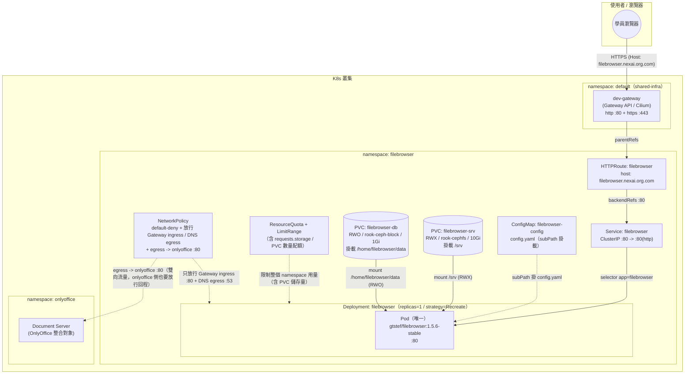

# filebrowser（FileBrowser Quantum）— 學員練習

## 產品說明

[filebrowser](../README.md)（實際跑的映像是社群 fork **FileBrowser
Quantum**，`gtstef/filebrowser:1.5.6-stable`）是一個網頁版檔案管理器，
提供瀏覽、上傳、下載、預覽，並整合 [onlyoffice](../../onlyoffice/) 做線上
編輯 Word / Excel / PPT。跟前一個範例 draw.io（純無狀態）不同，filebrowser
是整套 K8s 教學課程**第一個「有狀態」的產品**，用來介紹
`PersistentVolumeClaim`、`StorageClass`，特別是 **RWO vs RWX 該怎麼選**——
不是看應用程式種類，而是看「這份資料允不允許被多個 Pod 同時寫入」：

- `filebrowser-srv`（使用者實際上傳/瀏覽的檔案本體）：`ReadWriteMany` +
  `rook-cephfs`，示範多個 Pod 可以同時掛同一份檔案。
- `filebrowser-db`（FileBrowser 自己的 sqlite 資料庫 + 快取）：
  `ReadWriteOnce` + `rook-ceph-block`，因為 sqlite 不支援多個行程同時
  寫入。

也因為 sqlite 是單寫入者，這個產品刻意把 `replicas` 固定為 `1`、
`strategy.type` 用 `Recreate`（不是 draw.io 那種 `RollingUpdate`），而且
**沒有 HPA**——跟 draw.io「唯一有 HPA 的產品」正好形成對照：不是所有
應用都能無腦水平擴展，本產品是最直接的反例。另外 filebrowser 改用一份
宣告式的 `ConfigMap`（`config.yaml`）決定行為，而不是像舊版那樣只靠
環境變數，也是本產品的教學重點之一。

完整、已驗證可用的正解在上一層的 [../manifest/](../manifest/)（拆分版）與
[../filebrowser-all-in-one.yaml](../filebrowser-all-in-one.yaml)（合併版）
——**本目錄下的所有題目都以 `../manifest/` 為標準答案／驗收依據**，寫完
或修完後可直接跟正解 `diff` 對照。

## 架構圖

* 用 [drawio](https://www.drawio.com/) 開啟 `architecture.drawio` 檔
* 如不支援顯示 mermaid 圖，僅顯示程式碼，可用 [Mermaid Live Editor](https://mermaid.live/) 並貼上此程式顯示此架構圖


也提供 draw.io 原生格式的同一張圖：[architecture.drawio](architecture.drawio)
（可直接用 draw.io 打開、編輯——這座圖本身跟上一個產品 draw.io 用同一套
工具畫，剛好可以前後呼應）。

---

## 資源（CPU / Memory / Storage）該給多少？判斷方法

填 `__FILL_ME_3__`、`__FILL_ME_4__` 之前，先建立這個概念：filebrowser 的
資源設定除了 draw.io 那套 **Pod/Container 層**（`requests`/`limits`）對
**Namespace 層**（`ResourceQuota`/`LimitRange`）的關係之外，因為這是第一個
「有狀態」產品，還多了一層 **PVC 儲存量配額**：

```text
LimitRange.min
  ≤
Container.requests
  ≤
Container.limits
  ≤
LimitRange.max
Σ(replicas × 每個 Pod 的 requests)
  ≤
ResourceQuota.hard.requests
Σ(所有 PVC 實際申請的 storage)
  ≤
ResourceQuota.hard.requests.storage
```

### 1. Container 的 `requests` / `limits`（本例已固定）

`04-deployment.yaml` 的容器已經固定 `requests: cpu 50m / memory 64Mi`、
`limits: cpu 200m / memory 256Mi`。跟 draw.io 的邏輯一樣：`requests` 是
排程器判斷「這個 Pod 平常穩定執行大概要多少資源」的依據，`limits` 是
尖峰時的上限，超過 CPU limits 只會被節流（可壓縮資源，比例可以抓寬，本例
200m/50m = 4 倍），超過 Memory limits 會直接 OOMKilled（不可壓縮資源，
比例要抓保守，本例 256Mi/64Mi = 4 倍，已經是相對保守的抓法，因為
filebrowser 只是靜態檔案伺服器 + 小型 sqlite，本身耗用不大）。

### 2. `LimitRange.max.memory`（`__FILL_ME_4__` 要填的）

`max` 是幫整個 namespace 訂「單一容器」記憶體的天花板，必須 **≥** 目前
Deployment 容器實際填的 `limits.memory`（本例 `256Mi`），否則 Pod 會被
LimitRange 直接擋掉。`max.cpu`（已固定 `500m`）跟 Deployment 的
`limits.cpu: 200m` 的比例是 2.5 倍，記憶體也抓類似的緩衝倍率即可：
`256Mi × 2 = 512Mi`，這正是本例正解的填法——比 `limits.memory` 留一點
餘裕，但不用留到跟 CPU 那樣誇張的倍率（因為 filebrowser 的記憶體用量本來
就很平穩，不太可能忽然暴衝）。`min.memory`（已固定 `32Mi`）同理要
**≤** `requests.memory: 64Mi`，這裡已經幫你填好，可以拿來對照理解填法。

### 3. `ResourceQuota.hard.requests.storage`（`__FILL_ME_3__` 要填的）—— 本產品獨有的新概念

這是 draw.io 完全沒有的欄位，因為 draw.io 沒有 PVC。這個配額限制的是
**整個 namespace 裡所有 PVC 實際 `requests.storage` 加總**，公式：

```text
Σ(每個 PVC 的 spec.resources.requests.storage)  ≤  ResourceQuota.hard.requests.storage
```

本例：`02-pvc.yaml` 有兩顆 PVC——`filebrowser-srv` 要 `10Gi`、
`filebrowser-db` 要 `1Gi`，目前用量 = 10Gi + 1Gi = **11Gi**。配額不能只填
剛好 11Gi——要留一點餘裕：

1. `../README.md` 的「待關注」已經記錄 `filebrowser-db` 目前 1Gi 偏小，
   啟動時會有快取空間警告，實務上很可能之後要調大這顆 PVC；
2. `01-resourcequota-limitrange.yaml` 的 `persistentvolumeclaims: "4"`
   （已固定）代表這個 namespace 最多可以開到 4 顆 PVC，目前只用了
   2 顆，配額也該讓「未來可能再開 1~2 顆 PVC」這件事有空間發生。

正解用 `20Gi`，大約是目前實際用量（11Gi）的 1.8 倍，同時也對得上
`persistentvolumeclaims: "4"` 這個數量配額——如果只填剛好 11Gi，未來想
幫 `filebrowser-db` 擴容或多加一顆 PVC 時，會直接被 quota 擋掉
（`exceeded quota` 事件），這也是題目二除錯練習裡其中一個症狀的變化型，
可以對照感受。

**檢查你填的數字時，問自己這三個問題**：
1. 這個配額能同時容納 `02-pvc.yaml` 裡兩顆 PVC 實際申請的 `storage` 嗎？
2. 有沒有留一點餘裕給「未來擴容/多開一顆 PVC」（本產品沒有 HPA，但儲存
   需求還是可能隨檔案增加而成長）？
3. `LimitRange` 的 `max`/`min` 有沒有把 Deployment 實際的
   `requests`/`limits` 包在中間，而不是卡在外面？

---

## 題目一：半成品 YAML 填空

檔案在 [manifest-incomplete/](manifest-incomplete/)，內容跟正解
`../manifest/` 完全一樣，只有標記 `__FILL_ME_n__` 的地方被挖空。請照著
編號填入正確的值，8 個檔案填完後依序 `kubectl apply`（或自行合併），
目標是重現與 `../manifest/` 完全等價（語意上）的部署。

| 編號 | 檔案 | 題目 | 挖空欄位 | 提示 |
|---|---|---|---|---|
| `__FILL_ME_1__` | 00-namespace.yaml | 幫這個 namespace 取名字 | `metadata.name` | 這個值之後每個檔案的 `namespace:` 都要跟它一致，README 標題已經告訴你這個產品叫什麼 |
| `__FILL_ME_2__` | 00-namespace.yaml | 幫這個 namespace 加上分類標籤 | `labels.training/product` | 跟 `__FILL_ME_1__` 填同一個值即可（本教材慣例：label 值＝namespace 名稱） |
| `__FILL_ME_3__` | 01-resourcequota-limitrange.yaml | 設定整個 namespace 最多能同時申請多少 PVC 總儲存空間 | `ResourceQuota.hard.requests.storage` | 看 `02-pvc.yaml` 兩顆 PVC 各申請多少 `storage`，加總後再留一點擴容餘裕（詳見上面「資源該給多少」章節） |
| `__FILL_ME_4__` | 01-resourcequota-limitrange.yaml | 設定單一容器最多能要多少記憶體（上限） | `LimitRange.max.memory` | 必須 ≥ Deployment 容器實際填的 `limits.memory`，否則 Pod 會被 LimitRange 擋掉 |
| `__FILL_ME_5__` | 02-pvc.yaml | `filebrowser-srv` 這顆 PVC 要能被多個 Pod 同時掛載讀寫，該選哪一種存取模式 | `filebrowser-srv.spec.accessModes[0]` | 這顆 PVC 放的是使用者實際檔案，將來要支援多 Pod 同時讀寫；本產品說明段已經寫了答案是哪一種模式 |
| `__FILL_ME_6__` | 02-pvc.yaml | `filebrowser-srv` 該接哪一個 StorageClass | `filebrowser-srv.spec.storageClassName` | 要支援上一題選的存取模式，叢集裡哪個 StorageClass 是 CephFS（檔案系統型、支援多寫）？ |
| `__FILL_ME_7__` | 02-pvc.yaml | `filebrowser-db` 放的是 sqlite 資料庫，只能有一個行程寫入，該選哪一種存取模式 | `filebrowser-db.spec.accessModes[0]` | 跟上面 `filebrowser-srv` 的選擇正好相反，為什麼？ |
| `__FILL_ME_8__` | 02-pvc.yaml | `filebrowser-db` 該接哪一個 StorageClass | `filebrowser-db.spec.storageClassName` | 要支援上一題選的存取模式，叢集裡哪個 StorageClass 是 Ceph RBD（區塊儲存、單寫）？ |
| `__FILL_ME_9__` | 03-configmap.yaml | 關掉啟動時對外檢查新版本的功能 | `data."config.yaml".server.disableUpdateCheck` | 檔案上方的教學註解完整解釋了這個踩過的坑（開機卡 31 秒），該填 `true` 還是 `false`？ |
| `__FILL_ME_10__` | 03-configmap.yaml | 設定 filebrowser 後端要用叢集內部哪個網址呼叫自己（給 OnlyOffice Document Server 回頭抓檔案用） | `data."config.yaml".server.internalUrl` | 格式是 `http://<Service 名稱>.<namespace>.svc.cluster.local`，對照 `05-service.yaml` 跟 `00-namespace.yaml` 填的值 |
| `__FILL_ME_11__` | 03-configmap.yaml | 設定檔案來源要對應到容器裡的哪個掛載路徑 | `data."config.yaml".server.sources[0].path` | 看 `04-deployment.yaml` 的 `volumeMounts`，`filebrowser-srv` 這顆 PVC 掛在容器內的哪個路徑？ |
| `__FILL_ME_12__` | 04-deployment.yaml | 這個 Deployment 要開幾個 Pod 副本 | `spec.replicas` | sqlite 資料庫不支援多個行程同時寫入，這個產品說明段已經講了答案 |
| `__FILL_ME_13__` | 04-deployment.yaml | 設定滾動更新策略要用哪一種 | `spec.strategy.type` | 跟 draw.io 用的 `RollingUpdate` **不一樣**——因為 RWO 的 `filebrowser-db` 同時間只能被一個節點掛載，若新舊 Pod 同時存在會搶不到volume，該用哪個策略先把舊 Pod 整個砍掉，再建立新的？ |
| `__FILL_ME_14__` | 04-deployment.yaml | 填入 FileBrowser Quantum 官方穩定線容器映像的名稱與版本 | `containers[0].image` | `../README.md` 開頭已經寫了目前用的正式版映像 tag |
| `__FILL_ME_15__` | 04-deployment.yaml | 填入容器內部應用程式實際監聽的 port | `containers[0].ports[0].containerPort` | 跟 Service 的 `targetPort` 這個 named port、還有 ConfigMap 裡 `server.port` 要對得上 |
| `__FILL_ME_16__` | 04-deployment.yaml | 設定 readiness 探測要打哪個 port | `readinessProbe.httpGet.port` | 可以直接引用上面 `ports` 陣列裡取的 name，不用重複寫數字（跟 `livenessProbe` 那組保持一致寫法） |
| `__FILL_ME_17__` | 04-deployment.yaml | 設定要捨棄全部 Linux capability | `securityContext.capabilities.drop` | Linux capability 的「全部捨棄」該怎麼寫？（提示：全大寫的一個字） |
| `__FILL_ME_18__` | 05-service.yaml | 設定這個 Service 要選中哪些 Pod | `spec.selector.app` | 跟 Deployment 的 `template.metadata.labels.app` 必須完全一致，否則 Service 找不到任何 Endpoint（`manifest-buggy/` 的除錯題就是在考類似的坑） |
| `__FILL_ME_19__` | 05-service.yaml | 設定 Service 要把流量轉去 Pod 的哪個 port | `spec.ports[0].targetPort` | 對應到 Pod 上 named port 的名稱，不是數字 |
| `__FILL_ME_20__` | 06-httproute.yaml | 設定這個 HTTPRoute 要掛在哪個 Gateway 底下 | `parentRefs[0].name` | 看 `../../shared-infra/` 底下那份共用資源叫什麼名字 |
| `__FILL_ME_21__` | 06-httproute.yaml | 設定對外存取這個服務要用的網域名稱 | `hostnames[0]` | 沿用叢集網域慣例：`<product>.nexai.org.com`，這個 product 是什麼？ |
| `__FILL_ME_22__` | 06-httproute.yaml | 設定 HTTPRoute 要把流量轉去 Service 的哪個 port | `backendRefs[0].port` | 看 `05-service.yaml` 裡 Service 對外開的是幾號 port（不是 containerPort） |
| `__FILL_ME_23__` | 07-networkpolicy.yaml | 設定 `allow-ingress-from-gateway` 這條規則要保護哪些 Pod | `spec.podSelector.matchLabels.app` | 和 Service/Deployment 用同一組 label |
| `__FILL_ME_24__` | 07-networkpolicy.yaml | 設定只放行進到容器的哪個 port | `spec.ingress[0].ports[0].port` | 跟 `__FILL_ME_15__` 應該是同一個號碼 |
| `__FILL_ME_25__` | 07-networkpolicy.yaml | 設定 `allow-egress-filebrowser-to-onlyoffice` 這條 egress 規則要放行到哪個 namespace | `spec.egress[0].to[0].namespaceSelector.matchLabels."kubernetes.io/metadata.name"` | filebrowser 要主動呼叫哪個產品的 Document Server 才能做 OnlyOffice 整合？ |

**提示總則**：不確定的話，`../manifest/` 目錄下同名檔案就是答案，但建議先自己
推理過一輪，再對答案 —— 光是抄答案學不到「為什麼」。

---

## 題目二：埋錯除錯

檔案在 [manifest-buggy/](manifest-buggy/)，是一份**看起來完整、可以直接
`kubectl apply` 的部署**，但裡面藏了 **4 個真的會讓部署失敗或行為異常的
錯誤**，分散在不同檔案裡（每個檔案最多一個錯，也有檔案完全沒錯）。請先
整套 apply 下去，再用 `kubectl describe` / `kubectl get -o yaml` /
`kubectl logs` 等指令找出問題、修正它們，過程本身就是最寫實的維運訓練。

不直接告訴你錯在哪一行，但提供症狀方向：

1. **其中一個檔案**：`kubectl get pvc -n filebrowser` 裡其中一顆 PVC
   會一直卡在 `Pending`，`kubectl describe pvc` 的 Events 會看到跟
   provisioning / access mode 相關的錯誤訊息。跟這個產品的核心概念
   ——**RWX vs RWO 該用哪個 StorageClass**——直接有關，是本產品獨有的
   坑，draw.io 那套除錯題完全不會遇到。
2. **其中一個檔案**：Pod 會 `Running` 但 `kubectl get endpoints
   filebrowser -n filebrowser` 永遠是空的，透過 Gateway 連線會得到
   503 / connection refused。跟 label 有關。
3. **其中一個檔案**：Pod 可能卡在 `ContainerCreating`，或起來後容器立刻
   報錯找不到設定檔／找不到某個 key，`kubectl describe pod` 的 Events
   或 `kubectl logs` 會看到跟掛載某個檔案 key 相關的訊息。跟 ConfigMap
   的資料 key 名稱，以及 Deployment 掛載它時引用的檔名，兩邊要不要
   完全一致有關。
4. **其中一個檔案**：這個錯誤在第一次 `kubectl apply` 時看起來完全正常，
   Pod 照樣 `Running 1/1`——**但下一次更新這個 Deployment（例如改
   image tag 或任何欄位）時，新 Pod 可能會卡住**，因為 `filebrowser-db`
   是 RWO（一次只能被一個節點掛載）。跟這個 Deployment 選用的滾動更新
   策略有關，該用哪一種策略才能保證舊 Pod 先完全終止、釋放掉 RWO
   volume，新 Pod 才建立？

找到並修正全部 4 個之後，用下面「驗收標準」章節確認整套環境真的健康。

**提示**：懷疑某個資源設定錯了的時候，可以直接跟 `../manifest/` 同名檔案
`diff`，但建議先靠 `kubectl describe` / `kubectl get events -n
filebrowser --sort-by=.lastTimestamp` 這些第一手觀察線索自己推理，養成
真正除錯的直覺，而不是直接比對兩份檔案找不同。

---

## 驗收標準

不論是完成「題目一：填空」還是「題目二：除錯」，都用下面同一套標準驗收，
目標是跟 `../manifest/`（正解）部署起來的最終狀態等價：

- [ ] `kubectl get pvc -n filebrowser` 顯示 **兩顆 PVC**
      （`filebrowser-srv`、`filebrowser-db`）皆為 `Bound`
- [ ] `kubectl exec -n filebrowser deploy/filebrowser -- df -h /srv
      /home/filebrowser/data` 兩個掛載點都存在、容量跟 `02-pvc.yaml`
      申請的 `storage` 相符（用來確認 RWX/RWO 兩顆 PVC 真的各自掛到
      正確的路徑，不是掛反或掛錯）
- [ ] `kubectl get pods -n filebrowser` 顯示 **1 個** Pod，為 `Running`
      且 `READY 1/1`（沒有 `CrashLoopBackOff`、沒有 `0/1`、沒有
      `Pending`；注意本產品 `replicas` 本來就固定是 1，不是 2）
- [ ] `kubectl get endpoints filebrowser -n filebrowser` 顯示
      **1 個** Pod IP:80（不是空的 `<none>`）
- [ ] `kubectl describe httproute filebrowser -n filebrowser` 的
      `Status.Conditions` 顯示 `Accepted: True` 且 `ResolvedRefs: True`
- [ ] `curl -H "Host: filebrowser.nexai.org.com"
      http://<dev-gateway EXTERNAL-IP>/` 回傳 HTTP 200，且內容是真的
      FileBrowser 登入頁面（不是連線失敗、不是 503）
- [ ] 同上，改用 `https://` + `-k`（自簽憑證）也回傳 200
- [ ] `kubectl logs -n filebrowser deploy/filebrowser` 沒有出現找不到
      `config.yaml` 或找不到某個掛載 key 的 FATAL 訊息，且啟動時間在
      幾秒內完成（沒有卡住 31 秒不動——那是 `disableUpdateCheck` 沒關的
      症狀）
- [ ] **本產品沒有 HPA**（刻意不做：單副本 + sqlite 不適合水平擴展，跟
      draw.io 的 HPA 範例形成對照）——不需要、也不應該執行
      `kubectl get hpa -n filebrowser`，`../manifest/` 底下本來就沒有
      `05-hpa.yaml` 這種檔案
- [ ] （若有套用 07-networkpolicy.yaml）套用後重新測試上面兩條 curl，
      確認 NetworkPolicy 沒有把 Gateway 進來的流量擋掉；有部署
      [onlyoffice](../../onlyoffice/) 的話，額外確認
      `kubectl exec -n filebrowser deploy/filebrowser -- wget -qO-
      http://onlyoffice.onlyoffice.svc.cluster.local/healthcheck`
      能連通（filebrowser → onlyoffice 這個 egress 方向）
- [ ] 填完/修完的檔案在語意上與 `../manifest/` 一致
      （可用 `diff -u manifest-incomplete/ ../manifest/` 或
      `diff -u manifest-buggy/ ../manifest/` 做最終比對，兩邊應該只剩下
      教學註解、練習提示這類非語意差異）

全部打勾即完成本產品的練習。
