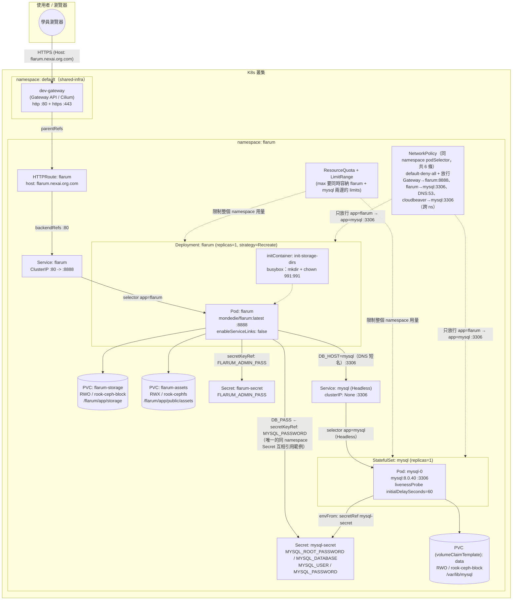

# Flarum — 學員練習

## 產品說明

[Flarum](https://flarum.org/) 是極簡、輕量且現代化的開源討論區/論壇軟體。在整套
K8s 教學課程裡，flarum 是**第四個範例**，也是目前踩坑最多、最值得講給學員聽的
一個——它把自己專用的 mysql 資料庫**併在同一個 namespace**裡一起管理（盤點下來
mysql 從頭到尾只有 flarum 一個消費者，不需要獨立成共用產品），因此是全課程第一次
同時出現：

- **StatefulSet**（mysql）跟 Deployment（flarum）在同一個 namespace 裡並存。
- **initContainer**（本課程唯一）：兩顆一開始是空的 PVC，需要先建好 Flarum
  期待的子目錄結構、調整好權限，主容器才能正常寫入。
- **同 namespace 兩個 Secret 互相引用**（本課程唯一）：`flarum-secret` 跟
  `mysql-secret` 是兩個獨立的 Secret 物件，但 flarum 的 Deployment 直接用
  `secretKeyRef` 讀 `mysql-secret` 的 `MYSQL_PASSWORD` 當作自己的 `DB_PASS`，
  不需要手動複製一份密碼——這是 Secret 是 namespace-scoped 資源、跨 namespace
  不能互相引用時做不到的事。

完整、已驗證可用的正解在上一層的 [../manifest/](../manifest/)（拆分版，11 支
編號檔案）與 [../flarum-all-in-one.yaml](../flarum-all-in-one.yaml)（合併版）——
**本目錄下的所有題目都以 `../manifest/` 為標準答案／驗收依據**，寫完或修完後可
直接跟正解 `diff` 對照。

## 架構圖

* 用 [drawio](https://www.drawio.com/) 開啟 `architecture.drawio` 檔
* 如不支援顯示 mermaid 圖，僅顯示程式碼，可用 [Mermaid Live Editor](https://mermaid.live/) 並貼上此程式顯示此架構圖


也提供 draw.io 原生格式的同一張圖：[architecture.drawio](architecture.drawio)
（可直接用 draw.io 本人打開、編輯）。這張圖比 draw.io 產品自己的架構圖複雜不少——
兩個 Service、兩個 Secret、兩顆獨立 PVC 加一顆 volumeClaimTemplate PVC、一個
initContainer、以及 StatefulSet + Deployment 並存，剛好反映 flarum 在整套課程裡
「第一次把多種元件整合在同一個 namespace」的角色。

---

## 資源（CPU / Memory）該給多少？判斷方法

填 `__FILL_ME_3__`～`__FILL_ME_5__` 之前，先建立這個概念：這個 namespace 裡
**同時存在兩種工作負載**——flarum Deployment 跟 mysql StatefulSet——resource
的加總跟 max/min 的天花板/地板，都要同時照顧到這兩邊，不能只想著其中一個：

```text
LimitRange.min
  ≤  
每個容器的 requests
  ≤  
每個容器的 limits
  ≤  
LimitRange.max
Σ(每個 Pod 的 requests)  （flarum 1 個 Pod + mysql 1 個 Pod）
  ≤  
ResourceQuota.hard.requests
Σ(每個 Pod 的 limits)   （flarum 1 個 Pod + mysql 1 個 Pod）
  ≤  
ResourceQuota.hard.limits
```

### 1. 兩邊容器各自的 `requests`/`limits`（本例已固定，不用填）

| 工作負載 | requests.cpu | requests.memory | limits.cpu | limits.memory |
|---|---|---|---|---|
| flarum（Deployment，1 個 Pod） | 100m | 256Mi | 500m | 1Gi |
| mysql（StatefulSet，1 個 Pod） | 250m | 512Mi | 1（=1000m） | 1Gi |

跟 draw.io 那組單一 Deployment 的邏輯一樣：`requests` 是排程器決定「這個 Pod
能不能塞進某個節點」的依據，`limits` 是尖峰時允許用到的上限，CPU 可壓縮（超過
只會被節流）所以比例可以抓寬一點，Memory 不可壓縮（超過會被 OOMKilled）所以
比例要抓保守一點——mysql 的 `limits.cpu` 抓到 `requests.cpu` 的 4 倍（1000m /
250m），是因為資料庫在做查詢/建索引時的尖峰負載通常比一般 Web 應用大，這是
mysql 官方 image 文件建議的量。

### 2. `LimitRange.max` — flarum 教材最關鍵的一個坑（`__FILL_ME_4__`、`__FILL_ME_5__`）

`LimitRange.max` 是幫**整個 namespace**訂「單一容器」的天花板，必須 **≥**
namespace 裡**所有**容器實際填的 `limits`——這裡的陷阱是：**這個 namespace
裡有兩種完全不同的工作負載，max 要能同時蓋住兩邊，取兩邊之中比較高的那個**：

- `max.cpu`：flarum 的 `limits.cpu` 是 500m，mysql 的 `limits.cpu` 是 1（也就是
  1000m）——**mysql 比較高**，所以 `max.cpu` 至少要 `"1"`，如果照抄 draw.io
  當初只算 flarum 自己會得到的數字（估計約 500m 上下），mysql 的 Pod 會直接被
  API server 擋掉、連 `Pending` 都排不進去（`kubectl describe statefulset` 會看到
  `exceeds its limit` 或 `pods "mysql-0" is forbidden` 這類訊息）。
- `max.memory`：這次剛好兩邊都是 1Gi 打平，但 `max.memory` 沒有壓線設成 1Gi，
  而是抓了一倍緩衝設成 `2Gi`——因為記憶體是不可壓縮資源，一旦之後要調整任何一邊
  的 `limits.memory`（例如 mysql 資料量變大想調高），還有空間可以動，不用連
  LimitRange 一起改。

**這是本教材特別想凸顯的教學點**：mysql 一併進這個 namespace，原本只為 flarum
單獨設計的 `LimitRange.max` 就不夠用了——**`max` 永遠要用「這個 namespace 裡
所有工作負載」的角度去抓，而不是只看你正在改的那一個 Deployment**。

### 3. `ResourceQuota.hard.requests.cpu`（`__FILL_ME_3__` 要填的）

Namespace 總量配額，計算基準是**這個 namespace 裡所有 Pod 的 `requests`
加總**（不是 `limits`），這裡沒有 HPA、两邊 replicas 也都固定是 1，所以目前
用量是固定的：

```text
flarum requests.cpu(100m) + mysql requests.cpu(250m) = 350m
```

配額不能只填剛好 350m——除了两邊本來的用量，upgrade（`strategy: Recreate` 短暫
仍會有舊 Pod terminating、新 Pod pending 的瞬間重疊）、`kubectl debug` 之類的
臨時除錯 Pod 都需要一點餘裕，正解用 `"750m"`，比 350m 多了一倍以上的緩衝。
`requests.memory`/`limits.cpu`/`limits.memory`（本例已固定為 `1Gi`/`"2"`/`3Gi`）
同理，但要注意 `limits` 加總是「上限承諾」，實務上很少要求每個 Pod 都真的同時
吃滿 limit，屬於合理的超額訂閱（overcommit）。

**檢查你填的數字時，問自己這三個問題**：
1. 這個配額有沒有同時算進 flarum **跟** mysql 兩邊的用量？（不能只算其中一個）
2. `LimitRange.max` 有沒有蓋過 namespace 裡**目前已知最高**的那個 `limits`
   （通常是 mysql，不是 flarum）？
3. `persistentvolumeclaims: "4"` / `requests.storage: 20Gi` 這兩格（本例已固定）
   夠不夠裝下 flarum 的 2 顆 PVC + mysql 的 1 顆 `volumeClaimTemplate` PVC？

---

## 題目一：半成品 YAML 填空

檔案在 [manifest-incomplete/](manifest-incomplete/)，內容跟正解 `../manifest/`
完全一樣，只有標記 `__FILL_ME_n__` 的地方被挖空。請照著編號填入正確的值，
11 個檔案填完後依序 `kubectl apply`（或自行合併），目標是重現與 `../manifest/`
完全等價（語意上）的部署。

| 編號 | 檔案 | 題目 | 挖空欄位 | 提示 |
|---|---|---|---|---|
| `__FILL_ME_1__` | 00-namespace.yaml | 幫這個 namespace 取名字 | `metadata.name` | 這個值之後每個檔案的 `namespace:` 都要跟它一致，README 標題已經告訴你這個產品叫什麼 |
| `__FILL_ME_2__` | 00-namespace.yaml | 幫這個 namespace 加上分類標籤 | `labels.training/product` | 跟 `__FILL_ME_1__` 填同一個值即可（本教材慣例：label 值＝namespace 名稱） |
| `__FILL_ME_3__` | 01-resourcequota-limitrange.yaml | 設定整個 namespace 最多能同時 request 多少 CPU 總量 | `ResourceQuota.hard.requests.cpu` | flarum 與 mysql 兩個容器的 `requests.cpu` 加總是多少？這個配額至少要能同時容納兩者，並留一點餘裕（上方「資源該給多少」章節有完整算法） |
| `__FILL_ME_4__` | 01-resourcequota-limitrange.yaml | 設定單一容器最多能要多少 CPU（上限） | `LimitRange.max.cpu` | 這個 namespace 裡兩個工作負載（flarum Deployment、mysql StatefulSet）各自的 `limits.cpu` 哪個比較高？`max` 至少要蓋過那一個，否則那個 Pod 會建立不起來 |
| `__FILL_ME_5__` | 01-resourcequota-limitrange.yaml | 設定單一容器最多能要多少記憶體（上限） | `LimitRange.max.memory` | 同上，但這次兩個工作負載的 `limits.memory` 剛好一樣高，`max` 要留多少緩衝？ |
| `__FILL_ME_6__` | 02-mysql-secret.yaml | 幫這個 Secret 取名字 | `metadata.name` | 07 號檔案的 flarum Deployment 會用 `secretKeyRef` 指定這個名字去讀 `MYSQL_PASSWORD`，兩邊要對得上 |
| `__FILL_ME_7__` | 03-mysql-service.yaml | 設定這個 Service 要變成 Headless（無 ClusterIP） | `spec.clusterIP` | StatefulSet 要搭配哪種特殊值的 Service，才能讓每個 Pod 拿到穩定的 DNS 名稱？ |
| `__FILL_ME_8__` | 04-mysql-statefulset.yaml | 設定這個 StatefulSet 要用哪個 Headless Service 提供網路身分 | `spec.serviceName` | 要跟 03-mysql-service.yaml 建立的 Service 名稱一致 |
| `__FILL_ME_9__` | 04-mysql-statefulset.yaml | 設定容器要從哪個 Secret 讀取一整組環境變數 | `envFrom[0].secretRef.name` | 跟 02-mysql-secret.yaml 建立的 Secret 名稱一致（也就是 `__FILL_ME_6__` 的答案） |
| `__FILL_ME_10__` | 04-mysql-statefulset.yaml | 設定 livenessProbe 要等多久才開始檢查 | `livenessProbe.initialDelaySeconds` | 上面教學註解已經寫了實測數字：mysql 第一次 initdb 在這座叢集要跑多久？抓太短會怎樣？ |
| `__FILL_ME_11__` | 04-mysql-statefulset.yaml | 設定 PVC 要用哪個 StorageClass | `volumeClaimTemplates[0].spec.storageClassName` | mysql 資料庫是單一 Pod 寫入，該選 RWO 還是 RWX 的 StorageClass？這座叢集的 RWO StorageClass 叫什麼？ |
| `__FILL_ME_12__` | 05-flarum-secret.yaml | 幫這個 Secret 取名字 | `metadata.name` | 07 號檔案的 flarum Deployment 會用 `secretKeyRef` 指定這個名字去讀 `FLARUM_ADMIN_PASS` |
| `__FILL_ME_13__` | 05-flarum-secret.yaml | 設定 Flarum 後台管理員的登入密碼 | `stringData.FLARUM_ADMIN_PASS` | 只是教學用途，跟 `../../flarum/README.md` 寫的預設密碼一致即可 |
| `__FILL_ME_14__` | 06-flarum-pvc.yaml | 設定 `flarum-storage` 這顆 PVC 的存取模式 | `accessModes[0]`（flarum-storage） | 只有一個 replica 在寫這些執行期資料（log/cache/session），需要多個節點同時掛載嗎？ |
| `__FILL_ME_15__` | 06-flarum-pvc.yaml | 設定 `flarum-storage` 這顆 PVC 要用哪個 StorageClass | `storageClassName`（flarum-storage） | 呼應上一題的存取模式，這座叢集哪個 StorageClass 對應 RWO？ |
| `__FILL_ME_16__` | 06-flarum-pvc.yaml | 設定 `flarum-assets` 這顆 PVC 的存取模式 | `accessModes[0]`（flarum-assets） | 上傳的頭像/附加檔未來可能要給多個 Pod 同時讀寫，需要哪種存取模式？ |
| `__FILL_ME_17__` | 06-flarum-pvc.yaml | 設定 `flarum-assets` 這顆 PVC 要用哪個 StorageClass | `storageClassName`（flarum-assets） | 呼應上一題，這座叢集哪個 StorageClass 支援多寫者（RWX）？ |
| `__FILL_ME_18__` | 07-flarum-deployment.yaml | 決定要不要關閉 K8s 自動注入的 Service 環境變數 | `spec.template.spec.enableServiceLinks` | 上面教學註解解釋了 `FLARUM_PORT` 撞名的坑，這裡該填 `true` 還是 `false`？ |
| `__FILL_ME_19__` | 07-flarum-deployment.yaml | 設定 initContainer 要把目錄的擁有者改成哪個 uid:gid | `initContainers[0].command`（`chown -R` 的目標） | 要跟主容器實際執行的使用者一致，才不會主容器沒有寫入權限（提示：同檔案 `fsGroup` 那行寫的號碼，兩處要一致） |
| `__FILL_ME_20__` | 07-flarum-deployment.yaml | 設定要連線到哪個資料庫主機 | `env[DB_HOST].value` | 同 namespace 裡 mysql 的 Service 叫什麼名字？不需要完整 FQDN |
| `__FILL_ME_21__` | 07-flarum-deployment.yaml | 設定要從哪個 Secret 讀取資料庫密碼 | `env[DB_PASS].valueFrom.secretKeyRef.name` | 這是全課程唯一一個「同 namespace 兩個 Secret 互相引用」的例子，密碼實際存在哪個 Secret 物件裡？ |
| `__FILL_ME_22__` | 07-flarum-deployment.yaml | 設定要從哪個 Secret 讀取後台管理員密碼 | `env[FLARUM_ADMIN_PASS].valueFrom.secretKeyRef.name` | 跟上一題是不同的 Secret，答案在 05 號檔案 |
| `__FILL_ME_23__` | 07-flarum-deployment.yaml | 設定 livenessProbe 要等多久才開始檢查 | `livenessProbe.initialDelaySeconds` | Flarum 第一次啟動要實際跑完安裝流程（連 MySQL、建表），這個延遲該抓多寬鬆？ |
| `__FILL_ME_24__` | 07-flarum-deployment.yaml | 設定 `flarum-storage` 這顆 PVC 要掛到容器內的哪個路徑 | `volumeMounts[storage].mountPath` | 只掛「資料類」子目錄，不要整個 `/flarum/app`（上面教學註解解釋了為什麼），這裡該填哪個路徑？ |
| `__FILL_ME_25__` | 07-flarum-deployment.yaml | 設定 `flarum-assets` 這顆 PVC 要掛到容器內的哪個路徑 | `volumeMounts[assets].mountPath` | 同上，這次是給使用者上傳頭像/附加檔用的子目錄 |
| `__FILL_ME_26__` | 08-flarum-service.yaml | 設定這個 Service 要選中哪些 Pod | `spec.selector.app` | 跟 07-flarum-deployment.yaml 的 `template.metadata.labels.app` 必須完全一致 |
| `__FILL_ME_27__` | 08-flarum-service.yaml | 設定 Service 要把流量轉去 Pod 的哪個 port | `spec.ports[0].targetPort` | 對應到 Pod 上 named port 的名稱，不是數字 |
| `__FILL_ME_28__` | 09-httproute.yaml | 設定這個 HTTPRoute 要掛在哪個 Gateway 底下 | `parentRefs[*].name` | 看 `../../shared-infra/` 底下那份共用資源叫什麼名字（http、https 兩個 `parentRefs` 都是同一個答案） |
| `__FILL_ME_29__` | 09-httproute.yaml | 設定對外存取這個服務要用的網域名稱 | `hostnames[0]` | 沿用叢集網域慣例：`<product>.nexai.org.com`，這個 product 是什麼？且要跟 07 號檔案的 `FORUM_URL` 一致 |
| `__FILL_ME_30__` | 09-httproute.yaml | 設定 HTTPRoute 要把流量轉去 Service 的哪個 port | `backendRefs[0].port` | 看 08-flarum-service.yaml 裡 Service 對外開的是幾號 port（不是 containerPort） |
| `__FILL_ME_31__` | 10-networkpolicy.yaml | 設定 `allow-ingress-to-mysql-from-flarum` 這條規則要保護哪些 Pod | `podSelector.matchLabels.app` | 這條規則的名字已經告訴你保護的對象是誰 |
| `__FILL_ME_32__` | 10-networkpolicy.yaml | 設定只放行哪個標籤的 Pod 連進 mysql | `ingress[0].from[0].podSelector.matchLabels.app` | 這條規則的名字已經告訴你允許誰連進來 |
| `__FILL_ME_33__` | 10-networkpolicy.yaml | 設定只放行進到 mysql 的哪個 port | `ingress[0].ports[0].port` | mysql 對外服務的是哪個號碼？跟 03-mysql-service.yaml 的 port 一致 |
| `__FILL_ME_34__` | 10-networkpolicy.yaml | 設定 `allow-egress-flarum-to-mysql` 這條規則要限制哪些 Pod 的對外流量 | `podSelector.matchLabels.app` | 這條規則的名字已經告訴你限制的對象是誰 |
| `__FILL_ME_35__` | 10-networkpolicy.yaml | 設定這些 Pod 的對外流量只能連到哪個標籤的 Pod | `egress[0].to[0].podSelector.matchLabels.app` | 這條規則的名字已經告訴你允許連到誰 |

**提示總則**：不確定的話，`../manifest/` 目錄下同名檔案就是答案，但建議先自己
推理過一輪，再對答案 —— 光是抄答案學不到「為什麼」。

---

## 題目二：埋錯除錯

檔案在 [manifest-buggy/](manifest-buggy/)，是一份**看起來完整、可以直接
`kubectl apply` 的部署**，但裡面藏了 **5 個真的會讓部署失敗或行為異常的錯誤**
（主要集中在 flarum Deployment 那支檔案，因為它是整個產品資訊密度最高的地方，
其他檔案零星各有一個或完全沒錯）。請先整套 apply 下去，再用 `kubectl describe` /
`kubectl get -o yaml` / `kubectl logs` 等指令找出問題、修正它們，過程本身就是最
寫實的維運訓練。

不直接告訴你錯在哪一行，但提供症狀方向：

1. mysql 的 Pod 剛部署完看起來正常，但過一段時間後開始 `CrashLoopBackOff`，
   之後不管密碼打對打錯都連不進去（`Host 'x.x.x.x' is not allowed to
   connect`），就算重新套用 Secret 也沒用，只能砍掉 PVC 重來。跟某個 probe
   要等多久才開始檢查有關——這座叢集上 mysql 第一次初始化實測要跑多久？
2. flarum 的 Pod 會啟動然後很快進入 `CrashLoopBackOff`，`kubectl logs` 能看到
   跟資料庫連線/認證失敗有關的錯誤，但 mysql 那邊自己是健康的。跟某個環境變數
   「密碼實際上是去讀哪個 Secret 物件」有關。
3. flarum 的 Pod 啟動後很快崩潰或反覆重啟，錯誤訊息看起來跟應用程式監聽的 port
   設定「對不上」有關，好像收到了一個它自己沒有主動設定過的埠號。跟 Pod 層級
   某個開關（用來決定要不要注入額外環境變數）有關。
4. flarum 的 Pod 一直沒辦法變成 `Ready`，或是啟動後馬上出錯，看起來像是
   應用程式本身的程式碼檔案不見了、或是某些預期存在的路徑是空的。跟某個掛載
   路徑「蓋掉了不該蓋的東西」有關（上面教學註解其實已經解釋過這個坑）。
5. 單獨看每個 Pod 都很健康（mysql `Running`、flarum `Running`），但套用
   `10-networkpolicy.yaml` 之後，flarum 連 mysql 卻會 timeout（可以在 flarum
   Pod 裡面用 `nc -zv mysql 3306` 或直接看應用行為驗證）。跟兩條規則之間
   「互相用來辨識彼此的標籤」有關。

找到並修正全部 5 個之後，用下面「驗收標準」章節確認整套環境真的健康。

**提示**：懷疑某個資源設定錯了的時候，可以直接跟 `../manifest/` 同名檔案
`diff`，但建議先靠 `kubectl describe` / `kubectl logs` /
`kubectl get events -n flarum --sort-by=.lastTimestamp` 這些第一手觀察線索
自己推理，養成真正除錯的直覺，而不是直接比對兩份檔案找不同。

---

## 驗收標準

不論是完成「題目一：填空」還是「題目二：除錯」，都用下面同一套標準驗收，
目標是跟 `../manifest/`（正解）部署起來的最終狀態等價：

- [ ] `kubectl get pods -n flarum` 顯示 `mysql-0` 為 `Running`、`READY 1/1`、
      `RESTARTS` 是 `0`
- [ ] `kubectl get pods -n flarum` 顯示 `flarum-xxx` 為 `Running`、`READY 1/1`
      （沒有 `CrashLoopBackOff`、沒有卡在 `0/1`）
- [ ] `kubectl get pvc -n flarum` 顯示 `flarum-storage`、`flarum-assets`、
      `data-mysql-0` 三顆 PVC 都是 `Bound`
- [ ] `kubectl exec -n flarum deploy/flarum -- ls /flarum/app/storage
      /flarum/app/public/assets` 能看到 initContainer 建立的子目錄結構
      （`storage/logs`、`storage/cache`、`assets/avatars` 等），代表掛載路徑
      正確、initContainer 也確實跑過
- [ ] `kubectl get endpoints flarum mysql -n flarum` 兩個 Service 都有實際的
      `IP:port`（不是空的 `<none>`）
- [ ] `kubectl logs -n flarum deploy/flarum -c flarum` 沒有資料庫認證失敗的
      錯誤（代表 `DB_PASS` 的 `secretKeyRef` 確實讀到 `mysql-secret` 裡
      正確的密碼——Secret 互相引用成功）
- [ ] `kubectl describe httproute flarum -n flarum` 的 `Status.Conditions`
      顯示 `Accepted: True` 且 `ResolvedRefs: True`
- [ ] `curl -H "Host: flarum.nexai.org.com" http://<dev-gateway EXTERNAL-IP>/`
      回傳 HTTP 200，且內容是真正的 Flarum 論壇首頁（標題為「K8s Training
      Forum」，不是連線失敗、不是 503、不是空白頁）
- [ ] 同上，改用 `https://` + `-k`（自簽憑證）也回傳 200 且同樣看得到
      「K8s Training Forum」
- [ ] （若有套用 10-networkpolicy.yaml）在 flarum Pod 裡面測試
      `nc -zv mysql 3306` 或觀察應用行為，確認 flarum → mysql:3306 這條路徑
      是通的，但套用 NetworkPolicy 前後 flarum 對外服務（Gateway 進來）都要
      正常
- [ ] 填完/修完的檔案在語意上與 `../manifest/` 一致
      （可用 `diff -u manifest-incomplete/ ../manifest/` 或
      `diff -u manifest-buggy/ ../manifest/` 做最終比對，兩邊應該只剩下
      教學註解、練習提示這類非語意差異）

全部打勾即完成本產品的練習。
