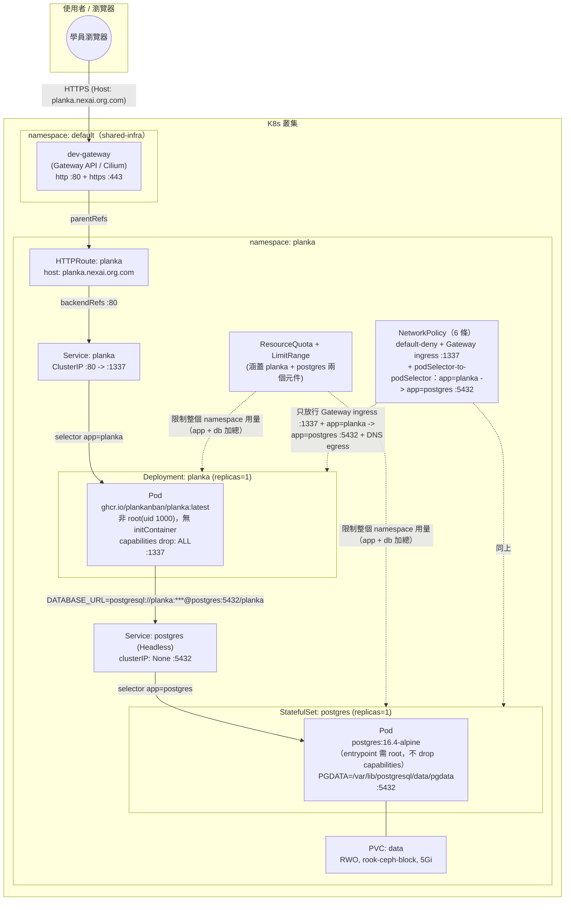

# Planka — 學員練習

## 產品說明

[Planka](https://planka.app/) 是開源、輕量的看板式專案管理工具（類似
Trello），這是整套 K8s 教學課程第五個範例，也是**第一個「自帶專屬資料庫」
的產品**——PostgreSQL 跟 Planka 應用程式放在同一個 namespace，只服務這一個
產品（後面的 flarum 把 mysql 併進同一個 namespace 之後，變成同一種架構，
兩個產品可以互相對照講解）。

跟前面產品比，這裡有兩個值得特別強調的教學對照點：

1. **官方文件常說 Planka 要用 mysql——這是錯的**。Planka 官方
   docker-compose 實際用的是 **PostgreSQL**，這裡部署一份專屬的
   PostgreSQL StatefulSet，跟 flarum 用的 mysql 是不同的資料庫產品，但
   架構模式（同 namespace、專屬資料庫、podSelector-to-podSelector
   NetworkPolicy 隔離）完全一樣，適合拿來對照。
2. **同一份「安全強化」不是每個 image 都能套用，也不是每個 image 都不能**：
   官方 `ghcr.io/plankanban/planka` image 實測發現本來就是用非 root 的
   `node` 使用者（uid 1000）啟動，不像 mysql/postgres/flarum 那樣需要先以
   root 啟動、chown 資料目錄後再降權，所以這裡的 Deployment 可以放心把
   `capabilities` 全部 `drop` 掉，**也不需要 initContainer** 預先建立子
   目錄（Planka 本身會在寫入前自己確保目錄存在）。這是「安全性強化要不要
   做、能不能做，要看 image 實際設計，不能無腦套模板」的活教材，跟
   mysql/flarum「不能 drop、需要 initContainer」正好是完整對照組。

完整、已驗證可用的正解在上一層的 [../manifest/](../manifest/)（拆分版，11
支編號檔案）與 [../planka-all-in-one.yaml](../planka-all-in-one.yaml)（合併
版）——**本目錄下的所有題目都以 `../manifest/` 為標準答案／驗收依據**，寫
完或修完後可直接跟正解 `diff` 對照。

⚠️ **實測踩過的坑，寫作業時也會遇到**：`ghcr.io/plankanban/planka` 這個
image 第一次在某個 Node 上拉取實測要 5～10 分鐘（比 Docker Hub 上的其他
image 慢很多），套用 `07-planka-deployment.yaml`（或填完題目一）之後不要
急著判斷失敗，先用 `kubectl describe pod` 確認是不是還在 `Pulling image`。

## 架構圖

* 用 [drawio](https://www.drawio.com/) 開啟 `architecture.drawio` 檔
* 如不支援顯示 mermaid 圖，僅顯示程式碼，可用 [Mermaid Live Editor](https://mermaid.live/) 並貼上此程式顯示此架構圖


也提供 draw.io 原生格式的同一張圖：[architecture.drawio](architecture.drawio)
（可直接用 draw.io 產品本人打開、編輯）。

---

## 資源（CPU / Memory）該給多少？判斷方法

填 `__FILL_ME_3__`～`__FILL_ME_5__` 之前，先建立這個概念：資源設定分成
**Pod/Container 層**（Deployment/StatefulSet 裡的 `requests`/`limits`）和
**Namespace 層**（`ResourceQuota`/`LimitRange`），兩層要互相對得上：

```text
LimitRange.min
  ≤
Container.requests
  ≤
Container.limits
  ≤
LimitRange.max
Σ(replicas × 每個 Pod 的 requests)   （postgres + planka 都要算進去）
  ≤
ResourceQuota.hard.requests
Σ(replicas × 每個 Pod 的 limits)     （postgres + planka 都要算進去）
  ≤
ResourceQuota.hard.limits
```

跟 draw.io 那個單一 Deployment 的範例不同，這個 namespace 裡**同時有兩個
元件**（`04-postgres-statefulset.yaml` 的 postgres 容器、
`07-planka-deployment.yaml` 的 planka 容器），算配額時兩者都要加總，不能只
看其中一個。

### 1. 兩個容器現有的 `requests`（本例已固定，不是要填的空格）

| 容器 | requests.cpu | requests.memory | limits.cpu | limits.memory |
|---|---|---|---|---|
| postgres（StatefulSet，replicas=1） | 200m | 512Mi | **1**（1000m） | 1Gi |
| planka（Deployment，replicas=1） | 150m | 384Mi | 500m | 768Mi |
| **加總** | **350m** | **896Mi** | 1500m | 1.75Gi |

`requests` 是排程器決定把 Pod 排到哪個節點的依據；`limits` 是尖峰時最多能
用到的量，通常抓 `requests` 的 2～5 倍當緩衝，CPU（可壓縮資源，超用只會被
節流）可以抓寬一點，Memory（不可壓縮資源，超用會直接 OOMKilled）要抓保守
一點——這點跟 draw.io 範例的判斷邏輯一致，只是這裡要對兩個容器分別套用。

### 2. `ResourceQuota.hard.requests.cpu`（`__FILL_ME_3__` 要填的）

Namespace 總量配額，計算基準是**這個 namespace 裡所有 Pod 的 `requests`
加總**（不是 `limits`），而且這個 namespace 有兩個元件都要算：

```text
postgres: 1 replica × 200m = 200m
planka  : 1 replica × 150m = 150m
目前實際用量合計 = 350m
```

這個產品沒有 HPA（postgres 是 StatefulSet 通常也不會自動擴縮，planka 目前
固定 1 個 replica），但配額不能只填剛好 350m——要留給「手動調整 replica」
或「學員自己實驗加 Pod」的餘裕，正解用 `"1"`（即 1000m），比實際用量多將
近 3 倍緩衝。`limits.cpu`/`limits.memory`/`requests.memory` 那幾格（本例
已固定為 `"2"`/`3Gi`/`1.5Gi`）同理，`limits` 加總是「上限承諾」，允許合理
超額訂閱（overcommit），不必要求 quota 的 limits 總量能同時滿足所有容器都
吃到頂。

### 3. `LimitRange.max` / `min`（`__FILL_ME_4__`、`__FILL_ME_5__` 要填的）

這兩個值是幫**整個 namespace**訂「單一容器」的天花板與地板，適用於
namespace 裡**每一個**容器（postgres 跟 planka 都要同時符合），所以要用
「兩者裡最極端的那個」去推：

- `max`（`__FILL_ME_4__`）：namespace 裡任何一個容器最多能要多少，必須
  **≥** namespace 裡**所有**容器實際填的 `limits`。這裡兩個容器的
  `limits.cpu` 分別是 postgres 的 `1`（1000m）跟 planka 的 `500m`，取其中
  **較大**的那個當下限依據——也就是說 `max.cpu` 至少要等於 postgres 的
  `1`，正解剛好填 `"1"`，是一個「等於」的邊界案例：如果學員填得比 `1`
  小（例如 `500m`），postgres 這個容器就會被 LimitRange 直接擋掉、連
  `Pending` 都排不進去，即使 planka 那邊完全沒問題。
- `min`（`__FILL_ME_5__`）：namespace 裡任何一個容器最少要 request 多少，
  必須 **≤** namespace 裡**所有**容器實際填的 `requests`。這裡兩個容器的
  `requests.memory` 分別是 postgres 的 `512Mi` 跟 planka 的 `384Mi`，取
  **較小**的那個當上限依據，正解填 `128Mi`，留了不小的緩衝空間（本教材在
  幫別的產品加輕量容器時真的踩過「min 抓太高擋掉合理小容器」這個坑）。

**檢查你填的數字時，問自己這三個問題**：
1. 這個配額的 `requests.cpu` 加總，有沒有把 postgres **和** planka 兩個
   容器都算進去，不是只算其中一個？
2. `LimitRange.max.cpu` 有沒有蓋過 namespace 裡「limits 最大」的那個容器
   （這裡是 postgres）？
3. `LimitRange.min.memory` 有沒有低於 namespace 裡「requests 最小」的那個
   容器（這裡是 planka）？

---

## 題目一：半成品 YAML 填空

檔案在 [manifest-incomplete/](manifest-incomplete/)，內容跟正解
`../manifest/` 完全一樣，只有標記 `__FILL_ME_n__` 的地方被挖空。請照著編號
填入正確的值，11 個檔案填完後依序 `kubectl apply`（或自行合併），目標是重
現與 `../manifest/` 完全等價（語意上）的部署。

| 編號 | 檔案 | 題目 | 挖空欄位 | 提示 |
|---|---|---|---|---|
| `__FILL_ME_1__` | 00-namespace.yaml | 幫這個 namespace 取名字 | `metadata.name` | README 標題已經告訴你這個產品叫什麼，之後每個檔案的 `namespace:` 都要跟它一致 |
| `__FILL_ME_2__` | 00-namespace.yaml | 幫這個 namespace 加上分類標籤 | `labels.training/product` | 跟 `__FILL_ME_1__` 填同一個值即可（本教材慣例：label 值＝namespace 名稱） |
| `__FILL_ME_3__` | 01-resourcequota-limitrange.yaml | 設定整個 namespace 最多能同時 request 多少 CPU 總量 | `ResourceQuota.hard.requests.cpu` | 這個 namespace 同時跑 postgres（requests.cpu 200m）跟 planka（requests.cpu 150m）兩個元件，配額至少要能同時容納兩者加總（350m），並留一點手動擴充的餘裕（詳見上方「資源判斷」章節） |
| `__FILL_ME_4__` | 01-resourcequota-limitrange.yaml | 設定單一容器最多能要多少 CPU（上限） | `LimitRange.max.cpu` | 必須 ≥ namespace 裡「limits.cpu 最大」的那個容器；這個 namespace 裡誰的 limits.cpu 最大，postgres 還是 planka？ |
| `__FILL_ME_5__` | 01-resourcequota-limitrange.yaml | 設定單一容器最少要 request 多少記憶體（下限） | `LimitRange.min.memory` | 必須 ≤ namespace 裡「requests.memory 最小」的那個容器；這個 namespace 裡誰的 requests.memory 最小？ |
| `__FILL_ME_6__` | 02-postgres-secret.yaml | 設定 PostgreSQL 的資料庫密碼 | `stringData.POSTGRES_PASSWORD` | 這個密碼之後會被 `05-planka-secret.yaml` 的 `DATABASE_URL` 引用，兩邊必須一致；密碼故意不含 `@` `:` `/` 這類 URI 保留字元 |
| `__FILL_ME_7__` | 03-postgres-service.yaml | 設定這個 Service 要不要有自己的 ClusterIP | `spec.clusterIP` | StatefulSet 通常搭配哪一種特殊 Service，讓每個 Pod 有自己穩定的 DNS 名稱，而不是共用一個虛擬 IP？（提示：檔名已經寫了 Headless） |
| `__FILL_ME_8__` | 03-postgres-service.yaml | 設定這個 Service 要選中哪些 Pod | `spec.selector.app` | 跟 `04-postgres-statefulset.yaml` 的 `template.metadata.labels.app` 必須完全一致 |
| `__FILL_ME_9__` | 04-postgres-statefulset.yaml | 設定這個 StatefulSet 要綁定哪個 Headless Service | `spec.serviceName` | 要對到 `03-postgres-service.yaml` 的 `metadata.name` |
| `__FILL_ME_10__` | 04-postgres-statefulset.yaml | 設定 PostgreSQL 資料目錄實際要放在掛載點底下的哪個子路徑 | `env[PGDATA].value` | 不要直接指到 `volumeMounts.mountPath` 的根目錄——Ceph RBD 格式化成 ext4 後，掛載點根目錄一開始就有一個資料夾，會讓 postgres 的 `initdb` 誤判「目錄不是空的」而拒絕啟動，指到子目錄可以避開這個問題 |
| `__FILL_ME_11__` | 04-postgres-statefulset.yaml | 設定 liveness 探測要打哪個 port | `livenessProbe.tcpSocket.port` | 可以直接引用上面 `ports` 陣列取的 name，不用重複寫數字 `5432` |
| `__FILL_ME_12__` | 04-postgres-statefulset.yaml | 設定這顆 PVC 的存取模式 | `volumeClaimTemplates.spec.accessModes` | 這顆 PVC 全程只會有 1 個 postgres Pod 掛它，該選單一節點讀寫還是多節點讀寫？ |
| `__FILL_ME_13__` | 04-postgres-statefulset.yaml | 設定這顆 PVC 要用叢集裡哪一種 StorageClass | `volumeClaimTemplates.spec.storageClassName` | 資料庫類單寫場景，這座叢集提供的哪一種 StorageClass 對應 Ceph RBD（區塊儲存）？ |
| `__FILL_ME_14__` | 05-planka-secret.yaml | 組出 Planka 連線 PostgreSQL 用的完整連線字串 | `stringData.DATABASE_URL` | 格式是 `postgresql://<user>:<password>@<host>:<port>/<db>`；user/password/db 要跟 `02-postgres-secret.yaml` 一致，host 直接用 `03-postgres-service.yaml` 的 Service 名稱即可（同 namespace 不需要 FQDN） |
| `__FILL_ME_15__` | 06-planka-pvc.yaml | 設定這顆 PVC 的存取模式 | `spec.accessModes` | 使用者上傳的頭像/附件未來可能要給多個 Pod 同時讀寫，該選哪一種存取模式？（跟 `__FILL_ME_12__` 的 postgres PVC 刻意不同，注意對照） |
| `__FILL_ME_16__` | 07-planka-deployment.yaml | 填入 Planka 官方容器映像的名稱與版本 | `containers[0].image` | Planka 官方發布在 `ghcr.io`（不是 Docker Hub）的映像名稱，本檔案上方教學註解跟 `../README.md` 都有提到這個 image 拉取比較慢 |
| `__FILL_ME_17__` | 07-planka-deployment.yaml | 設定對外宣告的服務網址 | `env[BASE_URL].value` | 這個值要跟 `09-httproute.yaml` 的 `hostnames` 一致，Planka 拿它組前端頁面裡的絕對網址 |
| `__FILL_ME_18__` | 07-planka-deployment.yaml | 填入容器內部應用程式實際監聽的 port | `containers[0].ports[0].containerPort` | 跟 `08-planka-service.yaml` 的 `targetPort: http` 這個 named port 要對得上（Planka/Sails 預設監聽的 port 號碼比較特別，不是常見的 3000/8080） |
| `__FILL_ME_19__` | 07-planka-deployment.yaml | 設定 readiness 探測要打哪個 port | `readinessProbe.httpGet.port` | 可以直接引用上面 `ports` 陣列取的 name，不用重複寫數字（跟 `livenessProbe` 那組保持一致寫法） |
| `__FILL_ME_20__` | 07-planka-deployment.yaml | 設定要捨棄全部 Linux capability | `securityContext.capabilities.drop` | 官方 planka image 是用什麼身分啟動的？（提示：不像 postgres 需要先以 root 啟動再降權，這裡可以放心全部捨棄，寫法跟 draw.io 範例的 `__FILL_ME_10__` 一樣） |
| `__FILL_ME_21__` | 07-planka-deployment.yaml | 設定容器內部要把 PVC 掛到哪個路徑 | `volumeMounts[0].mountPath` | Planka（Node.js/Sails 應用）會在這個路徑下自己建立 `protected/`、`private/` 等子目錄，不需要 initContainer 預先建立——路徑本身是 Planka 應用程式碼寫死的慣例路徑 |
| `__FILL_ME_22__` | 08-planka-service.yaml | 設定這個 Service 要選中哪些 Pod | `spec.selector.app` | 跟 `07-planka-deployment.yaml` 的 `template.metadata.labels.app` 必須完全一致，否則 Service 找不到任何 Endpoint（`manifest-buggy/` 的除錯題就是在考這個） |
| `__FILL_ME_23__` | 08-planka-service.yaml | 設定 Service 要把流量轉去 Pod 的哪個 port | `spec.ports[0].targetPort` | 對應到 Pod 上 named port 的名稱，不是數字 |
| `__FILL_ME_24__` | 09-httproute.yaml | 設定這個 HTTPRoute 要掛在哪個 Gateway 底下 | `parentRefs[0].name` | 看 `../../shared-infra/` 底下那份共用資源叫什麼名字 |
| `__FILL_ME_25__` | 09-httproute.yaml | 設定對外存取這個服務要用的網域名稱 | `hostnames[0]` | 沿用叢集網域慣例：`<product>.nexai.org.com`，這個 product 是什麼？也要跟 `__FILL_ME_17__` 填的值一致 |
| `__FILL_ME_26__` | 09-httproute.yaml | 設定 HTTPRoute 要把流量轉去 Service 的哪個 port | `backendRefs[0].port` | 看 `08-planka-service.yaml` 裡 Service 對外開的是幾號 port（不是 `containerPort`） |
| `__FILL_ME_27__` | 10-networkpolicy.yaml | 設定「放行 Gateway 進來的流量」這條規則要保護哪些 Pod | `allow-ingress-to-planka-from-gateway.spec.podSelector.matchLabels.app` | 和 `07-planka-deployment.yaml` 用同一組 label |
| `__FILL_ME_28__` | 10-networkpolicy.yaml | 設定「只放行 planka 連進來」這條規則要保護哪些 Pod | `allow-ingress-to-postgres-from-planka.spec.podSelector.matchLabels.app` | 這條規則保護的是資料庫那一邊，該用哪個 app label？ |
| `__FILL_ME_29__` | 10-networkpolicy.yaml | 設定「允許連到 postgres」這條 egress 規則要套用在哪些 Pod 上 | `allow-egress-planka-to-postgres.spec.podSelector.matchLabels.app` | 這是一條 egress 規則，套用對象是「要連出去」的那一邊——是 planka 還是 postgres？ |
| `__FILL_ME_30__` | 10-networkpolicy.yaml | 設定這條 egress 規則允許連到哪些 Pod | `allow-egress-planka-to-postgres.spec.egress[0].to[0].podSelector.matchLabels.app` | 這是 planka 要連去的目的地，同一個 namespace 裡誰在監聽 `5432`？ |

**提示總則**：不確定的話，`../manifest/` 目錄下同名檔案就是答案，但建議先
自己推理過一輪，再對答案——光是抄答案學不到「為什麼」。

---

## 題目二：埋錯除錯

檔案在 [manifest-buggy/](manifest-buggy/)，是一份**看起來完整、可以直接
`kubectl apply` 的部署**，但裡面藏了 **5 個真的會讓部署失敗或行為異常的
錯誤**，分散在不同檔案裡（每個檔案最多一個錯，也有檔案完全沒錯）。請先整
套 apply 下去，再用 `kubectl describe` / `kubectl get -o yaml` /
`kubectl logs` 等指令找出問題、修正它們，過程本身就是最寫實的維運訓練。

不直接告訴你錯在哪一行，但提供症狀方向：

1. **其中一個檔案**：`postgres-0` 這個 Pod 遲遲無法變成 `Running`（或者
   起來沒多久就重啟），`kubectl logs postgres-0 -n planka`（或
   `kubectl describe pod postgres-0 -n planka` 的 Events）會看到 postgres
   在初始化資料目錄時因為「目錄不是空的」而拒絕啟動的訊息。跟資料目錄要
   指到掛載點底下的哪個路徑有關。
2. **其中一個檔案**：`planka` 這個 Pod 會 `Running`，但
   `kubectl get endpoints planka -n planka` 永遠是空的，透過 Gateway 連線
   會得到 503 / connection refused。跟 label 有關。
3. **其中一個檔案**：`planka` 這個 Pod 卡在無法建立容器的狀態（不是
   `Running`，也不是單純的 `CrashLoopBackOff`），`kubectl describe pod`
   的 Events 會提到某個環境變數要引用的 Secret 欄位（key）找不到。跟
   Secret 的哪個 key 被引用有關。
4. **其中一個檔案**：`postgres-0` 跟 `planka` 兩個 Pod 都顯示
   `Running`，NetworkPolicy 也都套用成功，但 `planka` Pod 的
   log（或直接連進 `planka` Pod 用 `nc`/`curl` 測 `postgres:5432`）會顯示
   連線逾時或被拒絕，資料庫怎麼樣都連不上。跟 NetworkPolicy 裡 podSelector
   要選中哪個 label 有關。
5. **其中一個檔案**：`kubectl describe httproute planka -n planka` 的狀態
   可能仍顯示 `Accepted: True`，但實際透過 Gateway 發流量會失敗
   （connection refused 或逾時）。跟 `backendRefs` 打的 port 號碼有關——
   這個號碼該對應 Service 的哪個 port，而不是容器內部監聽的 port？

找到並修正全部 5 個之後，用下面「驗收標準」章節確認整套環境真的健康。

**提示**：懷疑某個資源設定錯了的時候，可以直接跟 `../manifest/` 同名檔案
`diff`，但建議先靠 `kubectl describe` / `kubectl logs` /
`kubectl get events -n planka --sort-by=.lastTimestamp` 這些第一手觀察線
索自己推理，養成真正除錯的直覺，而不是直接比對兩份檔案找不同。

---

## 驗收標準

不論是完成「題目一：填空」還是「題目二：除錯」，都用下面同一套標準驗收，
目標是跟 `../manifest/`（正解）部署起來的最終狀態等價：

- [ ] `kubectl get pods -n planka` 顯示 `postgres-0` 跟 `planka-xxx` 兩個
      Pod，皆為 `Running` 且 `READY 1/1`（沒有 `CrashLoopBackOff`、沒有
      `0/1`、沒有 `Pending`、沒有 `CreateContainerConfigError`）
- [ ] `kubectl exec -n planka deploy/planka -- whoami` 回傳 `node`（不是
      `root`），或用 `kubectl get pod -n planka -l app=planka -o
      jsonpath='{.items[0].spec.containers[0].securityContext}'` 確認
      `capabilities.drop` 是 `["ALL"]` 且沒有以 root 執行
- [ ] `kubectl get endpoints planka -n planka` 顯示 **1 個** Pod
      IP:1337（不是空的 `<none>`）
- [ ] `kubectl get endpoints postgres -n planka` 顯示 **1 個** Pod
      IP:5432（不是空的 `<none>`）
- [ ] `kubectl describe httproute planka -n planka` 的 `Status.Conditions`
      顯示 `Accepted: True` 且 `ResolvedRefs: True`
- [ ] `curl -H "Host: planka.nexai.org.com" http://<dev-gateway
      EXTERNAL-IP>/` 回傳 HTTP 200，且內容是真的 Planka 登入頁面（不是連
      線失敗、不是 503/504）
- [ ] 同上，改用 `https://` + `-k`（自簽憑證）也回傳 200
- [ ] `kubectl exec -n planka postgres-0 -- psql -U planka -d planka -c
      "\dt"` 能看到 Planka 自動建立的資料表（代表 migrations 有跑成功、
      DATABASE_URL 密碼正確能連上）
- [ ] `kubectl get pvc -n planka` 顯示 `data-postgres-0`（RWO，
      rook-ceph-block）與 `planka-data`（RWX，rook-cephfs）皆為 `Bound`
- [ ] （若有套用 10-networkpolicy.yaml）套用後重新測試上面兩條 curl，確認
      NetworkPolicy 沒有把 Gateway 進來的流量擋掉；另外可用
      `kubectl run tmp --rm -it --image=busybox -n planka --labels="app=tmp"
      -- nc -vz postgres 5432` 驗證「沒有貼 `app=planka` 標籤的 Pod」連不
      到 postgres:5432，而 `planka` 自己的 Pod 可以
- [ ] 填完/修完的檔案在語意上與 `../manifest/` 一致（可用
      `diff -u manifest-incomplete/ ../manifest/` 或
      `diff -u manifest-buggy/ ../manifest/` 做最終比對，兩邊應該只剩下教
      學註解、練習提示這類非語意差異）

全部打勾即完成本產品的練習。
