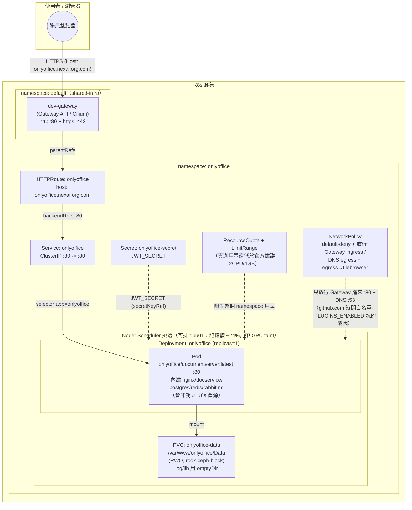

# ONLYOFFICE — 學員練習

## 產品說明

[ONLYOFFICE Document Server](https://www.onlyoffice.com/)
是強大的線上 Office 辦公套件，支援 Word、Excel、PPT 的線上即時共同編輯，
可與 Nextcloud、Filebrowser 等系統整合，官方提供「單容器全包」映像
（`onlyoffice/documentserver`），內建自己的 PostgreSQL、Redis、
RabbitMQ，全部包在同一個 container 裡執行，不需要外接資料庫。

這是課程第六個範例，也是目前**資源需求最重**的一個產品（官方建議至少
2 CPU / 4GB RAM）。重點不在應用邏輯本身，而在「資源緊繃的共用叢集，
該怎麼安排一個吃重的工作負載」——這座叢集 `k8s01~03` 三台 Node 記憶體
長期使用率已經 81~85%，硬把這個產品排上去有拖垮節點的風險，所以本產品
是全課程**首個 `toleration`（節點排程）範例**：讓 Pod「可以」排到記憶體
最空的 `gpu01`（原本保留給 GPU 工作負載，帶
`nvidia.com/gpu=true:NoSchedule` taint），但不指定節點（`nodeSelector`
註解保留，排不進去時再取消註解釘死），示範「taint/toleration 不是
只服務 GPU 排程，任何『這個節點保留給特定用途』的情境都適用」，以及
「toleration 是允許、nodeSelector 才是指定」的差別。另外還有
一個很寫實的除錯教材：**「官方建議的最低需求」不等於「實際會用到的量」**
——本產品的官方建議是 2 CPU / 4GB，但實測穩定狀態下記憶體用量只有約
400~500Mi，遠低於官方建議值，之後的「資源該給多少」章節會用這個真實
落差當範例，帶學員建立「不要盲信 vendor 建議的最低需求，要實測」的判斷
習慣。

持久化刻意簡化：官方全包模式內部的 PostgreSQL/RabbitMQ 資料路徑跟安裝
的套件版本強綁定，要正確用 PVC 持久化需要更多細節，教學上不展開，只掛
一個 PVC 在 `/var/www/onlyoffice/Data`，其餘 log/cache 用 `emptyDir`。

完整、已驗證可用的正解在上一層的 [../manifest/](../manifest/)（拆分版）與
[../onlyoffice-all-in-one.yaml](../onlyoffice-all-in-one.yaml)（合併版）——
**本目錄下的所有題目都以 `../manifest/` 為標準答案／驗收依據**，寫完或
修完後可直接跟正解 `diff` 對照。

## 架構圖

* 用 [drawio](https://www.drawio.com/) 開啟 `architecture.drawio` 檔
* 如不支援顯示 mermaid 圖，僅顯示程式碼，可用 [Mermaid Live Editor](https://mermaid.live/) 並貼上此程式顯示此架構圖


也提供 draw.io 原生格式的同一張圖：[architecture.drawio](architecture.drawio)
（可直接用 draw.io 本人打開、編輯）。

---

## 資源（CPU / Memory）該給多少？判斷方法

填 `__FILL_ME_3__`～`__FILL_ME_5__` 之前，先建立這個概念：資源設定分成
**Pod/Container 層**（Deployment 裡的 `requests`/`limits`）和 **Namespace 層**
（`ResourceQuota`/`LimitRange`），兩層要互相對得上：

```text
LimitRange.min
  ≤  
Container.requests
  ≤  
Container.limits
  ≤  
LimitRange.max
Σ(replicas × 每個 Pod 的 requests)
  ≤  
ResourceQuota.hard.requests
Σ(replicas × 每個 Pod 的 limits)
  ≤  
ResourceQuota.hard.limits
```

### 0. 先講重點：官方建議值 ≠ 實際用量

ONLYOFFICE 官方文件建議「最少 2 CPU / 4GB RAM」，但這座叢集實測穩定
狀態下（沒人在編輯文件的日常狀態）記憶體用量只有 **約 400~500Mi**，
只有官方建議值的 1/8 左右；只有「第一次啟動」時因為要產生字型/主題快取，
CPU 會短暫吃滿 limit，是一次性行為，不是穩定負載。這是本產品最重要的
教學點：**vendor 建議的最低需求，通常是「保守到能涵蓋最極端情境」的數字
，不能直接照抄當作 K8s 的 `requests`／`limits`，正確作法是先用建議值
（或更保守的估計）上線，再用 `kubectl top pod` 觀察一段時間的實際用量，
回頭校正**。本例的 `requests`/`limits`（已固定）就是照這個邏輯訂出來的：
比官方建議的 2 CPU/4GB 低，但仍保留足夠緩衝，不是照抄官方數字，也不是
直接砍到實測的 400~500Mi（避免完全沒有尖峰緩衝）。

### 1. Container 的 `requests`（本例已固定：cpu "1" / memory 2Gi）

`requests` 代表這個容器「平常穩定執行」大概需要的量，是**排程器**用來
決定把 Pod 排到哪個節點的依據。本例刻意訂得比官方建議的 2 CPU/4GB
低一截，但仍明顯高於實測的 400~500Mi 穩定用量——這不是隨便打折，
是因為 `requests` 除了「平常夠用」，還要留給「這是全課程資源需求最重
的產品，而 k8s01~03 記憶體已經很緊」這個排程限制一些緩衝，
避免把 `requests` 訂得太貼近實測值，結果 Node 上其他非預期尖峰（例如
第一次啟動的字型產生作業）把資源擠爆。

### 2. Container 的 `limits`（本例已固定：cpu "2" / memory 4Gi）

`limits` 是允許這個容器「尖峰時最多」能用到的量，本例剛好等於官方
建議的下限（2 CPU/4GB），這樣設計是因為：

- **CPU 是可壓縮資源**：超過 `limits` 只會被「節流（throttle）」變慢，
  不會被殺，所以拿官方建議值當 `limits` 上限，剛好可以涵蓋第一次啟動
  字型產生那種短暫尖峰。
- **Memory 是不可壓縮資源**：超過 `limits` 會直接被 **OOMKilled**，
  所以 Memory 的 `limits` 訂在官方建議值（4Gi），比實測穩定用量
  （400~500Mi）留了將近 8 倍緩衝，涵蓋大量並發編輯文件、大檔案轉檔
  等真的會拉高記憶體用量的情境。

### 3. `LimitRange.max` / `min`（`__FILL_ME_4__`、`__FILL_ME_5__` 要填的）

這兩個值是幫**整個 namespace**訂「單一容器」的天花板與地板：

- `max`：namespace 裡任何一個容器最多能要多少，必須 **≥** 目前
  Deployment 實際填的 `limits`（本例 Deployment 的 `limits.cpu: "2"`
  ≤ `max.cpu`），否則 Pod 會被 LimitRange 直接擋掉、連 Pending 都
  排不進去。本產品因為是全課程最重的工作負載，`max` 直接對齊官方建議
  的上限（cpu 4 / memory 6Gi），也預留了一點點給未來調整的空間。
- `min`：namespace 裡任何一個容器最少要 request 多少，必須 **≤** 目前
  Deployment 實際填的 `requests`（本例 `requests.memory: 2Gi` ≥
  `min.memory`）。抓太高會擋掉合理的輕量容器（本教材在幫 cloudbeaver
  加 Adminer 時真的踩過這個坑），一般抓「這個 namespace 裡預期最小的
  合理容器」的量即可。
- `default`/`defaultRequest`（本例已寫好 cpu 2/1、memory 4Gi/2Gi）：
  使用者忘記寫 `requests`/`limits` 時的自動預設值，跟上面 `max`/`min`
  的天花板/地板是兩件事，別搞混。

### 4. `ResourceQuota.hard.requests.cpu`（`__FILL_ME_3__` 要填的）

Namespace 總量配額，計算基準是**這個 namespace 裡所有 Pod 的
`requests` 加總**（不是 `limits`），公式：

```text
Σ(每個 Deployment/StatefulSet 的 replicas × 每個 Pod 的 requests)  ≤  ResourceQuota.hard.requests
```

本例：`replicas: 1`、Pod `requests.cpu: "1"`，目前用量 = 1 × 1 = 1
CPU。配額不能只填剛好 1——同一份 ResourceQuota 把 `pods` 上限開到
`"3"`，代表這個 namespace 允許之後額外起 1~2 個臨時 Pod（例如上課時
臨時起一個 debug Pod 檢查 `/var/www/onlyoffice/Data` 底下的檔案內容），
所以配額至少要留出「現有 Deployment + 至少一個額外 Pod」的空間，正解
用 `"2"`，等於留了一倍餘裕。`limits.cpu`/`limits.memory` 那兩格
（本例已固定為 `"4"`/`6Gi`）同理，但要注意 `limits` 加總是「上限承諾」，
屬於合理的超額訂閱（overcommit），不必要求 quota 的 limits 總量能同時
滿足所有 Pod 都吃到頂。

**檢查你填的數字時，問自己這三個問題**：
1. 這個配額能同時容納 Deployment 目前的 `replicas` 嗎？（不能只算
   極限情況，也要想到 `pods: "3"` 代表 namespace 允許的其他 Pod）
2. 這個數字跟官方建議的「2 CPU / 4GB」對照起來，是不是仍然比照抄
   官方數字更貼近實測用量？（別忘了本產品的教學重點就是「實測 vs.
   vendor 建議」的落差）
3. LimitRange 的 `max`/`min` 有沒有把 Deployment 實際的
   `requests`/`limits` 包在中間，而不是卡在外面？

---

## 題目一：半成品 YAML 填空

檔案在 [manifest-incomplete/](manifest-incomplete/)，內容跟正解
`../manifest/` 完全一樣，只有標記 `__FILL_ME_n__` 的地方被挖空。請照著
編號填入正確的值，8 個檔案填完後依序 `kubectl apply`（或自行合併），
目標是重現與 `../manifest/` 完全等價（語意上）的部署。

| 編號 | 檔案 | 題目 | 挖空欄位 | 提示 |
|---|---|---|---|---|
| `__FILL_ME_1__` | 00-namespace.yaml | 幫這個 namespace 取名字 | `metadata.name` | 這個值之後每個檔案的 `namespace:` 都要跟它一致，README 標題已經告訴你這個產品叫什麼 |
| `__FILL_ME_2__` | 00-namespace.yaml | 幫這個 namespace 加上分類標籤 | `labels.training/product` | 跟 `__FILL_ME_1__` 填同一個值即可（本教材慣例：label 值＝namespace 名稱） |
| `__FILL_ME_3__` | 01-resourcequota-limitrange.yaml | 設定整個 namespace 最多能同時 request 多少 CPU 總量 | `ResourceQuota.hard.requests.cpu` | Deployment 只有 1 個 replica、`requests.cpu: "1"`，但同檔案的 `pods: "3"` 代表 namespace 允許額外的臨時 Pod，配額要留這個空間；詳見上方「資源該給多少」章節第 4 點 |
| `__FILL_ME_4__` | 01-resourcequota-limitrange.yaml | 設定單一容器最多能要多少 CPU（上限） | `LimitRange.max.cpu` | 必須 ≥ Deployment 裡容器實際填的 `limits.cpu`；本產品是官方建議 2 CPU/4GB 起跳的重量級工作負載，上限該抓多少？ |
| `__FILL_ME_5__` | 01-resourcequota-limitrange.yaml | 設定單一容器最少要 request 多少記憶體（下限） | `LimitRange.min.memory` | 必須 ≤ Deployment 裡容器實際填的 `requests.memory`，否則 Pod 會被 LimitRange 擋掉（下限擋掉輕量容器是本教材真的踩過的坑） |
| `__FILL_ME_6__` | 02-secret.yaml | 設定 JWT 簽章金鑰的值 | `stringData.JWT_SECRET` | 教學用途沒有格式限制，自己取一個字串即可，但要記得這把金鑰之後串接 filebrowser 時對方也要用同一把簽 token |
| `__FILL_ME_7__` | 03-pvc.yaml | 設定這個 PVC 要用哪一個 StorageClass | `spec.storageClassName` | 這座叢集**沒有 default StorageClass**，必須明確指定；這個 PVC 是單寫（`ReadWriteOnce`）場景，該挑哪一種？（提示：`training.md` 裡有列出這座叢集可用的 StorageClass 名稱） |
| `__FILL_ME_8__` | 03-pvc.yaml | 設定要申請多少儲存容量 | `spec.resources.requests.storage` | 檔案上方教學註解已經寫出實際要申請的容量 |
| `__FILL_ME_9__` | 04-deployment.yaml | 設定要把 Pod 排到哪一台 Node 上 | `spec.template.spec.nodeSelector."kubernetes.io/hostname"` | 檔案上方教學註解說了這座叢集哪一台 Node 記憶體用量最低、適合塞下這個吃重的工作負載（此行預設已註解、改以 toleration 為主不指定節點；屬選填，若要練習請取消註解後再填） |
| `__FILL_ME_10__` | 04-deployment.yaml | 設定要容忍（tolerate）哪一個 taint 的 key | `tolerations[0].key` | 目標 Node 身上帶的是哪個廠牌的 GPU taint？（提示：`nvidia.com/...`） |
| `__FILL_ME_11__` | 04-deployment.yaml | 設定要容忍的 taint value 要等於什麼 | `tolerations[0].value` | 對照這台 Node 身上 taint 的實際 value（在 `kubectl describe node gpu01` 看得到） |
| `__FILL_ME_12__` | 04-deployment.yaml | 設定要容忍的 taint effect 是什麼 | `tolerations[0].effect` | taint 的三種 effect（`NoSchedule`/`PreferNoSchedule`/`NoExecute`）中，這座叢集的 GPU taint 用的是哪一種？ |
| `__FILL_ME_13__` | 04-deployment.yaml | 填入 ONLYOFFICE 官方容器映像的名稱與版本 | `containers[0].image` | ONLYOFFICE Document Server 官方 Docker Hub 映像名稱，這裡用的是哪個 tag？ |
| `__FILL_ME_14__` | 04-deployment.yaml | 設定是否啟用外掛管理背景程序 | `env[PLUGINS_ENABLED].value` | 檔案上方教學註解整段都在講這個環境變數為什麼要關掉，仔細讀完再填 |
| `__FILL_ME_15__` | 04-deployment.yaml | 填入容器內部應用程式實際監聽的 port | `containers[0].ports[0].containerPort` | 跟 Service 的 `targetPort` 這個 named port 要對得上 |
| `__FILL_ME_16__` | 04-deployment.yaml | 設定 readiness 探測要打哪個路徑 | `readinessProbe.httpGet.path` | ONLYOFFICE Document Server 官方內建的健康檢查端點叫什麼名字？（跟 `livenessProbe` 那組保持一致寫法） |
| `__FILL_ME_17__` | 04-deployment.yaml | 設定 liveness 探測要打哪個 port | `livenessProbe.httpGet.port` | 可以直接引用上面 `ports` 陣列裡取的 name，不用重複寫數字 |
| `__FILL_ME_18__` | 04-deployment.yaml | 設定資料要掛到容器裡的哪個路徑 | `volumeMounts[0](data).mountPath` | 檔案上方教學註解明確寫出了這個「有明確文件、單純的資料路徑」是什麼 |
| `__FILL_ME_19__` | 05-service.yaml | 設定這個 Service 要選中哪些 Pod | `spec.selector.app` | 跟 Deployment 的 `template.metadata.labels.app` 必須完全一致，否則 Service 找不到任何 Endpoint（`manifest-buggy/` 的除錯題就是在考這個） |
| `__FILL_ME_20__` | 05-service.yaml | 設定 Service 要把流量轉去 Pod 的哪個 port | `spec.ports[0].targetPort` | 對應到 Pod 上 named port 的名稱，不是數字 |
| `__FILL_ME_21__` | 06-httproute.yaml | 設定這個 HTTPRoute 要掛在哪個 Gateway 底下 | `parentRefs[0].name` | 看 `../../shared-infra/` 底下那份共用資源叫什麼名字 |
| `__FILL_ME_22__` | 06-httproute.yaml | 設定對外存取這個服務要用的網域名稱 | `hostnames[0]` | 沿用叢集網域慣例：`<product>.nexai.org.com`，這個 product 是什麼？ |
| `__FILL_ME_23__` | 06-httproute.yaml | 設定 HTTPRoute 要把流量轉去 Service 的哪個 port | `backendRefs[0].port` | 看 05-service.yaml 裡 Service 對外開的是幾號 port（不是 containerPort） |
| `__FILL_ME_24__` | 07-networkpolicy.yaml | 設定 `allow-ingress-from-gateway` 要保護哪些 Pod | `allow-ingress-from-gateway.spec.podSelector.matchLabels.app` | 和 Service/Deployment 用同一組 label |
| `__FILL_ME_25__` | 07-networkpolicy.yaml | 設定要放行到哪一個 namespace 的出向流量 | `allow-egress-onlyoffice-to-filebrowser...namespaceSelector.matchLabels."kubernetes.io/metadata.name"` | 檔案上方教學註解說明了 Document Server 要主動回頭連哪個系統抓檔案內容 |

**提示總則**：不確定的話，`../manifest/` 目錄下同名檔案就是答案，但建議先自己
推理過一輪，再對答案 —— 光是抄答案學不到「為什麼」。

---

## 題目二：埋錯除錯

檔案在 [manifest-buggy/](manifest-buggy/)，是一份**看起來完整、可以直接
`kubectl apply` 的部署**，但裡面藏了 **4 個真的會讓部署失敗或行為異常的錯誤**，
分散在不同檔案裡（每個檔案最多一個錯，也有檔案完全沒錯）。請先整套 apply 下去，
再用 `kubectl describe` / `kubectl get -o yaml` / `kubectl top pod` /
`kubectl logs` 等指令找出問題、修正它們，過程本身就是最寫實的維運訓練。

不直接告訴你錯在哪一行，但提供症狀方向：

1. **其中一個檔案**：Pod 長時間維持 `Running` 且 `READY 1/1`，表面上看
   起來完全正常，應用功能也能用，但 `kubectl top pod -n onlyoffice`
   觀察一段時間會發現 **CPU 使用率異常偏高但應用看起來正常**——即使沒有
   任何人在編輯文件、也沒有並發流量，CPU 用量還是長時間貼著一個不低的
   水位，不像「閒置服務該有的低使用率」。跟這個應用背景執行的某個內建
   行程有關，而這個行程平常會嘗試連到叢集 NetworkPolicy 沒有放行的
   外部網際網路。
2. **其中一個檔案**：PVC 一直卡在 `Pending`，連帶 Pod 也卡住（`Pending`
   或 `ContainerCreating` 出不來），`kubectl describe pvc onlyoffice-data
   -n onlyoffice` 的 Events 會看到跟「找不到對應 StorageClass」相關的
   訊息。跟這座叢集「沒有 default StorageClass、每次都要明確指定」這件
   事有關。
3. **其中一個檔案**：Pod 會 `Running` 但 `kubectl get endpoints
   onlyoffice -n onlyoffice` 永遠是空的，透過 Gateway 連線會得到
   503 / connection refused。跟 label 有關。
4. **其中一個檔案**：HTTPRoute 狀態可能顯示 `Accepted: True`，但實際
   流量會失敗或連不到應用。跟 backendRefs 打的 port 號碼有關——這個
   號碼該對應 Service 的哪個 port，不是 containerPort。

找到並修正全部 4 個之後，用下面「驗收標準」章節確認整套環境真的健康。

**提示**：懷疑某個資源設定錯了的時候，可以直接跟 `../manifest/` 同名檔案
`diff`，但建議先靠 `kubectl describe` / `kubectl get events -n onlyoffice
--sort-by=.lastTimestamp` 這些第一手觀察線索自己推理，養成真正除錯的直覺，
而不是直接比對兩份檔案找不同。

---

## 驗收標準

不論是完成「題目一：填空」還是「題目二：除錯」，都用下面同一套標準驗收，
目標是跟 `../manifest/`（正解）部署起來的最終狀態等價：

- [ ] `kubectl get pod -n onlyoffice -o wide` 顯示 1 個 Pod，為
      `Running` 且 `READY 1/1`（沒有 `CrashLoopBackOff`、沒有 `0/1`、
      沒有 `Pending`）；`NODE` 欄位由 Scheduler 決定（k8s01~03 或
      `gpu01` 都算正確，若有取消註解 `nodeSelector` 則必須是 `gpu01`）
- [ ] `kubectl get pvc onlyoffice-data -n onlyoffice` 顯示 `STATUS`
      為 `Bound`，`kubectl describe pod` 能看到 volume 掛在
      `/var/www/onlyoffice/Data`
- [ ] `kubectl get endpoints onlyoffice -n onlyoffice` 顯示 **1 個**
      Pod IP:80（不是空的 `<none>`）
- [ ] `kubectl describe httproute onlyoffice -n onlyoffice` 的
      `Status.Conditions` 顯示 `Accepted: True` 且 `ResolvedRefs: True`
- [ ] `curl -H "Host: onlyoffice.nexai.org.com" http://<dev-gateway
      EXTERNAL-IP>/healthcheck` 回傳 `true`
- [ ] `curl -H "Host: onlyoffice.nexai.org.com" http://<dev-gateway
      EXTERNAL-IP>/` 回傳 HTTP 200，且內容是真的 ONLYOFFICE 歡迎頁
      （不是連線失敗、不是 503）
- [ ] 同上，改用 `https://` + `-k`（自簽憑證）也回傳 200
- [ ] `kubectl top pod -n onlyoffice` 在服務跑穩一段時間（排除剛啟動
      的字型產生尖峰）後，CPU 使用率**不會**異常偏高、長時間貼著滿水位
      （這是抓 `PLUGINS_ENABLED` 迴歸的關鍵檢查），記憶體用量大致落在
      實測的 400~500Mi 附近，遠低於 `limits`
- [ ] （若有套用 07-networkpolicy.yaml）套用後重新測試上面兩條 curl，
      確認 NetworkPolicy 沒有把 Gateway 進來的流量擋掉
- [ ] 填完/修完的檔案在語意上與 `../manifest/` 一致
      （可用 `diff -u manifest-incomplete/ ../manifest/` 或
      `diff -u manifest-buggy/ ../manifest/` 做最終比對，兩邊應該只剩下
      教學註解、練習提示這類非語意差異）

全部打勾即完成本產品的練習。
