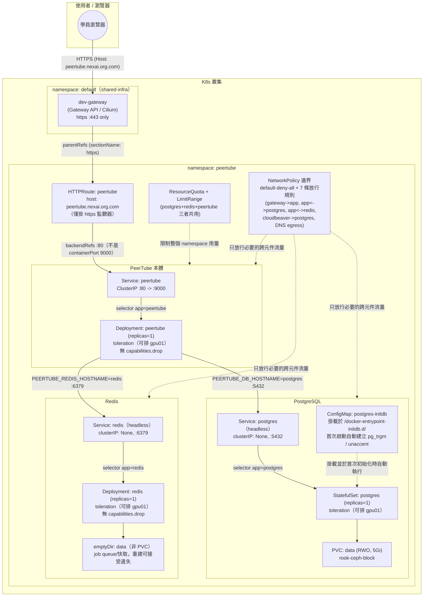

# PeerTube — 學員練習

## 產品說明

[PeerTube](https://joinpeertube.org/) 是基於 ActivityPub 協定與 P2P 技術的
去中心化影音分享平台（開源版 YouTube）。在本課程裡，它是**課程最後、最完整的
整合範例**：一次把前面所有產品分別學過的概念（StatefulSet、Secret、PVC、
ConfigMap 掛載腳本、跨元件 NetworkPolicy、節點排程）串在同一個 namespace 裡，
由 **3 個元件**組成：

- **PostgreSQL**（`postgres`）：`StatefulSet` + PVC，影片/使用者資料不能弄丟，
  還需要 `03-postgres-initdb-configmap.yaml` 這支 ConfigMap 在**第一次初始化**
  時自動掛到 `/docker-entrypoint-initdb.d/`，建立 PeerTube 要求的
  `pg_trgm`（模糊搜尋）/ `unaccent`（去重音搜尋）兩個 extension——全教材唯一
  一個「用 ConfigMap 掛資料庫初始化腳本」的範例。
- **Redis**（`redis`）：`Deployment` + `emptyDir`（**刻意不用** PVC/StatefulSet）。
  同樣是「資料庫類」服務，PostgreSQL 用 PVC、Redis 用 emptyDir，是本產品最重要
  的教學對照：該不該用持久化儲存，要看**資料本身重不重要**（job queue/快取
  重建遺失可接受），不是看「這是不是資料庫」這種表面分類。
- **PeerTube 本體**（`peertube`）：應用程式層，示範**反向代理感知設定**
  （`PEERTUBE_WEBSERVER_HTTPS`/`PEERTUBE_WEBSERVER_PORT`）跟**容器內部實際
  監聽 port**（9000）是兩個完全不同層次的概念——Gateway 在邊界做 TLS 終止，
  Pod 內部收到的永遠是明文 HTTP，但 PeerTube 產生的影片網址/ActivityPub
  聯邦資訊要用「使用者外部看到的網址」，這兩者搞混是所有「後面有反向代理」
  架構最常見的錯誤來源之一。

三個元件都加上 `toleration`，讓 Scheduler「可以」排到記憶體較寬裕的
`gpu01`、但不指定節點（`nodeSelector` 註解保留，沿用 onlyoffice 的排程做法），且 Redis、PeerTube 本體都**不能**
`capabilities.drop: [ALL]`（entrypoint 需要以 root 自降權），跟
mysql 同一種教訓、但跟 draw.io/filebrowser（可以 drop）、planka
（映像本身非 root，不需要 drop）形成完整的三方對照。

完整、已驗證可用的正解在上一層的 [../manifest/](../manifest/)（拆分版，
13 支編號檔案）與 [../peertube-all-in-one.yaml](../peertube-all-in-one.yaml)
（合併版）——**本目錄下的所有題目都以 `../manifest/` 為標準答案／驗收依據**，
寫完或修完後可直接跟正解 `diff` 對照。

## 架構圖

* 用 [drawio](https://www.drawio.com/) 開啟 `architecture.drawio` 檔
* 如不支援顯示 mermaid 圖，僅顯示程式碼，可用 [Mermaid Live Editor](https://mermaid.live/) 並貼上此程式顯示此架構圖


也提供 draw.io 原生格式的同一張圖：[architecture.drawio](architecture.drawio)
（這是全套教材最複雜的一張圖，用 namespace / 元件分組讓 3 個元件、3 個
Service、NetworkPolicy 邊界都保持清楚可讀）。

---

## 資源（CPU / Memory）該給多少？判斷方法

填 `__FILL_ME_3__`、`__FILL_ME_4__`、`__FILL_ME_6__`、`__FILL_ME_7__` 之前，
先建立這個概念：資源設定分成 **Pod/Container 層**（各元件自己的
`requests`/`limits`，本例已固定）和 **Namespace 層**
（`ResourceQuota`/`LimitRange`，這裡要填），兩層要互相對得上：

```text
LimitRange.min
  ≤
Container.requests
  ≤
Container.limits
  ≤
LimitRange.max
Σ(每個元件的 requests)
  ≤
ResourceQuota.hard.requests
Σ(每個元件的 limits)
  ≤
ResourceQuota.hard.limits
```

### 1. 三個元件各自的 `requests`/`limits`（本例已固定，不用填）

這個產品跟前面單一 Deployment 的產品不一樣，**namespace 裡同時跑 3 個獨立
元件**，要先把三者的數字列出來才看得懂後面 quota 怎麼算：

| 元件 | requests.cpu | requests.memory | limits.cpu | limits.memory |
|---|---|---|---|---|
| postgres（StatefulSet） | 200m | 512Mi | 1000m（`"1"`） | 1Gi |
| redis（Deployment） | 50m | 128Mi | 250m | 256Mi |
| peertube（Deployment） | 500m | 1Gi（1024Mi） | 2000m（`"2"`） | 2Gi（2048Mi） |
| **合計 Σ** | **750m** | **1664Mi（≈1.63Gi）** | **3250m（≈3.25 核）** | **3328Mi（≈3.25Gi）** |

CPU 是可壓縮資源（超過 limits 只會被節流變慢，不會被殺），Memory 是不可壓縮
資源（超過 limits 直接 OOMKilled）——這也是為什麼三個元件的
`limits/requests` 比例都抓在 2～5 倍之間，但 memory 抓得比 CPU 保守
（例如 peertube 是 2 倍，postgres 是 2 倍，redis 是 5 倍——redis 是輕量快取，
尖峰緩衝可以抓寬一點）。

### 2. `ResourceQuota.hard.requests.cpu`／`requests.memory`（`__FILL_ME_3__`、`__FILL_ME_4__` 要填的）

Namespace 總量配額，計算基準是**這個 namespace 裡所有 Pod 的 `requests`
加總**（不是 `limits`），公式：

```text
Σ(postgres.requests + redis.requests + peertube.requests)  ≤  ResourceQuota.hard.requests
```

本例：`Σrequests.cpu = 200m + 50m + 500m = 750m`、
`Σrequests.memory = 512Mi + 128Mi + 1024Mi = 1664Mi ≈ 1.63Gi`。配額不能只填
剛好等於目前用量——這個產品**沒有 HPA**（3 個元件都是固定 1 個 replica），
但仍要留給「日後調高某個元件副本數」或「LimitRange.default 生效在忘記寫
requests 的新 Pod」的餘裕，所以正解抓 `requests.cpu: "2"`（2000m，約 2.6 倍
餘裕）、`requests.memory: 3Gi`（3072Mi，約 1.85 倍餘裕）。`limits.cpu: "4"`／
`limits.memory: 6Gi`（本例已固定）同理，但要注意 `limits` 加總屬於合理的
超額訂閱（overcommit），不必要求 quota 的 limits 總量能同時滿足所有 Pod
都吃到頂——`Σlimits.cpu = 1000m+250m+2000m = 3250m ≤ 4000m`、
`Σlimits.memory = 1024Mi+256Mi+2048Mi = 3328Mi ≤ 6144Mi`，兩者都還有餘裕。

### 3. `LimitRange.max.cpu`／`min.memory`（`__FILL_ME_6__`、`__FILL_ME_7__` 要填的）

這兩個值是幫**整個 namespace**訂「單一容器」的天花板與地板，不是針對某一個
元件，所以要能同時包住三個元件裡「最大的那個」與「最小的那個」：

- `max.cpu`：namespace 裡任何一個容器最多能要多少，必須 **≥** 三個元件裡
  `limits.cpu` **最大**的那個（本例 peertube 的 `2000m`），正解填 `"2"`
  剛好等於這個最大值——沒有多留 buffer，這是刻意留給學員感受「等於」也算
  合法，但完全沒有緩衝空間、日後想加大 peertube 的 limits 就得連帶調整
  `max` 的實際案例。
- `min.memory`：namespace 裡任何一個容器最少要 request 多少，必須 **≤**
  三個元件裡 `requests.memory` **最小**的那個（本例 redis 的 `128Mi`），
  正解填 `64Mi`，留了一半的緩衝——抓太高會像本教材在幫 cloudbeaver 加
  Adminer 時真的踩過的坑一樣，擋掉合理的輕量容器。

**檢查你填的數字時，問自己這三個問題**：
1. 這個配額能同時容納 3 個元件（postgres + redis + peertube）目前的用量嗎？
   （不是只算其中一個）
2. `LimitRange.max` 有沒有 ≥ 三個元件裡 `limits` 最大的那個（peertube）？
   `LimitRange.min` 有沒有 ≤ 三個元件裡 `requests` 最小的那個（redis）？
3. `persistentvolumeclaims`（`__FILL_ME_5__`）配額夠不夠——這個 namespace
   實際會建立 **2 個 PVC**（postgres 的 `data` + peertube 的
   `peertube-storage`），配額要 ≥ 2，正解抓 `"4"` 留了日後加 PVC 的空間。

---

## 題目一：半成品 YAML 填空

檔案在 [manifest-incomplete/](manifest-incomplete/)，內容跟正解
`../manifest/` 完全一樣，只有標記 `__FILL_ME_n__` 的地方被挖空。請照著編號
填入正確的值，13 個檔案填完後依序 `kubectl apply`（或自行合併），目標是重現
與 `../manifest/` 完全等價（語意上）的部署。這是全套教材檔案數最多、填空
數最多的一題，建議先讀過一次 [../README.md](../README.md) 的教學重點說明
再開始填。

| 編號 | 檔案 | 題目 | 挖空欄位 | 提示 |
|---|---|---|---|---|
| `__FILL_ME_1__` | 00-namespace.yaml | 幫這個 namespace 取名字 | `metadata.name` | 這個值之後每個檔案的 `namespace:` 都要跟它一致，README 標題已經告訴你這個產品叫什麼 |
| `__FILL_ME_2__` | 00-namespace.yaml | 幫這個 namespace 加上分類標籤 | `labels.training/product` | 跟 `__FILL_ME_1__` 填同一個值即可（本教材慣例：label 值＝namespace 名稱） |
| `__FILL_ME_3__` | 01-resourcequota-limitrange.yaml | 設定整個 namespace 最多能同時 request 多少 CPU 總量 | `ResourceQuota.hard.requests.cpu` | 這個 namespace 同時跑 postgres/redis/peertube 三個元件，要把三者的 `requests.cpu` 加總後再留餘裕，見上面「資源該給多少」章節的計算 |
| `__FILL_ME_4__` | 01-resourcequota-limitrange.yaml | 設定整個 namespace 最多能同時 request 多少 Memory 總量 | `ResourceQuota.hard.requests.memory` | 同上，三個元件的 `requests.memory` 加總後留餘裕 |
| `__FILL_ME_5__` | 01-resourcequota-limitrange.yaml | 設定整個 namespace 最多能建立幾個 PVC | `ResourceQuota.hard.persistentvolumeclaims` | 這個 namespace 實際會建立幾個 PVC？（提示：不是只有 postgres 有，peertube 本體也有一個） |
| `__FILL_ME_6__` | 01-resourcequota-limitrange.yaml | 設定單一容器最多能要多少 CPU（上限） | `LimitRange.max.cpu` | 必須 ≥ 三個元件裡 `limits.cpu` 最大的那一個，是哪個元件？ |
| `__FILL_ME_7__` | 01-resourcequota-limitrange.yaml | 設定單一容器最少要 request 多少記憶體（下限） | `LimitRange.min.memory` | 必須 ≤ 三個元件裡 `requests.memory` 最小的那一個，是哪個元件？ |
| `__FILL_ME_8__` | 02-postgres-secret.yaml | 設定 PostgreSQL 的登入帳號 | `stringData.POSTGRES_USER` | 這個值之後會被 09-peertube-deployment.yaml 的 `PEERTUBE_DB_USERNAME` 引用，兩邊要對得上 |
| `__FILL_ME_9__` | 02-postgres-secret.yaml | 設定 PostgreSQL 要建立的資料庫名稱 | `stringData.POSTGRES_DB` | 這個值之後會被 09-peertube-deployment.yaml 的 `PEERTUBE_DB_NAME` 引用，兩邊要對得上 |
| `__FILL_ME_10__` | 03-postgres-initdb-configmap.yaml | 幫初始化腳本取檔名 | `data.<key>`（檔名） | 官方 postgres image 只認 `/docker-entrypoint-initdb.d/` 底下副檔名 `.sql`／`.sh` 的檔案，檔名本身沒有強制規則，但要讓人一看就懂用途 |
| `__FILL_ME_11__` | 03-postgres-initdb-configmap.yaml | 填入 PeerTube 官方文件要求的第一個 PostgreSQL extension | SQL 裡的 extension 名稱 | 做「模糊搜尋」用的那個 extension，README 說明段落有提到 |
| `__FILL_ME_12__` | 03-postgres-initdb-configmap.yaml | 填入 PeerTube 官方文件要求的第二個 PostgreSQL extension | SQL 裡的 extension 名稱 | 做「去重音搜尋」用的那個 extension，README 說明段落有提到 |
| `__FILL_ME_13__` | 04-postgres-service.yaml | 設定這個 Service 要不要配發 ClusterIP | `spec.clusterIP` | StatefulSet 通常搭配哪一種 Service（讓每個 Pod 有自己的 DNS 記錄，而不是共用一個負載平衡 IP）？填哪個特殊值代表「不要配發」？ |
| `__FILL_ME_14__` | 04-postgres-service.yaml | 設定這個 Service 要選中哪些 Pod | `spec.selector.app` | 跟 05-postgres-statefulset.yaml 的 `template.metadata.labels.app` 必須完全一致 |
| `__FILL_ME_15__` | 04-postgres-service.yaml | 設定 Service 要把流量轉去 Pod 的哪個 port | `spec.ports[0].targetPort` | 對應到 Pod 上 named port 的名稱，不是數字 |
| `__FILL_ME_16__` | 05-postgres-statefulset.yaml | 設定要把 Pod 排到哪一個節點 | `spec.template.spec.nodeSelector.<key>`（節點名稱） | 教學重點段落說明了為什麼這三個元件都要排到同一個節點，是哪個節點？（此行預設已註解、改以 toleration 為主不指定節點；屬選填，若要練習請取消註解後再填） |
| `__FILL_ME_17__` | 05-postgres-statefulset.yaml | 設定 initdb 腳本要掛到容器裡的哪個路徑 | `volumeMounts[1].mountPath` | 官方 postgres image 只會自動執行這一個固定路徑底下的初始化腳本，路徑錯了 extension 永遠不會被建立（可對照 `manifest-buggy/` 的除錯題感受這個症狀） |
| `__FILL_ME_18__` | 05-postgres-statefulset.yaml | 設定 initdb volume 要引用哪個 ConfigMap | `volumes[0].configMap.name` | 要跟 03-postgres-initdb-configmap.yaml 的 `metadata.name` 一致 |
| `__FILL_ME_19__` | 05-postgres-statefulset.yaml | 設定 PVC 要用哪個 StorageClass | `volumeClaimTemplates[0].spec.storageClassName` | 這座叢集**沒有 default StorageClass**，資料庫類單寫場景該選 RWO 還是 RWX 的那個 class？（`../README.md` 或 `../../training.md` 有列出叢集的 StorageClass 名稱） |
| `__FILL_ME_20__` | 05-postgres-statefulset.yaml | 設定 postgres 資料需要多少儲存空間 | `volumeClaimTemplates[0].spec.resources.requests.storage` | 這是教學用途的小容量配置，抓個位數 Gi 即可 |
| `__FILL_ME_21__` | 06-redis.yaml | 設定 redis Service 要選中哪些 Pod | `Service.spec.selector.app` | 跟同檔案 Deployment 的 `template.metadata.labels.app` 必須完全一致（`manifest-buggy/` 的除錯題就是在考這個） |
| `__FILL_ME_22__` | 06-redis.yaml | 設定 redis Service 要把流量轉去 Pod 的哪個 port | `Service.spec.ports[0].targetPort` | 對應到 Pod 上 named port 的名稱，不是數字 |
| `__FILL_ME_23__` | 06-redis.yaml | 設定要把 redis Pod 排到哪一個節點 | `Deployment.spec.template.spec.nodeSelector.<key>`（節點名稱） | 跟 `__FILL_ME_16__` 應該填同一個節點名稱——三個元件為什麼要排到同一台？（此行預設已註解、改以 toleration 為主不指定節點；屬選填，若要練習請取消註解後再填） |
| `__FILL_ME_24__` | 06-redis.yaml | 填入 redis 容器內部實際監聽的 port | `Deployment...containers[0].ports[0].containerPort` | redis 的預設監聽埠是多少？要跟 `__FILL_ME_22__` 對得上 |
| `__FILL_ME_25__` | 07-peertube-secret.yaml | 設定管理員帳號的 Email | `stringData.PEERTUBE_ADMIN_EMAIL` | 這是教學用途的固定值，只有在資料庫全新初始化時才會生效，任意填一個看起來像 email 的字串即可 |
| `__FILL_ME_26__` | 07-peertube-secret.yaml | 設定 PeerTube 應用程式連線資料庫要用的密碼 | `stringData.PEERTUBE_DB_PASSWORD` | 這個值必須跟 02-postgres-secret.yaml 的 `POSTGRES_PASSWORD` **完全一致**，否則 PeerTube 連得到 postgres 這個位址、但認證會失敗（`manifest-buggy/` 的除錯題就是在考這個） |
| `__FILL_ME_27__` | 08-peertube-pvc.yaml | 設定 PVC 要用哪個 StorageClass | `spec.storageClassName` | 跟 `__FILL_ME_19__` 填法邏輯一樣，這座叢集沒有 default StorageClass |
| `__FILL_ME_28__` | 08-peertube-pvc.yaml | 設定這個 PVC 的存取模式 | `spec.accessModes[0]` | 檔案上方教學註解解釋了為什麼這裡選單寫而不是多寫共享，該填哪個存取模式？ |
| `__FILL_ME_29__` | 09-peertube-deployment.yaml | 設定「使用者實際存取網址」用的埠號 | `env[PEERTUBE_WEBSERVER_PORT].value` | 這裡要填的是瀏覽器打進來看到的埠號（透過 Gateway 走 https），不是容器內部監聽的埠號——两者是完全不同的兩件事，檔案上方教學註解有詳細解釋 |
| `__FILL_ME_30__` | 09-peertube-deployment.yaml | 設定「使用者實際存取網址」是否為 https | `env[PEERTUBE_WEBSERVER_HTTPS].value` | 這個產品的 HTTPRoute 只掛了 https 監聽器，這裡該填 `"true"` 還是 `"false"`？ |
| `__FILL_ME_31__` | 09-peertube-deployment.yaml | 設定要信任哪些來源的反向代理位址 | `env[PEERTUBE_TRUST_PROXY].value` | PeerTube 預設只信任 `loopback`（127.0.0.1），但流量是從 Gateway 的 Pod 網路進來的，要額外加上哪個值才能讓 PeerTube 正確判斷來源 IP／協定？（提示：RFC1918 私有位址的意思） |
| `__FILL_ME_32__` | 09-peertube-deployment.yaml | 設定要連去哪個 hostname 存取 Redis | `env[PEERTUBE_REDIS_HOSTNAME].value` | 要跟 06-redis.yaml 的 Service `metadata.name` 一致 |
| `__FILL_ME_33__` | 09-peertube-deployment.yaml | 設定要連去哪個 hostname 存取 PostgreSQL | `env[PEERTUBE_DB_HOSTNAME].value` | 要跟 04-postgres-service.yaml 的 Service `metadata.name` 一致 |
| `__FILL_ME_34__` | 09-peertube-deployment.yaml | 填入 PeerTube 容器內部實際監聽的 port | `containers[0].ports[0].containerPort` | 這是容器自己的監聽埠，注意跟 `__FILL_ME_29__` 填的「外部埠號」是不同層次的兩個數字，不要填成一樣 |
| `__FILL_ME_35__` | 09-peertube-deployment.yaml | 設定要掛載哪個 PVC 當作影片儲存空間 | `volumes[0].persistentVolumeClaim.claimName` | 要跟 08-peertube-pvc.yaml 的 `metadata.name` 一致 |
| `__FILL_ME_36__` | 10-peertube-service.yaml | 設定這個 Service 要選中哪些 Pod | `spec.selector.app` | 跟 09-peertube-deployment.yaml 的 `template.metadata.labels.app` 必須完全一致 |
| `__FILL_ME_37__` | 10-peertube-service.yaml | 設定 Service 要把流量轉去 Pod 的哪個 port | `spec.ports[0].targetPort` | 對應到 Pod 上 named port 的名稱，不是數字 |
| `__FILL_ME_38__` | 11-httproute.yaml | 設定對外存取這個服務要用的網域名稱 | `hostnames[0]` | 沿用叢集網域慣例：`<product>.nexai.org.com`，這個 product 是什麼？ |
| `__FILL_ME_39__` | 11-httproute.yaml | 設定 HTTPRoute 要把流量轉去 Service 的哪個 port | `backendRefs[0].port` | 看 10-peertube-service.yaml 裡 Service 對外開的是幾號 port（不是 containerPort，也不是 `__FILL_ME_29__` 那個外部埠號） |
| `__FILL_ME_40__` | 11-httproute.yaml | 設定這個 HTTPRoute 要掛在哪個 Gateway 底下 | `parentRefs[0].name` | 看 `../../shared-infra/` 底下那份共用資源叫什麼名字 |
| `__FILL_ME_41__` | 12-networkpolicy.yaml | 設定只放行進到 peertube 容器的哪個 port | `allow-ingress-to-peertube-from-gateway.spec.ingress[0].ports[0].port` | 跟 `__FILL_ME_34__` 應該是同一個號碼（NetworkPolicy 管的是實際監聽的容器 port，不是外部埠號） |
| `__FILL_ME_42__` | 12-networkpolicy.yaml | 設定這條規則要保護哪個元件的 Pod | `allow-ingress-to-postgres-from-peertube.spec.podSelector.matchLabels.app` | 這條規則的名字已經告訴你它在保護誰 |
| `__FILL_ME_43__` | 12-networkpolicy.yaml | 設定要放行「哪個元件」打進來的流量到 redis | `allow-ingress-to-redis-from-peertube.spec.ingress[0].from[0].podSelector.matchLabels.app` | 這條規則的名字已經告訴你放行的來源是誰 |

**提示總則**：不確定的話，`../manifest/` 目錄下同名檔案就是答案，但建議先自己
推理過一輪，再對答案 —— 光是抄答案學不到「為什麼」。

---

## 題目二：埋錯除錯

檔案在 [manifest-buggy/](manifest-buggy/)，是一份**看起來完整、可以直接
`kubectl apply` 的部署**，但裡面藏了 **6 個真的會讓部署失敗或行為異常的錯誤**，
分散在不同檔案裡（每個檔案最多一個錯，也有檔案完全沒錯）。請先整套 apply 下去，
再用 `kubectl describe` / `kubectl get -o yaml` / `kubectl logs` 等指令找出問題、
修正它們，過程本身就是最寫實的維運訓練。這是整套課程元件數最多的產品，除錯時
記得先確認「是哪一個 Pod／哪一段流量」出問題，再往下追。

不直接告訴你錯在哪一行，但提供症狀方向：

1. **其中一個檔案**：PeerTube Pod 會 `Running` 且 Ready，但第一次開啟網站
   完成註冊/新增影片等操作時，`kubectl logs` 會看到跟 postgres
   **authentication failed** 有關的錯誤，資料庫連線位址是對的，只有認證會失敗。
   跟兩個不同 Secret 之間的一致性有關。
2. **其中一個檔案**：PeerTube Pod 表面上一切正常（Running、Ready、網站打得開），
   但實際記錄到的來源 IP、或是否為 https 的判斷會出現異常，這個問題不會讓
   部署失敗，很容易被忽略。跟反向代理層的信任設定有關。
3. **其中一個檔案**：`postgres-0` Pod 會 `Running` 且 Ready，但 PeerTube Pod
   第一次啟動跑資料庫 migration 時會失敗，`kubectl logs` 會看到跟缺少某個
   PostgreSQL extension 有關的錯誤。跟 ConfigMap 有沒有真的掛到 postgres
   映像認得的那個路徑有關。
4. **其中一個檔案**：redis Deployment 的 Pod 會 `Running` 且 Ready（`redis-cli
   ping` 探測沒問題），但 `kubectl get endpoints redis -n peertube` 卻是空的，
   PeerTube Pod 連不到 redis，背景工作佇列相關功能會出現連線錯誤。跟 label
   有關。
5. **其中一個檔案**：套用整套 NetworkPolicy 之前一切正常，但套用之後 PeerTube
   Pod 突然連不到 postgres（之前連得到），`kubectl logs` 出現連線逾時
   （timeout，不是 authentication 失敗）。跟某條規則放行的 port 號碼有關。
6. **其中一個檔案**：HTTPRoute 狀態顯示 `Accepted: True`，但透過 Gateway
   實際存取會失敗或連不到網站；直接對 Service 測試卻正常。跟 backendRefs
   打的 port 號碼該對應 Service 的哪個 port 有關。

找到並修正全部 6 個之後，用下面「驗收標準」章節確認整套環境真的健康。

**提示**：懷疑某個資源設定錯了的時候，可以直接跟 `../manifest/` 同名檔案
`diff`，但建議先靠 `kubectl describe` / `kubectl get events -n peertube
--sort-by=.lastTimestamp` / `kubectl logs` 這些第一手觀察線索自己推理，養成
真正除錯的直覺，而不是直接比對兩份檔案找不同。

---

## 驗收標準

不論是完成「題目一：填空」還是「題目二：除錯」，都用下面同一套標準驗收，
目標是跟 `../manifest/`（正解）部署起來的最終狀態等價：

- [ ] `kubectl get pods -n peertube -o wide` 顯示 **3 個 Pod**
      （`redis-*`、`postgres-0`、`peertube-*`）皆為 `Running` 且
      `READY 1/1`（沒有 `CrashLoopBackOff`、沒有 `0/1`、沒有 `Pending`）；
      落在哪個節點由 Scheduler 決定，若有取消註解 `nodeSelector` 則都必須在
      `gpu01`
- [ ] `kubectl exec -n peertube postgres-0 -- psql -U peertube -d peertube -c
      "\dx"` 顯示已安裝的 extension 清單裡有 `pg_trgm` 與 `unaccent`
      （證明 ConfigMap 初始化腳本真的有跑）
- [ ] `kubectl get endpoints postgres redis peertube -n peertube` **三個都
      不是空的** `<none>`，各自有對應的 Pod IP
- [ ] `kubectl describe httproute peertube -n peertube` 的
      `Status.Conditions` 顯示 `Accepted: True` 且 `ResolvedRefs: True`
- [ ] `curl -k -H "Host: peertube.nexai.org.com" https://<dev-gateway
      EXTERNAL-IP>/` 回傳 HTTP 200，且內容是真的 PeerTube 前端頁面
      （不是連線失敗、不是 502/503）
- [ ] 首次啟動的管理員帳號密碼有從 `kubectl logs -n peertube deploy/peertube`
      的啟動記錄裡確認過（`root` 帳號＋首次安裝建立時使用的密碼），並知道
      這組密碼**只有全新安裝那一刻**有效，之後改 Secret 不會回頭生效
- [ ] （若有套用 12-networkpolicy.yaml）套用後重新測試上面的 curl 與
      `psql`/`redis-cli` 連線，確認 NetworkPolicy 放行了 `peertube <-> postgres`
      與 `peertube <-> redis` 這兩條跨元件流量，沒有把正常流量擋掉
- [ ] 填完/修完的檔案在語意上與 `../manifest/` 一致
      （可用 `diff -u manifest-incomplete/ ../manifest/` 或
      `diff -u manifest-buggy/ ../manifest/` 做最終比對，兩邊應該只剩下
      教學註解、練習提示這類非語意差異）

全部打勾即完成本產品的練習。
