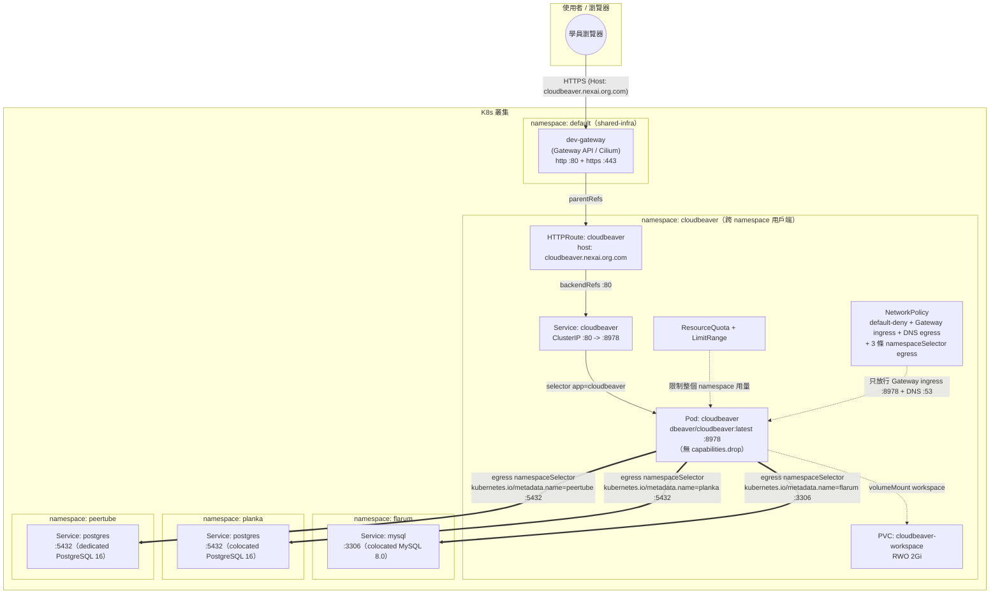

# CloudBeaver — 學員練習

## 產品說明

[CloudBeaver](https://dbeaver.com/) 是 DBeaver 官方推出的 Web 版本，同一個
瀏覽器介面可以建立多組資料庫連線、支援 MySQL/PostgreSQL 等多種資料庫，是一個
通用的視覺化資料庫管理工具（DBeaver-like）。跟前面幾個「本身就是一個應用」的
產品不同，CloudBeaver 在這門課裡**不屬於任何單一產品**，而是專門拿來集中查看/
驗證其他產品用到的資料庫內容的工具型產品。

課程走到這裡，前面各產品的 `*-all-in-one.yaml` 已經陸續出現不少資料庫，掃過
一輪後，真正跑著一個「可以用一般 SQL client 連進去」的網路資料庫的只有三個：
flarum 併在自己 namespace 裡的 mysql（3306）、planka 併在自己 namespace 裡的
postgres（5432）、peertube 專屬的 postgres（5432）。CloudBeaver 就是同時串接
這三個資料庫的共用用戶端，是全課程**第一個、也是唯一一個**「主動連到好幾個
不同 namespace」的產品，NetworkPolicy 的 egress 規則要用 `namespaceSelector`
分別指到 flarum/planka/peertube 三個 namespace（用叢集自動加上的
`kubernetes.io/metadata.name` 標籤比對，不用另外自訂標籤）——這是本教材
NetworkPolicy 主題的**壓軸／收尾概念**，也是把 flarum/planka/peertube 三個
產品串起來複習的整合練習：填完/修完本練習，等於把「同 namespace
podSelector-to-podSelector」（flarum、planka）跟「跨 namespace
namespaceSelector」兩種零信任網路模型都走過一遍。

完整、已驗證可用的正解在上一層的 [../manifest/](../manifest/)（拆分版）與
[../cloudbeaver-all-in-one.yaml](../cloudbeaver-all-in-one.yaml)（合併版）——
**本目錄下的所有題目都以 `../manifest/` 為標準答案／驗收依據**，寫完或修完後
可直接跟正解 `diff` 對照。

## 架構圖

* 用 [drawio](https://www.drawio.com/) 開啟 `architecture.drawio` 檔
* 如不支援顯示 mermaid 圖，僅顯示程式碼，可用 [Mermaid Live Editor](https://mermaid.live/) 並貼上此程式顯示此架構圖


也提供 draw.io 原生格式的同一張圖：[architecture.drawio](architecture.drawio)
（三條粗紅色虛線就是跨 namespace 的三條 egress——這是本圖跟其他產品架構圖
最不一樣的地方，也是這個產品的教學重點所在）。

---

## 資源（CPU / Memory）該給多少？判斷方法

填 `__FILL_ME_3__`～`__FILL_ME_5__` 之前，先建立這個概念：資源設定分成
**Pod/Container 層**（Deployment 裡的 `requests`/`limits`）和 **Namespace 層**
（`ResourceQuota`/`LimitRange`），兩層要互相對得上：

```text
LimitRange.min
  ≤  
Container.requests
  ≤  
Container.limits
  ≤  
LimitRange.max
Σ(replicas × 每個 Pod 的 requests)
  ≤  
ResourceQuota.hard.requests
Σ(replicas × 每個 Pod 的 limits)
  ≤  
ResourceQuota.hard.limits
```

### 1. Container 的 `requests`（本例已固定：cpu 250m / memory 512Mi）

`requests` 代表這個容器「平常穩定執行」大概需要的量，是**排程器**用來決定
把 Pod 排到哪個節點的依據。CloudBeaver 是 Java（GlassFish/Jetty）應用，JVM
本身啟動就要吃掉一截記憶體（class loading、JIT 暖機），起始需求比前面
PHP/Node 類的產品（draw.io、flarum）高一截，所以這裡直接抓比較寬鬆的數字，
不是跟 draw.io 一樣的 100m/256Mi，實際部署後再用 `kubectl top pod` 校正。

### 2. Container 的 `limits`（本例已固定：cpu "1" / memory 1536Mi）

`limits` 是允許這個容器「尖峰時最多」能用到的量。跟 draw.io 一樣的邏輯：

- **CPU 是可壓縮資源**：超過 `limits` 只會被節流變慢，不會被殺，比例可以抓寬
  一點（本例 1000m / 250m = 4 倍）。
- **Memory 是不可壓縮資源**：超過 `limits` 會直接被 **OOMKilled**，JVM 又特別
  容易一口氣吃到 heap 上限，所以 Memory 的 limit/request 比例要抓保守一點
  （本例 1536Mi / 512Mi = 3 倍，介於「省資源」與「JVM GC 前留緩衝」之間）。

### 3. `LimitRange.max` / `min`（`__FILL_ME_4__`、`__FILL_ME_5__` 要填的）

這兩個值是幫**整個 namespace**訂「單一容器」的天花板與地板：

- `max`：namespace 裡任何一個容器最多能要多少，必須 **≥** 目前 Deployment
  實際填的 `limits`（本例 Deployment 的 `limits.cpu: "1"` ≤ `max.cpu`），
  否則 Pod 會被 LimitRange 直接擋掉、連 Pending 都排不進去。
- `min`：namespace 裡任何一個容器最少要 request 多少，必須 **≤** 目前
  Deployment 實際填的 `requests`（本例 `requests.memory: 512Mi` ≥
  `min.memory`）。抓太高會擋掉合理的輕量容器——這門課真的在幫 cloudbeaver
  這個 namespace 加 Adminer 當第二個資料庫周邊工具時踩過這個坑：Adminer
  是很輕量的 PHP 應用，`requests.memory` 遠低於 CloudBeaver 自己這個
  Deployment 的量，如果 `min.memory` 抓得跟 CloudBeaver 一樣高，Adminer 的
  Pod 會直接被 LimitRange 擋掉、Forbidden 都出不去，這也是 `min` 該抓
  「這個 namespace 裡預期最小的合理容器」而不是「抓跟現有工作負載一樣」
  的活教材。
- `default`/`defaultRequest`（本例已寫好 cpu 500m/250m、memory 1Gi/512Mi）：
  使用者忘記寫 `requests`/`limits` 時的自動預設值，剛好對得上目前
  Deployment 實際填的數字（不是巧合，是刻意讓「預設值＝目前唯一工作負載的
  需求」）。

### 4. `ResourceQuota.hard.requests.cpu`（`__FILL_ME_3__` 要填的）

Namespace 總量配額，計算基準是**這個 namespace 裡所有 Pod 的 `requests`
加總**（不是 `limits`），公式：

```text
Σ(每個 Deployment/StatefulSet 的 replicas × 每個 Pod 的 requests)  ≤  ResourceQuota.hard.requests
```

本例：`replicas: 1`（CloudBeaver 用 `Recreate` 策略、只開 1 個 replica，
沒有 HPA），每個 Pod `requests.cpu: 250m`，目前用量 = 1 × 250m = 250m。
配額不能只填剛好 250m——這個 namespace 除了 CloudBeaver 本體，`pods: "3"`、
`persistentvolumeclaims: "2"` 這兩個上限已經暗示官方留了空間給未來加第二個
資料庫周邊工具（例如上面提到的 Adminer），配額至少要蓋過目前唯一工作負載的
requests，再留一點給未來擴充的餘裕（正解用 `"500m"`，等於留了 1 倍餘裕）。
`limits.cpu`/`limits.memory` 那兩格（本例已固定為 `"2"`/`2Gi`）同理，屬合理的
超額訂閱（overcommit），不必要求 quota 的 limits 總量能同時滿足所有 Pod 都
吃到頂。

**檢查你填的數字時，問自己這三個問題**：
1. 這個配額能容納 Deployment 目前的 1 個 Pod 嗎？
2. 有沒有留一點空間給這個 namespace 未來可能加的第二個工具（`pods: "3"`
   已經留了名額，CPU/Memory 配額也該同步留一點）？
3. LimitRange 的 `max`/`min` 有沒有把 Deployment 實際的 `requests`/`limits`
   包在中間，而不是卡在外面？

---

## 題目一：半成品 YAML 填空

檔案在 [manifest-incomplete/](manifest-incomplete/)，內容跟正解 `../manifest/`
完全一樣，只有標記 `__FILL_ME_n__` 的地方被挖空。請照著編號填入正確的值，
7 個檔案填完後依序 `kubectl apply`（或自行合併），目標是重現與 `../manifest/`
完全等價（語意上）的部署。**這個產品的填空題特別把重心放在
`06-networkpolicy.yaml` 的 `namespaceSelector` egress 規則上**（編號 20～28），
因為那是這個產品唯一、也是全課程壓軸的新概念，務必填完並想清楚每一格的意義。

| 編號 | 檔案 | 題目 | 挖空欄位 | 提示 |
|---|---|---|---|---|
| `__FILL_ME_1__` | 00-namespace.yaml | 幫這個 namespace 取名字 | `metadata.name` | 這個值之後每個檔案的 `namespace:` 都要跟它一致，README 標題已經告訴你這個產品叫什麼 |
| `__FILL_ME_2__` | 00-namespace.yaml | 幫這個 namespace 加上分類標籤 | `labels.training/product` | 跟 `__FILL_ME_1__` 填同一個值即可（本教材慣例：label 值＝namespace 名稱） |
| `__FILL_ME_3__` | 01-resourcequota-limitrange.yaml | 設定整個 namespace 最多能同時 request 多少 CPU 總量 | `ResourceQuota.hard.requests.cpu` | Deployment 只開 1 個 replica，容器 `requests.cpu: 250m`；配額至少要蓋過這個量，並留一點給未來可能加的第二個資料庫周邊工具（`pods: "3"` 已經暗示留了名額）（進階提示：填得太小會讓唯一的 Pod 直接被 quota 擋在門外，連 Pending 都排不進去，可對照 `manifest-buggy/` 的除錯題感受這個症狀） |
| `__FILL_ME_4__` | 01-resourcequota-limitrange.yaml | 設定單一容器最多能要多少 CPU（上限） | `LimitRange.max.cpu` | 必須 ≥ Deployment 裡容器實際填的 `limits.cpu`，否則 Pod 會被 LimitRange 擋掉 |
| `__FILL_ME_5__` | 01-resourcequota-limitrange.yaml | 設定單一容器最少要 request 多少記憶體（下限） | `LimitRange.min.memory` | 必須 ≤ Deployment 裡容器實際填的 `requests.memory`，抓太高會擋掉未來想加進這個 namespace 的輕量容器（這門課幫 cloudbeaver 加 Adminer 時真的踩過這個坑） |
| `__FILL_ME_6__` | 02-pvc.yaml | 設定這個 PVC 的存取模式 | `spec.accessModes[0]` | 只有 1 個 replica 會掛這顆 PVC，需要「單一節點可讀寫」還是「多節點共享讀寫」？（跟 filebrowser 那種多 Pod 共享的情境不一樣） |
| `__FILL_ME_7__` | 02-pvc.yaml | 設定要用哪個 StorageClass | `spec.storageClassName` | 這座叢集**沒有 default StorageClass**，要明確指定；RWO 單寫場景這門課統一用哪個 Ceph StorageClass？（可參考其他資料庫類產品，例如 flarum/planka 的 PVC） |
| `__FILL_ME_8__` | 02-pvc.yaml | 設定要申請多少容量 | `spec.resources.requests.storage` | 只是存帳號/連線設定的 workspace 目錄，不是存實際資料表內容，不需要很大 |
| `__FILL_ME_9__` | 03-deployment.yaml | 填入 CloudBeaver 官方容器映像的名稱 | `containers[0].image` | DBeaver 官方在 Docker Hub 發布的 CloudBeaver 映像叫什麼？檔案上方教學註解與 README 產品說明都有寫 |
| `__FILL_ME_10__` | 03-deployment.yaml | 填入容器內部應用程式實際監聽的 port | `containers[0].ports[0].containerPort` | 跟 04-service.yaml 的 `targetPort: http` 這個 named port、以及 06-networkpolicy.yaml 放行 Gateway ingress 的那個 port 要三邊對得上 |
| `__FILL_ME_11__` | 03-deployment.yaml | 設定 liveness 探測要等待幾秒才開始檢查 | `livenessProbe.initialDelaySeconds` | 檔案上方教學註解直接寫了原因：Java 應用冷啟動比 PHP/Node 慢，太早開始檢查會在應用程式還在初始化時就被砍掉；這個值該抓多寬鬆？（比 `readinessProbe` 的 30 秒還要更長） |
| `__FILL_ME_12__` | 03-deployment.yaml | 設定 workspace 要掛載到容器內的哪個路徑 | `volumeMounts[0].mountPath` | CloudBeaver 的 GlobalConfigurationDir，檔案上方教學註解有寫這個目錄的用途 |
| `__FILL_ME_13__` | 03-deployment.yaml | 設定要掛哪一個 PVC | `volumes[0].persistentVolumeClaim.claimName` | 要跟 02-pvc.yaml 裡 `metadata.name` 完全一致，否則 Pod 會卡在找不到 PVC |
| `__FILL_ME_14__` | 03-deployment.yaml | **觀念題（不是 YAML 值）**：這個 container 為什麼沒有 `securityContext.capabilities.drop` | 無對應欄位，寫在旁邊或口頭回答即可 | 對照 `../../draw.io/manifest/02-deployment.yaml` 的 `capabilities.drop: [ALL]`——CloudBeaver 官方 entrypoint 用 root 身分做了什麼事，才需要保留預設 capability？（提示：跟 mysql/postgres/redis 同一種「先 chown PVC 再降權」模式） |
| `__FILL_ME_15__` | 04-service.yaml | 設定這個 Service 要選中哪些 Pod | `spec.selector.app` | 跟 Deployment 的 `template.metadata.labels.app` 必須完全一致，否則 Service 找不到任何 Endpoint（`manifest-buggy/` 的除錯題就是在考這個） |
| `__FILL_ME_16__` | 04-service.yaml | 設定 Service 要把流量轉去 Pod 的哪個 port | `spec.ports[0].targetPort` | 對應到 Pod 上 named port 的名稱，不是數字 |
| `__FILL_ME_17__` | 05-httproute.yaml | 設定這個 HTTPRoute 要掛在哪個 Gateway 底下 | `parentRefs[0].name` | 看 `../../shared-infra/` 底下那份共用資源叫什麼名字 |
| `__FILL_ME_18__` | 05-httproute.yaml | 設定對外存取這個服務要用的網域名稱 | `hostnames[0]` | 沿用叢集網域慣例：`<product>.nexai.org.com`，這個 product 是什麼？ |
| `__FILL_ME_19__` | 05-httproute.yaml | 設定 HTTPRoute 要把流量轉去 Service 的哪個 port | `backendRefs[0].port` | 看 04-service.yaml 裡 Service 對外開的是幾號 port（不是 containerPort） |
| `__FILL_ME_20__` | 06-networkpolicy.yaml | 設定「放行 Gateway 進來」這條規則要保護哪些 Pod | `allow-ingress-to-cloudbeaver-from-gateway.spec.podSelector.matchLabels.app` | 和 Service/Deployment 用同一組 label |
| `__FILL_ME_21__` | 06-networkpolicy.yaml | 設定只放行進到容器的哪個 port | `allow-ingress-to-cloudbeaver-from-gateway.spec.ingress[0].ports[0].port` | 跟 `__FILL_ME_10__` 應該是同一個號碼 |
| `__FILL_ME_22__` | 06-networkpolicy.yaml | 設定「連到三個資料庫」這條 egress 規則要套用在哪些 Pod 上 | `allow-egress-cloudbeaver-to-databases.spec.podSelector.matchLabels.app` | 一樣是這個產品的 Pod，和上面幾格填同一個值 |
| `__FILL_ME_23__` | 06-networkpolicy.yaml | 設定第一條 egress 規則要放行連到哪個 namespace（flarum） | `egress[0].to[0].namespaceSelector.matchLabels."kubernetes.io/metadata.name"` | 這是**這個產品的核心教學重點**：不是用自訂 label，是用 K8s 幫每個 namespace 自動加上的內建標籤，值就是 namespace 的名字本身。這條要放行去 flarum |
| `__FILL_ME_24__` | 06-networkpolicy.yaml | 設定第一條 egress 規則只放行到哪個 port | `egress[0].ports[0].port` | flarum 那個 mysql 監聽在哪個標準 port？README 上方的資料庫對照表有寫 |
| `__FILL_ME_25__` | 06-networkpolicy.yaml | 設定第二條 egress 規則要放行連到哪個 namespace（planka） | `egress[1].to[0].namespaceSelector.matchLabels."kubernetes.io/metadata.name"` | 同 `__FILL_ME_23__` 的邏輯，這條要放行去 planka |
| `__FILL_ME_26__` | 06-networkpolicy.yaml | 設定第二條 egress 規則只放行到哪個 port | `egress[1].ports[0].port` | planka 那個 postgres 監聽在哪個標準 port？ |
| `__FILL_ME_27__` | 06-networkpolicy.yaml | 設定第三條 egress 規則要放行連到哪個 namespace（peertube） | `egress[2].to[0].namespaceSelector.matchLabels."kubernetes.io/metadata.name"` | 同上，這條要放行去 peertube |
| `__FILL_ME_28__` | 06-networkpolicy.yaml | 設定第三條 egress 規則只放行到哪個 port | `egress[2].ports[0].port` | peertube 那個 postgres 監聽在哪個標準 port？ |

**提示總則**：不確定的話，`../manifest/` 目錄下同名檔案就是答案，但建議先自己
推理過一輪，再對答案 —— 光是抄答案學不到「為什麼」。另外提醒：部署這個產品
之前，flarum/planka/peertube 都要先部署好，而且要重新 apply 過各自最新的
NetworkPolicy（裡面已經加了放行 cloudbeaver 連進來的 `allow-ingress-to-*-from-cloudbeaver`
規則），不然就算 `06-networkpolicy.yaml` 填得全對，egress 流量在對方
namespace 的 ingress 那一側還是會被擋下來。

---

## 題目二：埋錯除錯

檔案在 [manifest-buggy/](manifest-buggy/)，是一份**看起來完整、可以直接
`kubectl apply` 的部署**，但裡面藏了 **4 個真的會讓部署失敗或行為異常的錯誤**，
分散在不同檔案裡（每個檔案最多一個錯，也有檔案完全沒錯）。請先整套 apply 下去
（記得 flarum/planka/peertube 也要先部署並套用最新 NetworkPolicy），再用
`kubectl describe` / `kubectl get -o yaml` / `kubectl logs` / `kubectl exec`
等指令找出問題、修正它們，過程本身就是最寫實的維運訓練。

不直接告訴你錯在哪一行，但提供症狀方向：

1. **其中一個檔案**：`kubectl get pods -n cloudbeaver` 顯示 Pod 一直卡在
   `Pending`，甚至 Deployment 根本連 1 個 Pod 都建立不出來，
   `kubectl describe replicaset -n cloudbeaver` 或
   `kubectl get events -n cloudbeaver` 的 Events 會看到跟 exceeded quota
   相關的訊息。跟 namespace 的資源配額有關——注意這個產品只有 **1 個
   replica**，跟前面 draw.io 除錯題「第二個 Pod 卡住」的症狀不太一樣，這次
   是連唯一的第一個 Pod 都生不出來。
2. **其中一個檔案**：Pod 會不斷 `CrashLoopBackOff`，`kubectl logs` 會看到
   跟權限（permission）有關的錯誤訊息，容器起不來就死掉。跟
   `securityContext` 有關——回想一下這個產品的教學重點：官方 entrypoint
   到底需不需要 root 權限去動 PVC？
3. **其中一個檔案**：Pod 會 `Running` 且 `READY 1/1`，但
   `kubectl get endpoints cloudbeaver -n cloudbeaver` 永遠是空的，透過
   Gateway 連線會得到 503 / connection refused。跟 label 有關。
4. **其中一個檔案**：進到 Pod 裡測試 TCP 連線（見下方「驗收標準」的指令），
   會發現**能連到兩個資料庫，但第三個連不上**（`/dev/tcp` 測試卡住/逾時，
   不是立刻被拒絕）。跟 `NetworkPolicy` 的 egress 規則有關——三條
   `namespaceSelector` 規則裡，有一條指到了不存在的 namespace 名稱。

找到並修正全部 4 個之後，用下面「驗收標準」章節確認整套環境真的健康。

**提示**：懷疑某個資源設定錯了的時候，可以直接跟 `../manifest/` 同名檔案
`diff`，但建議先靠 `kubectl describe` / `kubectl get events -n cloudbeaver
--sort-by=.lastTimestamp` 這些第一手觀察線索自己推理，養成真正除錯的直覺，
而不是直接比對兩份檔案找不同。

---

## 驗收標準

不論是完成「題目一：填空」還是「題目二：除錯」，都用下面同一套標準驗收，
目標是跟 `../manifest/`（正解）部署起來的最終狀態等價：

- [ ] `kubectl get pods -n cloudbeaver` 顯示 1 個 Pod，為 `Running` 且
      `READY 1/1`（沒有 `CrashLoopBackOff`、沒有 `0/1`、沒有 `Pending`、
      沒有異常 `RESTARTS`）
- [ ] `kubectl get pvc -n cloudbeaver` 顯示 `cloudbeaver-workspace` 為
      `Bound`
- [ ] `kubectl get endpoints cloudbeaver -n cloudbeaver` 顯示 **1 個**
      Pod IP:8978（不是空的 `<none>`）
- [ ] `kubectl describe httproute cloudbeaver -n cloudbeaver` 的
      `Status.Conditions` 顯示 `Accepted: True` 且 `ResolvedRefs: True`
- [ ] `curl -H "Host: cloudbeaver.nexai.org.com" http://<dev-gateway EXTERNAL-IP>/`
      回傳 HTTP 200，且內容是真的 CloudBeaver 頁面（不是連線失敗、不是 503）
- [ ] 同上，改用 `https://` + `-k`（自簽憑證）也回傳 200
- [ ] 從 cloudbeaver Pod 內部確認能用**原始 TCP**連到三個目標資料庫
      （不需要密碼，純粹驗證 NetworkPolicy 有沒有放行——這是本產品獨有的
      驗收步驟，因為它的網路架構是跨 namespace）：
      ```bash
      POD=$(kubectl get pod -n cloudbeaver -l app=cloudbeaver -o jsonpath='{.items[0].metadata.name}')
      kubectl exec -n cloudbeaver "$POD" -- bash -c 'echo > /dev/tcp/mysql.flarum.svc.cluster.local/3306 && echo OK'
      kubectl exec -n cloudbeaver "$POD" -- bash -c 'echo > /dev/tcp/postgres.planka.svc.cluster.local/5432 && echo OK'
      kubectl exec -n cloudbeaver "$POD" -- bash -c 'echo > /dev/tcp/postgres.peertube.svc.cluster.local/5432 && echo OK'
      ```
      三條都要印出 `OK`；任何一條卡住/逾時，代表對應那條 `namespaceSelector`
      egress 規則（或對方 namespace 的 `allow-ingress-*-from-cloudbeaver`
      ingress 規則）有問題。
- [ ] （若有套用 06-networkpolicy.yaml）套用後重新測試上面的 curl 與三條
      TCP 連線，確認 NetworkPolicy 沒有把 Gateway 進來的流量或連到三個
      資料庫的流量擋掉
- [ ] 填完/修完的檔案在語意上與 `../manifest/` 一致
      （可用 `diff -u manifest-incomplete/ ../manifest/` 或
      `diff -u manifest-buggy/ ../manifest/` 做最終比對，兩邊應該只剩下
      教學註解、練習提示這類非語意差異）

**範圍說明（不列入自動驗收）**：CloudBeaver 第一次啟動需要在瀏覽器手動完成
管理員設定精靈（GraphQL API 在 `configurationMode: true` 狀態下無法程式化
完成這一步，是產品本身的真實限制），且帳號名稱不能取 `admin`（已知的保留
名稱撞名 bug，細節見 [../README.md](../README.md) 的「上課前請先確認」章節）。
這個手動步驟**不是**本練習題的一部分，也不會被上面任何一條驗收標準檢查到——
上面的驗收標準只確認「K8s 資源本身部署正確、Pod 健康、網路連得到」，不涉及
CloudBeaver 應用層的帳號設定。

全部打勾即完成本產品的練習。
