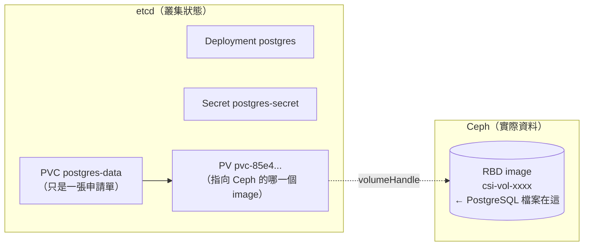

# 單元 1：Kubernetes 備份與復原概念

> 先把「備份 Kubernetes」拆開：到底有哪幾種東西要備份？各自住在哪裡？
> 用什麼工具備份？哪一種備份能解決哪一種災難？

## 目錄

1. [Kubernetes Resource 與 Application Data 的差異](#1-kubernetes-resource-與-application-data-的差異)
2. [etcd 保存什麼](#2-etcd-保存什麼)
3. [PVC / Volume 保存什麼](#3-pvc--volume-保存什麼)
4. [Object Storage 在備份架構中的角色](#4-object-storage-在備份架構中的角色)
5. [Velero 能解決什麼問題](#5-velero-能解決什麼問題)
6. [etcd Backup 能解決什麼問題](#6-etcd-backup-能解決什麼問題)
7. [為什麼「有備份」不等於「一定能還原」](#7-為什麼有備份不等於一定能還原)
8. [課堂觀察練習](#8-課堂觀察練習)

---

## 1. Kubernetes Resource 與 Application Data 的差異

以 `dr-demo` 為例，同一個「PostgreSQL 應用」其實由兩種完全不同性質的東西組成：

| | Kubernetes Resource（叢集狀態） | Application Data（應用資料） |
|---|---|---|
| 例子 | Deployment、Service、Secret、ConfigMap、PVC **物件**、HTTPRoute | PostgreSQL 的資料表、CephFS 上的 `dr-test.txt` |
| 長什麼樣子 | YAML / JSON，幾 KB | 資料庫檔案、使用者上傳的檔案，可能數百 GB |
| 住在哪裡 | **etcd** | **PV 背後的儲存系統**（本叢集：Ceph RBD / CephFS） |
| 誰寫進去的 | 管理者 `kubectl apply`、Controller | 應用程式在執行期間寫入 |
| 能不能重新產生 | 通常可以（Git 裡有 yaml → GitOps 重新套用） | **不行**。訂單、使用者資料丟了就是丟了 |
| 備份工具 | Velero（資源）、etcd snapshot（整個叢集狀態） | Velero Volume 備份（CSI Snapshot + Data Mover / File System Backup）、應用自己的 dump |

**一句話：** etcd 裡只有「這裡應該有一個 10Gi 的 PVC」這個**描述**，
PVC 裡面的**內容**不在 etcd 裡。只備份 etcd（或只備份 YAML），救回來的是
一個空殼——單元 5 情境 1 會實際重現「Pod Running、table 也在，但訂單全不見」。



---

## 2. etcd 保存什麼

etcd 是 Kubernetes 唯一的「資料庫」，API Server 是唯一會直接讀寫它的元件。
所有 `kubectl get` 看得到的東西，最後都是 etcd 裡的一筆 key/value：

```text
/registry/deployments/dr-demo/postgres
/registry/secrets/dr-demo/postgres-secret
/registry/persistentvolumeclaims/dr-demo/postgres-data
/registry/persistentvolumes/pvc-85e449cf-902b-463b-b555-b5ba1a06cc7b
/registry/namespaces/dr-demo
/registry/leases/kube-system/...           ← 連 leader election 都在
/registry/velero.io/backups/velero/...     ← CRD 的物件也在
```

- **有**：所有 namespace、所有資源、所有 CRD 物件、RBAC、Node 物件、Lease、Event。
- **沒有**：容器 image、PV 裡的資料、節點上的檔案、etcd 自己的憑證
  （`/etc/kubernetes/pki`）、Secret 靜態加密金鑰（`encryption-config.yaml`）。
- 本叢集有開 **Secret 靜態加密**：etcd 裡的 Secret 是加密過的密文。
  只有 etcd snapshot、沒有 `/etc/kubernetes/encryption-config.yaml`，
  還原後 API Server 讀不出任何 Secret → 單元 6 把這把金鑰列為「必須跟
  snapshot 一起備份」的項目。

---

## 3. PVC / Volume 保存什麼

| 物件 | 在哪裡 | 內容 |
|---|---|---|
| `PersistentVolumeClaim` | etcd | 「我要 10Gi、RWO、`rook-ceph-block`」的申請單 |
| `PersistentVolume` | etcd | 「這張申請單綁到 Ceph 上 `csi-vol-xxxx` 這顆 image」的對應 |
| 實際的區塊裝置 / 檔案系統 | Ceph（叢集節點的硬碟） | 應用程式真正寫入的資料 |

本叢集兩種 StorageClass 在備份上的差別：

| StorageClass | 類型 | 存取 | Velero 備份方式 | dr-demo 中的例子 |
|---|---|---|---|---|
| `rook-ceph-block` | Ceph RBD（區塊） | RWO | CSI Snapshot（`csi-rbdplugin-snapclass`）→ Data Mover 上傳 | `postgres-data`（實測 47,876,961 bytes） |
| `rook-cephfs` | CephFS（檔案） | RWX | CSI Snapshot（`csi-cephfsplugin-snapclass`）→ Data Mover 上傳 | `shared-data`（實測 45 bytes） |

⚠️ **reclaimPolicy 是 `Delete`**：刪掉 PVC（或刪掉整個 namespace）時，
Ceph 上的 image / subvolume 會被一起刪除。「不小心刪 namespace」在這座叢集
上等於「資料立刻消失」，沒有資源回收筒。

---

## 4. Object Storage 在備份架構中的角色

備份一定要能回答：**「如果整座叢集（包含 Ceph）都不見了，備份還在嗎？」**

| 存放位置 | 叢集內 Pod 掛了 | Namespace 被刪 | Ceph 壞掉 | 整座叢集消失 |
|---|---|---|---|---|
| 只有 CSI Snapshot（存在 Ceph 裡） | ✅ | ⚠️ 視 VolumeSnapshotContent 的 deletionPolicy | ❌ | ❌ |
| PVC 裡另外放一份 dump | ✅ | ❌ | ❌ | ❌ |
| **叢集外的 Object Storage（S3）** | ✅ | ✅ | ✅ | ✅ |

所以 Object Storage 在架構裡扮演三個角色：

1. **故障隔離（failure domain 分離）**：跟叢集不同機器、不同磁碟
   （本課：`10.90.1.125` 的 `/dev/sdb1`）。
2. **共同語言**：Velero、etcd 備份腳本、資料庫 dump 工具都會講 S3 API，
   一套儲存可以收全部種類的備份。
3. **可攜性**：新叢集只要指向同一個 bucket，就能看到舊叢集的所有備份
   （單元 8 重建叢集的關鍵）。

Velero 在 bucket 裡的實際結構（實測）：

```text
s3://velero/
├── backups/<備份名稱>/        ← 資源 manifest tar.gz、log、resource-list、volumeinfo
├── restores/<還原名稱>/       ← 還原 log 與結果
└── kopia/<namespace>/        ← Data Mover 上傳的 PV 資料（kopia repository，去重、加密）
```

---

## 5. Velero 能解決什麼問題

Velero 透過 **Kubernetes API** 工作（讀/寫資源），不直接碰 etcd：

| 情境 | Velero 適不適合 | 原因 |
|---|---|---|
| 誤刪一個 namespace / 應用 | ✅ 最適合 | 可以只還原那一個 namespace，不影響其他人 |
| 應用資料被寫壞（例如錯誤的 migration） | ✅ | 還原 PV 資料到指定時間點（可還原到另一個 namespace 比對） |
| 把應用搬到另一座叢集 | ✅ | 新叢集接上同一個 BSL 即可還原 |
| 整座叢集消失 | ✅（搭配重建） | 先重建空叢集 + 基礎元件，再用 Velero 還原應用 |
| etcd 資料損壞、control plane 起不來 | ❌ | Velero 本身跑在叢集裡，API Server 都掛了它也無能為力 |
| 回到「整座叢集某個時間點」的精確狀態 | ❌ 不擅長 | Velero 是逐一重建資源，不是原子性的時間點快照 |

---

## 6. etcd Backup 能解決什麼問題

etcd snapshot 是整個 etcd 資料庫在某一刻的**完整、一致**複本：

| 情境 | etcd snapshot 適不適合 | 原因 |
|---|---|---|
| etcd 資料損壞 / 多數成員掛掉失去 quorum | ✅ 唯一解 | 從 snapshot 重建 etcd 叢集 |
| 有人 `kubectl delete` 掉大量叢集層級資源（CRD、ClusterRole…） | ✅ | 整座叢集回到 snapshot 時間點 |
| 只想救回一個 namespace | ❌ 太粗 | 還原 etcd 會讓**全叢集**回到過去，其他團隊在那之後的變更全部消失 |
| 救回 PV 裡的資料 | ❌ | etcd 裡根本沒有 PV 資料 |
| 還原到**別的**叢集 | ❌ 不建議 | snapshot 綁著原叢集的憑證、Node、IP、ServiceAccount token |

---

## 7. 為什麼「有備份」不等於「一定能還原」

「備份成功」只證明 Velero 把**它被要求備份的東西**寫進 Object Storage。
中間任何一環沒想到，都會變成「Completed 的備份，救不回來的應用」：

| 斷點 | 症狀 | 單元 5 實測 |
|---|---|---|
| 沒備份 Volume 資料 | Pod Running、table 在，但業務資料全空 | 情境 1 ✅ |
| 排除了 Secret | `CreateContainerConfigError` | 情境 2 ✅ |
| 排除了 ConfigMap | Pod 卡在 `ContainerCreating`（FailedMount） | 情境 3 ✅ |
| 目標叢集沒有同名 StorageClass | PVC 永遠 `Pending`，Restore `PartiallyFailed` | 情境 4 ✅ |
| 快照前資料還在記憶體 | 檔案存在但 **0 bytes** | 情境 5 ✅ |
| 備份放在叢集裡 | 叢集一掛備份也跟著沒了 | 單元 2 |
| 從沒演練過還原 | 真的出事才發現少了憑證、少了步驟、RTO 遠超預期 | 單元 9 |

在這 5 個實測情境裡，**Velero 的 Backup 全部顯示 `Completed`、0 errors、
0 warnings**。能證明備份有用的只有一件事：**定期實際還原，並用資料驗證**。

---

## 8. 課堂觀察練習

以下都是唯讀指令，可以直接在課堂上跑：

```bash
# (1) 同一個應用，Resource 在 etcd、Data 在 Ceph —— 找出 PVC 對應到哪顆 Ceph image
kubectl -n dr-demo get pvc postgres-data -o jsonpath='{.spec.volumeName}{"\n"}'
kubectl get pv <上一行的 PV 名稱> -o jsonpath='{.spec.csi.volumeHandle}{"\n"}'

# (2) 看 PV 的 reclaimPolicy —— 刪 namespace 會不會連資料一起刪？
kubectl get pv -o custom-columns=PV:.metadata.name,CLAIM:.spec.claimRef.name,NS:.spec.claimRef.namespace,POLICY:.spec.persistentVolumeReclaimPolicy | grep dr-demo

# (3) 叢集裡有哪些 VolumeSnapshotClass（Velero CSI 備份靠它們）
kubectl get volumesnapshotclass

# (4) Velero 把備份放在哪裡
velero backup-location get
```

**問題討論：**

1. 如果只有 GitOps（所有 yaml 都在 Git），還需要 Velero 嗎？（提示：Git 裡有 PostgreSQL 的資料嗎？）
2. 如果只有 etcd snapshot，誤刪 `dr-demo` 之後能只救回 `dr-demo` 嗎？代價是什麼？
3. CSI Snapshot 已經在 Ceph 裡了，為什麼還要 `snapshotMoveData` 搬到 SeaweedFS？
