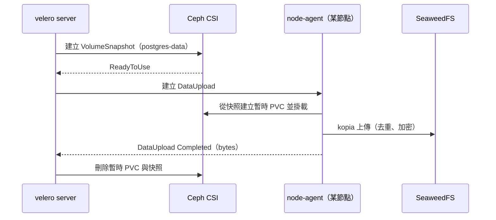

# 單元 3：第一次 Backup — 備份 Application

> 用 Velero UI 建立第一份備份，並且學會回答：「這份備份**真的**完成了嗎？」

## 目錄

1. [準備：受害者應用 dr-demo](#1-準備受害者應用-dr-demo)
2. [使用 Velero UI 建立 Backup](#2-使用-velero-ui-建立-backup)
3. [Include / Exclude Namespace](#3-include--exclude-namespace)
4. [Include / Exclude Resource](#4-include--exclude-resource)
5. [Label Selector](#5-label-selector)
6. [Volume Data Backup](#6-volume-data-backup)
7. [Backup Status / Warning / Error](#7-backup-status--warning--error)
8. [確認 Backup 是否真的完成](#8-確認-backup-是否真的完成)
9. [練習](#9-練習)

```text
03-first-backup/velero/
├── backup-dr-demo.yaml     第一次備份的 Backup CR（逐欄位註解）＝ UI 精靈送出的內容
└── backup-examples.yaml    Include/Exclude/Selector 五種對照範例 + 等價 CLI
```

---

## 1. 準備：受害者應用 dr-demo

```bash
kubectl apply -f dr/manifest/                 # 或 kubectl apply -f dr/dr-all-in-one.yaml
kubectl -n dr-demo rollout status deploy/postgres
./dr/script/write-postgres.sh                 # 寫入 DR-TEST-DB-001
./dr/script/check-data.sh                     # 備份前先確認 3 項全 PASS —— 這是之後比對的基準
./dr/script/baseline.sh                       # （建議）留存叢集基準紀錄
```

dr-demo 的組成（這就是我們要保護的「一個應用」）：

| 資源 | 名稱 | 備註 |
|---|---|---|
| Namespace | `dr-demo` | |
| Secret | `postgres-secret` | DB 帳密 |
| Deployment / Service | `postgres` | PostgreSQL 16 |
| PVC（RBD, RWO） | `postgres-data` | 資料庫檔案 |
| PVC（CephFS, RWX） | `shared-data` | `dr-test.txt` |
| Pod | `cephfs-test-1` / `cephfs-test-2` | 寫入 / 讀取 CephFS |

---

## 2. 使用 Velero UI 建立 Backup

本課程使用 **OTWLD Velero UI**（安裝見 [../velero-ui/](../velero-ui/)）：
`https://velero.nexai.org.com`。

UI 是一個**逐步精靈（step-by-step wizard）**，每一步都對應到 Backup CR 的
欄位。欄位名稱可能隨 UI 版本（本課程為 0.10.2）略有不同，但**背後產生的
永遠是同一個 Backup 物件**：

| 精靈步驟 | 本課程填什麼 | 對應 Backup CR 欄位 |
|---|---|---|
| 名稱 | `dr-demo-backup-01` | `metadata.name` |
| Namespaces（包含 / 排除） | 包含 `dr-demo` | `spec.includedNamespaces` / `excludedNamespaces` |
| Resources（包含 / 排除） | 不填（全部） | `spec.includedResources` / `excludedResources` |
| Cluster-scoped 資源 | 不設定（自動） | `spec.includeClusterResources` |
| Label Selector | 不填 | `spec.labelSelector` |
| Volume 快照 | 開啟 | `spec.snapshotVolumes: true` |
| Snapshot Move Data | **開啟** | `spec.snapshotMoveData: true` |
| File System Backup | 關閉 | `spec.defaultVolumesToFsBackup: false` |
| Storage Location | `default` | `spec.storageLocation` |
| TTL | `720h`（30 天） | `spec.ttl` |

送出之後，**第一件事**是去確認 UI 實際產生了什麼。UI 的備份詳細頁有
Manifest 檢視，也可以直接用 kubectl：

```bash
kubectl -n velero get backup dr-demo-backup-01 -o yaml
```

跟 [velero/backup-dr-demo.yaml](velero/backup-dr-demo.yaml) 對照，確認
`includedNamespaces`、`snapshotMoveData` 等欄位符合你的預期。**UI 是方便的
輸入介面，但判斷依據永遠是 CR 本身。**

等價 CLI（本課程實測使用的指令）：

```bash
velero backup create dr-course-backup-01 \
  --include-namespaces dr-demo \
  --snapshot-move-data \
  --wait
```

---

## 3. Include / Exclude Namespace

| 寫法 | 意思 | 用途 |
|---|---|---|
| `includedNamespaces: [dr-demo]` | 只備份 dr-demo | **應用層級備份**（本課主線） |
| `includedNamespaces: [dr-demo, filebrowser]` | 多個應用一起 | 有相依關係的一組應用 |
| `includedNamespaces: ["*"]` + `excludedNamespaces: [kube-system, velero, rook-ceph]` | 全叢集，扣掉系統元件 | 每日全量備份（單元 9） |

為什麼要排除 `kube-system` / `velero` / `rook-ceph`？這些是**基礎元件**，
重建叢集時應該用它們自己的安裝方式（kubeadm、velero install、Rook Helm）
重新建立，而不是從備份把舊狀態倒回去（單元 8 會詳細說明順序）。

---

## 4. Include / Exclude Resource

```bash
# 只要設定、不要資料
velero backup create example-c --include-namespaces dr-demo --include-resources secrets,configmaps
# 全部，但排除 Event
velero backup create example-d --include-namespaces dr-demo --exclude-resources events,events.events.k8s.io
```

`includeClusterResources` 是最容易被誤用的一個：

| 值 | 行為 | 實測物件數 |
|---|---|---|
| 不設定（`null`，預設） | 只帶上跟被選 namespace **有關**的 cluster 資源（PV、CRD） | **19** 個（`dr-course-backup-01`） |
| `true` | **整座叢集**所有 cluster-scoped 資源（Node、ClusterRole、StorageClass、所有 CRD……） | **921** 個（舊備份 `dr-demo-backup-001`） |

舊的那份 `includeClusterResources: true` 備份，還原時產生了 **188 個
warnings**（幾乎都是「已存在，跳過」）——看起來嚇人，而且真正重要的警告會
被淹沒。除非真的要搬整座叢集的設定，否則應用層級備份不要設 `true`。

---

## 5. Label Selector

```bash
velero backup create example-e --include-namespaces dr-demo --selector app=postgres
```

⚠️ Label Selector 是套用在**每一個資源**上，不是「選 namespace」或「選應用」。
實測（2026-09-23，對 dr-demo 用 `app=postgres`）：

```text
Resource List:
  apps/v1/ReplicaSet:          dr-demo/postgres-54bfb985f9, ...
  v1/Pod:                      dr-demo/postgres-54bfb985f9-grjh5, ...
  v1/PersistentVolumeClaim:    dr-demo/postgres-data     ← 沒有 label，但被 Pod 引用而連帶加入
  v1/PersistentVolume:         pvc-85e449cf-...          ← 被 PVC 引用而連帶加入
  v1/Namespace:                dr-demo
  （沒有 Deployment、沒有 Secret、沒有 Service、沒有 shared-data）
```

原因：`dr-demo` 的 Deployment 只有 `spec.template.metadata.labels` 有
`app=postgres`，**Deployment 自己的 `metadata.labels` 是空的**；Secret 和
Service 也都沒貼 label。這份備份 `Completed`，但還原後只有一堆沒人管的
ReplicaSet/Pod，沒有帳密、沒有 Service。

**結論：** 要用 Label Selector，就要先建立「所有資源都貼上
`app.kubernetes.io/instance=<app>`」的規範；不然用 namespace 當備份邊界最安全。

---

## 6. Volume Data Backup

Velero 有三種方式處理 PV 資料，這座叢集用第 2 種：

| 方式 | 設定 | 資料放哪 | 叢集消失還在嗎 | 備註 |
|---|---|---|---|---|
| 1. CSI Snapshot（只拍快照） | `snapshotVolumes: true` | Ceph 裡 | ❌ | 最快，但跟資料同一個故障域 |
| **2. CSI Snapshot + Data Mover** | `snapshotVolumes: true` + `snapshotMoveData: true` | **S3（kopia）** | ✅ | 先拍快照（一致性時間點），再由 node-agent 把快照內容上傳 |
| 3. File System Backup | `defaultVolumesToFsBackup: true` | S3（kopia） | ✅ | node-agent 直接讀 Pod 的掛載目錄；不需 CSI，但不是時間點快照 |

Data Mover 的實際流程：



實測觀察 DataUpload：

```bash
$ kubectl -n velero get datauploads -l velero.io/backup-name=dr-course-backup-01 \
    -o custom-columns=NAME:.metadata.name,PVC:.spec.sourcePVC,PHASE:.status.phase,BYTES:.status.progress.totalBytes,NODE:.status.node
NAME                        PVC             PHASE       BYTES      NODE
dr-course-backup-01-gl5tr   shared-data     Completed   45         k8s02
dr-course-backup-01-xrdz9   postgres-data   Completed   47876961   k8s01
```

`shared-data` 只有 45 bytes——正好是 `dr-test.txt` 的大小
（`DR-TEST-FS-001\n` 15 bytes + `CephFS Disaster Recovery Test\n` 30 bytes）。
**BYTES 是判斷「資料有沒有真的被搬走」最直接的數字**。

---

## 7. Backup Status / Warning / Error

| Phase | 意思 | 該怎麼辦 |
|---|---|---|
| `New` / `Queued` | 等待處理（Velero 一次處理一份備份） | 等 |
| `InProgress` | 正在備份資源 | 等 |
| `WaitingForPluginOperations` | 資源已備份，Data Mover 還在上傳 | 看 DataUpload 進度 |
| `Finalizing` | 收尾（上傳 metadata） | 等 |
| **`Completed`** | 完成，沒有 error | **仍要做第 8 節的檢查** |
| `PartiallyFailed` | 有部分項目失敗 | `velero backup describe` 看 Errors，**不能當作可用備份** |
| `Failed` | 整份失敗 | `velero backup logs` |
| `FailedValidation` | 參數錯（例如 BSL 不存在） | 看 `status.validationErrors` |

Warning 與 Error 的差別：

- **Error**：某個項目沒備份到 → `PartiallyFailed`。
- **Warning**：備份到了，但有需要注意的地方（例如某個 hook 沒執行）→ 仍然是
  `Completed`。**Completed + warnings > 0 一定要打開來看。**

```bash
velero backup describe dr-course-backup-01            # 摘要（含 Warnings/Errors 區塊）
velero backup describe dr-course-backup-01 --details  # 完整資源清單 + Volume 細節
velero backup logs dr-course-backup-01 | grep -Ei 'level=(error|warning)'
```

---

## 8. 確認 Backup 是否真的完成

實測結果（`velero backup describe dr-course-backup-01 --details`，節錄）：

```text
Phase:  Completed

Namespaces:
  Included:  dr-demo

Snapshot Move Data:            true
Data Mover:                    velero
TTL:  720h0m0s

Started:    2026-09-23 16:27:52 +0800 CST
Completed:  2026-09-23 16:29:30 +0800 CST

Total items to be backed up:  19
Items backed up:              19

Backup Item Operations:  2 of 2 completed successfully, 0 failed
Backup Volumes:
  CSI Snapshots:
    dr-demo/postgres-data:
      Data Movement:
        Moved data Size (bytes): 47876961
        Result: succeeded
    dr-demo/shared-data:
      Data Movement:
        Moved data Size (bytes): 45
        Result: succeeded
```

**備份完成檢查清單**（每一項都要打勾，缺一不可）：

| # | 檢查 | 指令 / 位置 | 本次結果 |
|---|---|---|---|
| 1 | Phase 是 `Completed` | `velero backup get` | ✅ |
| 2 | Errors = 0，Warnings 已逐一看過 | `velero backup describe` | ✅ 0 / 0 |
| 3 | Items backed up = Total items | describe | ✅ 19 / 19 |
| 4 | 範圍正確：Resource List 有 Deployment、Secret、Service、PVC | `describe --details` | ✅ |
| 5 | 每個 PVC 都出現在 Backup Volumes，且 Result = succeeded | `describe --details` | ✅ 2 / 2 |
| 6 | Moved data Size 合理（不是 0、跟實際資料量同級） | describe / DataUpload | ✅ 47.8MB / 45B |
| 7 | 檔案真的在叢集外 | [單元 2 第 6 節](../02-backup-storage/#6-確認備份資料確實寫入叢集外部) | ✅ |
| 8 | **能還原，而且資料對** | 單元 4 | 👉 下一單元 |

第 8 項是唯一真正能證明備份有用的一項——單元 5 會示範 1~7 全部打勾、
第 8 項卻失敗的情況。

---

## 9. 練習

1. 用 UI 建立一份備份，只包含 `dr-demo` 的 `secrets` 和 `configmaps`。
   用 `kubectl -n velero get backup <name> -o yaml` 確認 UI 產生的
   `includedResources` 是否正確。
2. 對 `dr-demo` 用 `--selector app=postgres` 備份，對照第 5 節的實測結果。
   然後替 Deployment、Secret、Service 都補上 `app: postgres` 的
   `metadata.labels`，再備份一次，比較 Resource List 的差異。
3. 故意把 `snapshotMoveData` 關掉備份一次，`describe --details` 的
   Backup Volumes 區塊有什麼不同？這份備份在「Ceph 整個壞掉」時還有用嗎？
4. 算一算：`dr-course-backup-01` 從 Started 到 Completed 花了多久？
   如果資料量放大 1000 倍（約 48GB），`itemOperationTimeout: 4h` 夠不夠？
