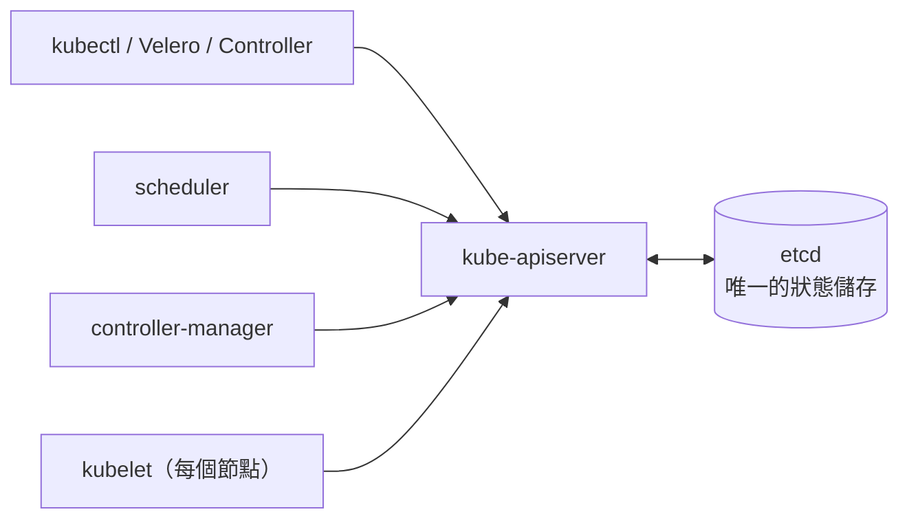
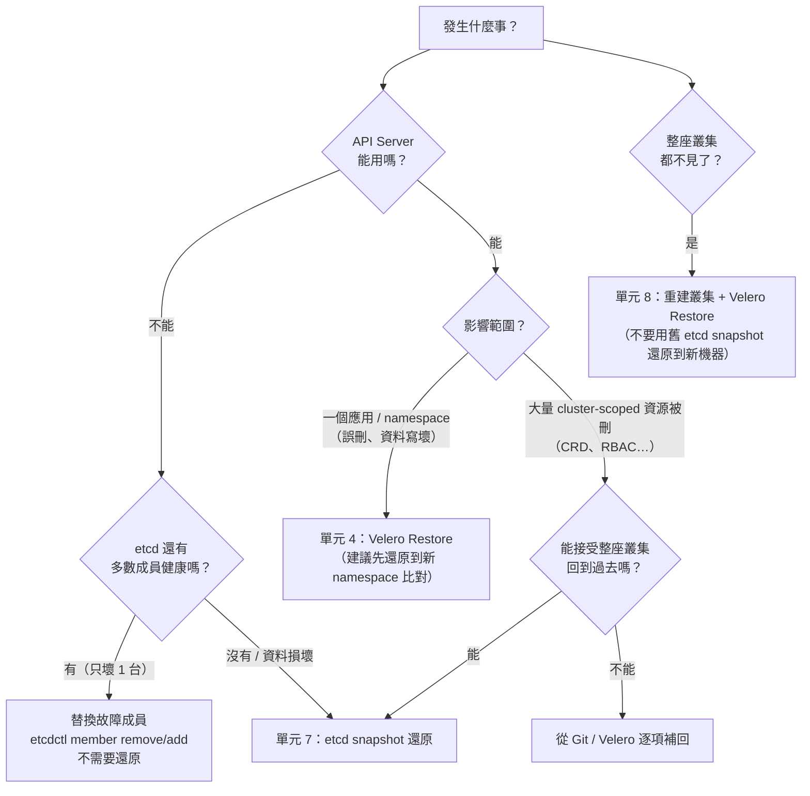

# 單元 6：建立 etcd 備份與還原策略

> Velero 保護的是「應用」；etcd snapshot 保護的是「叢集本身」。

## 目錄

1. [etcd 在 Kubernetes 中扮演什麼角色](#1-etcd-在-kubernetes-中扮演什麼角色)
2. [這座叢集的 etcd 長什麼樣子](#2-這座叢集的-etcd-長什麼樣子)
3. [etcd Snapshot](#3-etcd-snapshot)
4. [Backup 檔案保存位置](#4-backup-檔案保存位置)
5. [備份頻率與保留策略](#5-備份頻率與保留策略)
6. [etcd Backup 與 Velero Backup 的差異](#6-etcd-backup-與-velero-backup-的差異)
7. [什麼情況應該使用哪一種 Restore](#7-什麼情況應該使用哪一種-restore)
8. [講師操作：啟用並驗證 etcd 備份](#8-講師操作啟用並驗證-etcd-備份)
9. [練習](#9-練習)

```text
06-etcd-strategy/
├── manifest/
│   ├── 00-namespace.yaml                  etcd-backup namespace
│   ├── 01-s3-credentials.yaml.example     S3 帳密範本（.example：apply 目錄時不會被套用）
│   ├── 02-scripts-configmap.yaml          上傳 + 保留天數清理腳本
│   └── 03-cronjob.yaml                    k8s01/02/03 各一支 CronJob（與線上一致，suspend: true）
└── script/
    └── backup-control-plane-files.sh      備份 PKI / 加密金鑰 / static Pod manifest（snapshot 以外的必需品）
```

> 本單元的 yaml 與線上 `etcd-backup` namespace 的物件**完全一致**
> （`kubectl apply --dry-run=server` 回報 `unchanged`），線上目前是
> `suspend: true`。依課程決定，**不在文件撰寫時啟用**，由講師上課時操作第 8 節。

---

## 1. etcd 在 Kubernetes 中扮演什麼角色



- etcd 是一個**強一致**的分散式 key/value 資料庫（Raft 共識）。
- **只有 API Server 直接讀寫 etcd**，其他元件都經過 API Server。
- etcd 掛了 = API Server 無法讀寫 = `kubectl` 全部失敗、Controller 停擺。
  但**已經在跑的容器不會馬上停**（kubelet 繼續維持現有 Pod）——這是
  control plane 災難的典型特徵：「服務還在，但什麼都不能改」。
- 3 個成員的 etcd 可容忍 **1 個**成員故障（需要多數 = 2 票）。
  2 個成員同時掛掉 → 失去 quorum → 整個 etcd 唯讀甚至不可用。

---

## 2. 這座叢集的 etcd 長什麼樣子

從 `kubectl -n kube-system get pod etcd-k8s01 -o yaml` 查到的實際設定：

| 項目 | 值 | 對備份/還原的意義 |
|---|---|---|
| 拓樸 | **stacked**：每台 control-plane（k8s01~03）各跑一個 etcd static Pod | 還原時 3 台都要處理 |
| 版本 | `registry.k8s.io/etcd:3.6.6-0` | 用同版本的 `etcdctl` / `etcdutl` |
| 資料目錄 | `--data-dir=/var/lib/etcd` | 還原會產生新的資料目錄 |
| client URL | `https://127.0.0.1:2379`、`https://10.90.1.8x:2379` | 備份要在 control-plane 節點上連 127.0.0.1 |
| 憑證 | `/etc/kubernetes/pki/etcd/{ca,server,peer}.{crt,key}` | 連線要 mTLS；憑證本身**不在** snapshot 裡 |
| static Pod manifest | `/etc/kubernetes/manifests/etcd.yaml` | 還原時靠「移走 manifest」停止 etcd |
| API Server | `--etcd-servers=https://127.0.0.1:2379` | 每台 API Server 只連本機 etcd |
| **Secret 加密** | `--encryption-provider-config=/etc/kubernetes/encryption-config.yaml` | ⚠️ snapshot 裡的 Secret 是密文，**金鑰必須另外備份** |
| VIP | kube-vip `10.90.1.80` | 還原期間 API 不通，VIP 會在節點間漂移 |

講師可在任一 control-plane 上查看成員狀態（需 root，或透過 etcd Pod）：

```bash
# 透過 etcd Pod 執行（etcd image 內含 etcdctl）
kubectl -n kube-system exec etcd-k8s01 -- etcdctl \
  --endpoints=https://10.90.1.81:2379,https://10.90.1.82:2379,https://10.90.1.83:2379 \
  --cacert=/etc/kubernetes/pki/etcd/ca.crt \
  --cert=/etc/kubernetes/pki/etcd/server.crt \
  --key=/etc/kubernetes/pki/etcd/server.key \
  member list -w table

# 同樣的 TLS 參數，把 member list 換成：
#   endpoint status -w table   → 看 leader、DB 大小、raft index
#   endpoint health -w table   → 看每個成員是否健康
```

> 📝 撰寫本文件時，自動化環境的權限政策不允許直接對 etcd 執行指令
> （會接觸到叢集憑證），所以這裡**沒有附上實測輸出**，請講師課前自行跑一次並
> 記錄 DB 大小，作為估算備份檔大小與還原時間的依據。

---

## 3. etcd Snapshot

```bash
ETCDCTL_API=3 etcdctl snapshot save /backup/snapshot.db \
  --endpoints=https://127.0.0.1:2379 \
  --cacert=/etc/kubernetes/pki/etcd/ca.crt \
  --cert=/etc/kubernetes/pki/etcd/server.crt \
  --key=/etc/kubernetes/pki/etcd/server.key

etcdutl snapshot status /backup/snapshot.db --write-out=table
# +----------+----------+------------+------------+
# |   HASH   | REVISION | TOTAL KEYS | TOTAL SIZE |
# +----------+----------+------------+------------+
# | ...      | ...      | ...        | ...        |
```

重點：

- **snapshot 是線上操作**，不需要停 etcd，對叢集幾乎沒有影響。
- 從任一個健康成員拍都可以，內容是完整叢集狀態。
- `etcdctl`（需要連線）負責 `save`；`etcdutl`（離線檔案工具，etcd 3.5+）負責
  `status` / `restore`。舊教材常寫 `etcdctl snapshot restore`，在 3.6 已移除。
- 官方 etcd image 是 distroless（**沒有 shell**），所以線上 CronJob 把
  「拍 snapshot」和「上傳」拆成兩個容器（見 `03-cronjob.yaml` 的註解）。

**snapshot 只有一半。** 要把它還原成可用的叢集，還需要
[script/backup-control-plane-files.sh](script/backup-control-plane-files.sh)
備份的這些檔案：

| 檔案 | 少了它會怎樣 |
|---|---|
| `/etc/kubernetes/encryption-config.yaml`（+ `encryption/`） | API Server 讀不出**任何** Secret（`Internal error: ... failed to decrypt`） |
| `/etc/kubernetes/pki/ca.*`、`sa.*` | 所有 kubeconfig、ServiceAccount token 失效；kubelet 連不上 |
| `/etc/kubernetes/pki/etcd/*` | etcd 成員之間、API Server 到 etcd 的 mTLS 無法建立 |
| `/etc/kubernetes/manifests/*.yaml` | 不知道原本的 API Server / etcd 啟動參數（audit、OIDC、加密……） |

---

## 4. Backup 檔案保存位置

| 位置 | 評價 |
|---|---|
| control-plane 節點本機 `/var/lib/etcd-backup` | ❌ 節點壞了就一起沒了；kubeadm 預設教學常見的錯誤示範 |
| 叢集內的 PVC | ❌ 需要叢集活著才能讀 |
| **叢集外 Object Storage**（本課程：SeaweedFS bucket `etcd-backups/<node>/`） | ✅ |
| 再複製一份到異地 / 離線媒體 | ✅✅ 防勒索軟體、防機房災難 |

線上 CronJob 的保存結構：

```text
s3://etcd-backups/
├── k8s01/etcd-snapshot-k8s01-20260923003001.db
├── k8s02/etcd-snapshot-k8s02-20260923003002.db
└── k8s03/etcd-snapshot-k8s03-20260923003001.db
```

snapshot 暫存在 Pod 的 `emptyDir`，Pod 結束即刪除，**不在節點上留副本**
（節點上的舊 snapshot 也是敏感資料：裡面有所有 Secret 的密文）。

---

## 5. 備份頻率與保留策略

頻率由 **RPO**（能接受遺失多久的變更）決定：

| 叢集性質 | 建議頻率 | 保留 |
|---|---|---|
| 設定很少變動的平台叢集 | 每日 | 30 天 |
| 經常部署的共用叢集（本課程叢集） | 每 6 小時 ~ 每日，**加上重大變更前手動拍一次** | 7 天密集 + 每週一份保留 90 天 |
| GitOps 完全管理的叢集 | 每日（etcd 只是加速復原，Git 才是真相來源） | 14 天 |

保留策略的陷阱：

- 線上腳本 `RETENTION_DAYS=30` 會刪掉 30 天前的**所有**檔案。如果備份**停了
  31 天**沒人發現（例如 CronJob 被 suspend……就像現在），最後一份也會被清掉嗎？
  → 不會：清理是在**上傳成功之後**才跑；CronJob 停了，清理也停了。但反過來，
  如果上傳一直失敗、清理一直成功，就會發生。**監控「最新一份備份的時間」**
  （單元 9）比保留天數更重要。
- snapshot 很小（通常數十 MB ~ 數百 MB），保留成本很低——寧可多留。
- 還原到「太舊」的 snapshot 等於讓叢集回到過去，期間所有部署都要重做。

**重大變更前手動拍一次**（升級 K8s、升級 CNI、大量刪改 CRD 前）：

```bash
kubectl -n etcd-backup create job --from=cronjob/etcd-backup-k8s01 etcd-backup-manual-$(date +%Y%m%d%H%M)
```

---

## 6. etcd Backup 與 Velero Backup 的差異

| | etcd snapshot | Velero Backup |
|---|---|---|
| 備份什麼 | etcd 裡的**全部** key（整座叢集狀態） | 選定範圍的 K8s 資源 + **PV 資料** |
| 怎麼取得 | 直接連 etcd（需要 etcd 憑證） | 透過 API Server（需要 RBAC 權限） |
| PV 資料 | ❌ 沒有 | ✅ CSI Snapshot + Data Mover |
| 粒度 | 全有或全無 | namespace / 資源種類 / label |
| 一致性 | 整座叢集同一個時間點（原子性） | 逐一讀取資源，非原子性 |
| 還原方式 | 停掉所有 etcd → 從 snapshot 重建資料目錄 | `velero restore create`，逐一 `create` 資源 |
| 還原影響 | **整座叢集回到過去**，所有租戶都受影響 | 只影響被還原的範圍 |
| 需要叢集活著嗎 | 不需要（就是用來救死掉的叢集） | 需要（API Server 要能用） |
| 能還原到別的叢集嗎 | ❌ 不建議（綁 Node、IP、憑證） | ✅ 設計目標之一 |
| 本叢集 | `etcd-backup` CronJob（suspend） | Velero v1.18.2 |

它們**互補**，不是二選一。

---

## 7. 什麼情況應該使用哪一種 Restore



| 情境 | 用哪個 | 為什麼 |
|---|---|---|
| 誤刪 `dr-demo` namespace | Velero | 只救一個 namespace，不影響其他團隊 |
| PostgreSQL 資料被錯誤 migration 寫壞 | Velero（`restorePVs`） | etcd 裡沒有 DB 資料 |
| 3 台 etcd 中 1 台硬碟壞掉 | **兩者都不用**：替換成員 | 其餘 2 台仍有 quorum |
| 3 台 etcd 資料全部損壞 | etcd snapshot | Velero 需要 API Server，此時 API Server 起不來 |
| 有人 `kubectl delete crd --all` | etcd snapshot（若能接受回到過去）| CRD 刪除會連帶刪除所有 CR 物件 |
| 叢集 K8s 升級失敗，想退回 | etcd snapshot（升級前拍的） | 需要整座叢集一致地回到升級前 |
| 整座叢集 / 機房消失 | 重建 + Velero | 新機器、新 IP，舊 snapshot 不適用 |

---

## 8. 講師操作：啟用並驗證 etcd 備份

> 以下會改變線上狀態（啟用 CronJob、寫入 S3），請講師在課堂上確認後操作。

```bash
# 1. 確認 yaml 與線上一致
kubectl apply --dry-run=server -f dr/06-etcd-strategy/manifest/
# cronjob.batch/etcd-backup-k8s01 unchanged ...

# 2. 手動觸發一次（不用改 suspend 也能跑）
kubectl -n etcd-backup create job --from=cronjob/etcd-backup-k8s01 etcd-backup-test-01
kubectl -n etcd-backup wait --for=condition=complete job/etcd-backup-test-01 --timeout=600s

# 3. 看三個步驟的 log
POD=$(kubectl -n etcd-backup get pod -l job-name=etcd-backup-test-01 -o name)
kubectl -n etcd-backup logs $POD -c etcd-snapshot          # Snapshot saved at /backup/snapshot.db
kubectl -n etcd-backup logs $POD -c etcd-snapshot-status   # HASH / REVISION / TOTAL KEYS / TOTAL SIZE 表格
kubectl -n etcd-backup logs $POD -c upload                 # Uploading ... -> s3://etcd-backups/k8s01/...

# 4. 確認真的在叢集外（在備份機或任何有 aws CLI 的地方）
aws --endpoint-url http://10.90.1.125:8333 s3 ls s3://etcd-backups/k8s01/

# 5. 決定要每天自動跑時才解除 suspend
for n in k8s01 k8s02 k8s03; do
  kubectl -n etcd-backup patch cronjob etcd-backup-$n -p '{"spec":{"suspend":false}}'
done

# 6. 在每台 control-plane 上備份 snapshot 以外的必需檔案（root）
sudo BACKUP_PASSPHRASE_FILE=/root/.cp-backup-pass dr/06-etcd-strategy/script/backup-control-plane-files.sh
```

**驗證 snapshot 真的能用**（不碰線上 etcd，在任何一台 Linux 上）：

```bash
aws --endpoint-url http://10.90.1.125:8333 s3 cp s3://etcd-backups/k8s01/<檔名>.db ./snap.db
etcdutl snapshot status ./snap.db -w table
etcdutl snapshot restore ./snap.db --data-dir /tmp/etcd-verify     # 能解開 = 檔案完整
# 進一步：用這個資料目錄在本機起一個臨時 etcd，etcdctl get --prefix --keys-only /registry/namespaces
```

---

## 9. 練習

1. 為什麼 CronJob 用 `hostNetwork: true`？拿掉的話 `--endpoints=https://127.0.0.1:2379` 會連到哪裡？
2. 如果只保留了 etcd snapshot、沒有 `encryption-config.yaml`，還原後
   `kubectl get secret -A` 會發生什麼事？哪些系統元件會跟著壞掉？
3. 本叢集目前 Velero 有 `daily-full-backup` 的舊備份，但 etcd CronJob 是
   suspend。如果今天 3 台 etcd 同時損壞，你能救回什麼？救不回什麼？
4. 設計你們公司的 etcd 備份策略：頻率、保留、存放位置、誰有權限讀取、
   多久演練一次還原。
