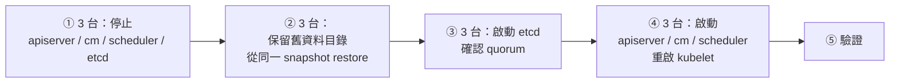

# 單元 7：Control Plane Disaster — etcd 還原

> ⚠️ **本單元是 runbook，不在本課程的共用叢集上執行。** etcd 還原會讓整座
> 叢集（包含其他租戶：`vui`、`cattle-*`、`rook-ceph`……）回到 snapshot 的時間點。
> 請在專用的 lab 叢集（例如單台 kubeadm VM）練習，或由講師以投影片 / 錄影示範。

## 目錄

1. [情境與目標](#1-情境與目標)
2. [模擬 etcd 資料損壞（僅限 lab 叢集）](#2-模擬-etcd-資料損壞僅限-lab-叢集)
3. [API Server 異常時會看到什麼現象](#3-api-server-異常時會看到什麼現象)
4. [還原前：安全確認事項](#4-還原前安全確認事項)
5. [從 Snapshot 還原 etcd（3 台 stacked etcd）](#5-從-snapshot-還原-etcd3-台-stacked-etcd)
6. [驗證 API Server](#6-驗證-api-server)
7. [驗證 Kubernetes Resource](#7-驗證-kubernetes-resource)
8. [驗證 Application](#8-驗證-application)
9. [還原後的副作用與清理](#9-還原後的副作用與清理)
10. [練習](#10-練習)

```text
07-etcd-restore/script/
└── restore-etcd-member.sh    單台成員的 stop / restore / start 步驟（預設 dry-run，--execute 才執行）
```

---

## 1. 情境與目標

**情境：** 3 台 control-plane 的 etcd 資料同時損壞（例如儲存層故障、有人誤刪
`/var/lib/etcd`、錯誤的維運腳本），etcd 失去 quorum，API Server 無法運作。

**目標：** 用單元 6 備份的 snapshot + control-plane 檔案，把 etcd 重建回
snapshot 時間點，讓 API Server 恢復，並確認應用與資料正常。

**不是這個單元要處理的：**

- 只壞 1 台 etcd → 其餘 2 台還有 quorum，用 `etcdctl member remove` +
  `kubeadm join --control-plane` 替換成員即可，**不需要還原**。
- 只壞一個應用 → 單元 4 的 Velero。

---

## 2. 模擬 etcd 資料損壞（僅限 lab 叢集）

在**單 control-plane 的 lab 叢集**上：

```bash
# 0. 先確定有可用的 snapshot（單元 6）
etcdutl snapshot status /root/snap.db -w table

# 1. 寫一筆「snapshot 之後」的變更，還原後用來確認時間點
kubectl create namespace after-snapshot

# 2. 模擬資料損壞：停 etcd，把資料目錄搬走
sudo mv /etc/kubernetes/manifests/etcd.yaml /root/
sudo mv /var/lib/etcd /var/lib/etcd.corrupted
sudo mv /root/etcd.yaml /etc/kubernetes/manifests/
# etcd 會用空資料目錄重新啟動 = 一座「全新、空白」的 etcd
```

另一種模擬：直接停掉 etcd（`mv etcd.yaml` 出去不放回），觀察 API Server
「連不到 etcd」的症狀。

---

## 3. API Server 異常時會看到什麼現象

| 觀察點 | etcd 停止 / 失去 quorum | etcd 資料被清空（空白 etcd） |
|---|---|---|
| `kubectl get nodes` | 卡住後 `Error from server: etcdserver: request timed out`，或 `The connection to the server 10.90.1.80:6443 was refused` | `No resources found`，或因 RBAC 資料不見而 `Forbidden` |
| API Server log（`crictl logs`） | `connection error: desc = "transport: Error while dialing dial tcp 127.0.0.1:2379: connect: connection refused"` | 不斷嘗試重建預設物件（`default` namespace、`kubernetes` Service） |
| `crictl ps` | kube-apiserver 反覆重啟（liveness 失敗） | 正常運作 |
| 現有 Pod | **繼續運作**（kubelet 維持現狀） | 繼續運作一段時間，但 kubelet 回報時發現 Node 物件不存在 |
| 對外服務 | 大多仍可連線（Cilium datapath 已建立） | 逐漸異常（Endpoints 消失、Controller 重新對帳） |
| 新部署 / 擴縮 / 自我修復 | ❌ 全部停擺 | ❌ |

**判讀重點：「服務還在，但 `kubectl` 什麼都做不了」** 是 control plane
災難的特徵，跟「應用掛了」完全不同。第一步永遠是**上節點看**：

```bash
# 在 control-plane 節點上（不靠 kubectl）
sudo crictl ps -a | grep -E 'etcd|kube-apiserver'
sudo crictl logs --tail 50 $(sudo crictl ps -a --name etcd -q | head -1)
sudo crictl logs --tail 50 $(sudo crictl ps -a --name kube-apiserver -q | head -1)
sudo journalctl -u kubelet --since "10 min ago" | tail -50
```

---

## 4. 還原前：安全確認事項

**etcd 還原是整座叢集最高風險的操作。** 正式環境執行前，逐項確認並留下紀錄：

| # | 確認事項 | 為什麼 |
|---|---|---|
| 1 | **真的需要還原嗎？** 是否只有 1 台壞（替換成員即可）？ | 還原會讓全叢集回到過去，能不用就不用 |
| 2 | 取得變更核准，通知**所有**租戶（本叢集：`vui`、Rancher `cattle-*`、Velero 使用者…） | snapshot 之後所有人的變更都會消失 |
| 3 | 選定 snapshot：時間點、來源節點、`etcdutl snapshot status` 通過 | 損壞發生**之前**的最後一份 |
| 4 | 3 台都拿到**同一個** snapshot 檔（比對 sha256） | 不同 snapshot 會組出分裂的叢集 |
| 5 | `etcdutl` 版本 = 叢集 etcd 版本（3.6.6） | 避免資料格式不相容 |
| 6 | `encryption-config.yaml` 與 snapshot **同一時期**（金鑰沒有輪替過） | 金鑰對不上 → 所有 Secret 無法解密 |
| 7 | `/etc/kubernetes/pki` 完整（CA、sa.key、etcd CA） | 單元 6 `backup-control-plane-files.sh` |
| 8 | 保留目前損壞的資料目錄（`mv`，**不要 `rm`**） | 還原失敗時還有退路，也便於事後鑑識 |
| 9 | 有節點 console / BMC / VM console 存取權 | 還原過程 API 不通，kube-vip VIP 也可能漂移，SSH 是唯一入口 |
| 10 | 規劃還原後的處理：Ceph PV 對帳、GitOps 重新同步、Velero 備份同步 | 見第 9 節 |
| 11 | 暫停自動化：CI/CD 部署、GitOps（Fleet）、Velero Schedule | 避免還原期間有東西寫入半恢復的叢集 |
| 12 | 兩人作業：一人執行、一人對照 runbook 確認 | 高壓下最容易漏步驟 |

---

## 5. 從 Snapshot 還原 etcd（3 台 stacked etcd）

整體順序（**每一步都要 3 台都完成，才能進下一步**）：



### ① 停止 control plane（3 台都做）

static Pod 由 kubelet 監看 `/etc/kubernetes/manifests/`，**把 manifest 移走
就等於停止該 Pod**：

```bash
sudo ./restore-etcd-member.sh stop --execute
# 等於：
sudo mkdir -p /etc/kubernetes/manifests-parked
sudo mv /etc/kubernetes/manifests/{kube-apiserver,kube-controller-manager,kube-scheduler,etcd}.yaml \
        /etc/kubernetes/manifests-parked/

# 確認都停了（沒有輸出才繼續）
sudo crictl ps | grep -E 'etcd|kube-apiserver'
```

### ② 從 snapshot 重建資料目錄（3 台都做，同一個 snapshot、同一個 token）

```bash
sha256sum /root/snap.db                       # 3 台比對，必須一致
sudo RESTORE_TOKEN=etcd-restore-20260923 ./restore-etcd-member.sh restore /root/snap.db --execute
```

腳本實際執行的內容（以 k8s01 為例，腳本 dry-run 輸出）：

```text
[dry-run] etcdutl snapshot status /root/snap.db -w table
[dry-run] mv /var/lib/etcd /var/lib/etcd.before-restore-20260923170233
[dry-run] etcdutl snapshot restore /root/snap.db
            --name k8s01
            --initial-cluster k8s01=https://10.90.1.81:2380,k8s02=https://10.90.1.82:2380,k8s03=https://10.90.1.83:2380
            --initial-advertise-peer-urls https://10.90.1.81:2380
            --initial-cluster-token etcd-restore-test
            --data-dir /var/lib/etcd
[dry-run] chmod 700 /var/lib/etcd
```

參數說明：

| 參數 | 意義 |
|---|---|
| `--name` | 本成員名稱，必須等於 `etcd.yaml` 裡的 `--name`（本叢集 = hostname） |
| `--initial-cluster` | **完整**的 3 成員清單。restore 會把它寫進新的成員資料 |
| `--initial-advertise-peer-urls` | 本成員的 peer URL（本機 IP:2380） |
| `--initial-cluster-token` | 新叢集識別字串；3 台必須相同，且**不同於**舊叢集，避免跟殘留的舊成員互相加入 |
| `--data-dir` | 寫到 `etcd.yaml` 指定的路徑（`/var/lib/etcd`），這樣 manifest 不用改 |

> 💡 kubeadm 產生的 `etcd.yaml` 裡，k8s01 的 `--initial-cluster` 只有它自己
> （因為 k8s02/03 是後來 join 的）。這**沒關係**：資料目錄已經存在時，etcd 會
> 忽略所有 `--initial-*` 參數，以資料目錄內的成員資訊為準。

### ③ 啟動 etcd，確認 quorum（3 台都做）

```bash
sudo ./restore-etcd-member.sh start-etcd --execute

# 3 台都啟動後，在任一台確認
sudo crictl exec $(sudo crictl ps --name etcd -q) etcdctl \
  --endpoints=https://10.90.1.81:2379,https://10.90.1.82:2379,https://10.90.1.83:2379 \
  --cacert=/etc/kubernetes/pki/etcd/ca.crt --cert=/etc/kubernetes/pki/etcd/server.crt \
  --key=/etc/kubernetes/pki/etcd/server.key \
  endpoint health -w table
# 3 個都要 HEALTH = true；再用 endpoint status 確認只有一個 IS LEADER = true
```

### ④ 啟動 API Server 與其他元件（3 台都做）

```bash
sudo ./restore-etcd-member.sh start-cp --execute
# 移回 kube-apiserver / kube-controller-manager / kube-scheduler，並重啟 kubelet
```

重啟 kubelet 是為了讓它重新向 API Server 註冊、重新同步 Pod 狀態，
避免 kubelet 快取的狀態跟回到過去的 etcd 對不上。

---

## 6. 驗證 API Server

```bash
kubectl get --raw='/readyz?verbose' | tail -5          # [+]etcd ok ... readyz check passed
kubectl get --raw='/livez'                              # ok
kubectl get nodes -o wide                               # 4 台 Ready（kubelet 重啟後約 1 分鐘）
kubectl -n kube-system get pods -o wide | grep -E 'etcd|apiserver|controller|scheduler'
```

**Secret 解密驗證**（本叢集有靜態加密，這一步最容易忽略）：

```bash
kubectl -n dr-demo get secret postgres-secret -o jsonpath='{.data.POSTGRES_USER}' | base64 -d; echo
# drtest   ← 讀得出來 = encryption-config.yaml 的金鑰正確
# 如果看到 "Internal error occurred: ... failed to decrypt" → 金鑰與 snapshot 不符（見安全確認 #6）
```

---

## 7. 驗證 Kubernetes Resource

```bash
# (1) 時間點正確：snapshot 之後建立的東西不應該存在
kubectl get ns after-snapshot          # Error from server (NotFound) ← 正確

# (2) 跟單元 3 的 baseline.sh 輸出比對
./dr/script/baseline.sh ./tmp/after-etcd-restore
diff <(awk '{print $1,$2}' ./tmp/baseline-*/pods.txt | sort) \
     <(awk '{print $1,$2}' ./tmp/after-etcd-restore/pods.txt | sort)

# (3) 系統元件
kubectl get pods -A | grep -vE 'Running|Completed'     # 找出異常 Pod
kubectl get gateway -A                                  # dev-gateway / app-gateway PROGRAMMED=True
kubectl get storageclass
velero backup-location get                              # Available
```

---

## 8. 驗證 Application

跟單元 4 同樣的標準——看資料，不是看 Pod：

```bash
./dr/script/check-data.sh dr-demo
```

注意：etcd 還原**不會動到 PV 資料**。如果 dr-demo 的 PostgreSQL 在 snapshot
之後又寫了資料，那些資料**仍然在 Ceph 裡**（etcd 只記得「有這個 PVC」）。
所以 etcd 還原後常見的是「資源回到過去，資料停在現在」的混合狀態。

---

## 9. 還原後的副作用與清理

| 副作用 | 原因 | 處理 |
|---|---|---|
| **孤兒 PV**：snapshot 之後建立的 PVC，Ceph 上有 image，etcd 裡沒有 PV | etcd 回到過去，Ceph 沒有 | 比對 `ceph rbd ls` 與 `kubectl get pv`，確認後手動清理 |
| **斷掉的 PV**：snapshot 之後刪除的 PVC，etcd 裡又出現 PV，Ceph 上 image 已刪 | 反向同上 | Pod 掛載失敗；刪除 PVC/PV 後由應用或 Velero 補回 |
| Deployment 版本回退 | snapshot 之後的部署消失 | GitOps（Fleet）重新同步；或重新執行 CI/CD |
| Velero 備份清單 | snapshot 之後的 Backup CR 消失 | Velero 會從 bucket **自動同步回來**（`lastSyncedTime`） |
| Lease / leader election 混亂 | 各元件 lease 回到過去 | 通常數分鐘內自動恢復；必要時重啟 cilium-operator、coredns |
| ServiceAccount token | 若 `sa.key` 沒變，舊 token 仍有效 | 若 PKI 也換了，所有 Pod 需重建 |
| 恢復自動化 | 第 4 節 #11 暫停的東西 | 確認叢集穩定後逐一恢復 |

最後，**事後檢討**：損壞原因、實際 RTO、snapshot 與事件的時間差（實際 RPO）、
runbook 哪裡不清楚——更新這份文件。

---

## 10. 練習

（在自己的 lab 叢集，不是課程共用叢集）

1. 用 kubeadm 建一台單 control-plane VM，依第 2 節模擬資料損壞，照第 5 節
   還原（單台時 `--initial-cluster` 只有自己）。記錄從發現到 `kubectl get nodes`
   恢復花了幾分鐘。
2. 還原時**故意**用一份沒有對應 `encryption-config.yaml` 的 snapshot（或換一把
   金鑰），觀察 `kubectl get secret` 的錯誤訊息與哪些 Pod 會壞掉。
3. 在 snapshot 之後建立一個有 PVC 的 Deployment，然後還原 etcd。
   用 Ceph 工具找出那顆孤兒 RBD image。
4. 為什麼第 ② 步 3 台要用同一個 `--initial-cluster-token`，而且要跟原本的叢集不同？
