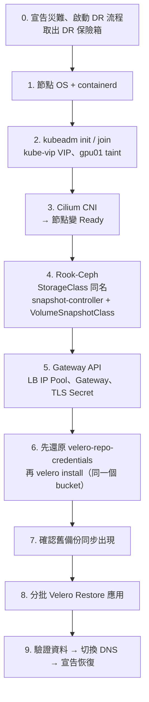

# 單元 8：Cluster Disaster — Kubernetes 整個消失怎麼辦？

> ⚠️ **本單元是 runbook，不在本課程的共用叢集上執行。** 建議用另一組 VM
> 建一座「DR 叢集」實際演練一次，或由講師以錄影示範。

## 目錄

1. [情境：叢集完全遺失](#1-情境叢集完全遺失)
2. [什麼還在、什麼沒了](#2-什麼還在什麼沒了)
3. [哪些東西需要重新建立（重建清單）](#3-哪些東西需要重新建立重建清單)
4. [重建順序總覽](#4-重建順序總覽)
5. [Step 1：Kubernetes Control Plane 重建](#5-step-1kubernetes-control-plane-重建)
6. [Step 2：CNI / Storage / Gateway 等基礎元件](#6-step-2cni--storage--gateway-等基礎元件)
7. [Step 3：重新連接外部 Backup Storage](#7-step-3重新連接外部-backup-storage)
8. [Step 4：使用 Velero Restore Application](#8-step-4使用-velero-restore-application)
9. [Step 5：驗證 Application 與資料](#9-step-5驗證-application-與資料)
10. [為什麼不用 etcd snapshot 還原整座叢集？](#10-為什麼不用-etcd-snapshot-還原整座叢集)
11. [練習](#11-練習)

```text
08-cluster-rebuild/script/
└── restore-apps-in-order.sh    依相依順序分批 Velero 還原（預設 dry-run）
```

---

## 1. 情境：叢集完全遺失

可能的原因：機房停電 + 儲存陣列損壞、虛擬化平台誤刪整組 VM、勒索軟體加密
所有節點、升級失敗到無法回復。

模擬方式（DR 演練叢集）：直接把 4 台節點 VM 全部刪除，或 `kubeadm reset -f`
每一台並清空 Ceph OSD 磁碟。

重點：**連 Ceph 一起沒了**。這座叢集的 PV 資料存在 Rook-Ceph，而 Ceph 的 OSD
就是叢集節點上的磁碟——節點消失，所有 PV 資料也跟著消失。

---

## 2. 什麼還在、什麼沒了

| 東西 | 存放位置 | 叢集消失後 |
|---|---|---|
| 應用 K8s 資源 | etcd | ❌ 沒了 → Velero 備份（S3）還在 ✅ |
| 應用 PV 資料 | Ceph（叢集節點磁碟） | ❌ 沒了 → **只有 `snapshotMoveData` 搬到 S3 的那份還在** ✅ |
| CSI Snapshot（沒搬出去的） | Ceph | ❌ 跟著沒了 |
| etcd snapshot | S3 `etcd-backups/` | ✅ 還在（但不適合用在新叢集，見第 10 節） |
| Velero 備份 | S3 `velero/` | ✅ |
| 所有 manifest（本 repo、Helm values） | Git | ✅ |
| 叢集基準紀錄（`baseline.sh` 輸出） | 叢集外 | ✅（如果有照單元 3 做） |
| **Velero kopia repo 密碼**（`velero-repo-credentials`） | 叢集內 Secret | ❌ **除非另外保存** → 沒有它讀不出 S3 上的 PV 資料 |
| S3 credentials | 叢集內 Secret | ❌ 除非另外保存（密碼管理系統） |
| TLS 憑證（`gateway-tls`、自簽 Root CA） | 叢集內 Secret / 產生憑證的機器 | ⚠️ 視保存方式 |
| DNS 紀錄（`*.nexai.org.com` → Gateway IP） | DNS 伺服器 | ✅ 若新叢集沿用相同 LB IP |

**災難前就必須存在叢集外的東西（DR 保險箱）：**

```text
□ velero-repo-credentials（kopia repository 密碼）
□ Velero S3 credentials（credentials-velero）
□ etcd 備份 S3 credentials
□ TLS 憑證與私鑰、Root CA
□ 各應用的外部相依資訊（外部 DB、SMTP、OAuth client secret…）
□ 本 repo（manifest、Helm values、install-velero.sh）
□ 最新的 baseline.sh 輸出
□ 這份 runbook 的紙本 / 離線版本
```

---

## 3. 哪些東西需要重新建立（重建清單）

依本叢集 2026-09-23 的實際狀態整理：

| 層級 | 元件 | 本叢集實際版本 / 設定 | 重建方式 |
|---|---|---|---|
| 節點 | OS / container runtime | Ubuntu 26.04、containerd 2.2.5 | 自動化佈建（PXE / cloud-init / Ansible） |
| Control plane | Kubernetes | v1.35.7，kubeadm，3 control-plane + 1 worker | `kubeadm init` / `join` |
| | API VIP | kube-vip，`10.90.1.80` | kube-vip static Pod（`/etc/kubernetes/kube-vip.conf`） |
| | Secret 加密 | `encryption-config.yaml` | **產生新金鑰即可**（新叢集資料由 Velero 重建，不需沿用舊金鑰） |
| | Audit / OIDC | `audit-policy.yaml`、`auth-config.yaml` | 從 Git / control-plane 檔案備份還原 |
| 節點設定 | gpu01 taint | `nvidia.com/gpu=true:NoSchedule` | `kubectl taint`（onlyoffice/peertube 等靠它排程） |
| 網路 | CNI | **Cilium 1.19.3**（Helm），`kube-proxy-replacement: true`，`enable-gateway-api: true` | `helm install cilium` + 相同 values |
| | LB IP Pool | `lb-pool`：`10.90.1.90-94` | CiliumLoadBalancerIPPool |
| | Gateway API | GatewayClass `cilium`；Gateway：`admin-gateway`(.90)、`app-gateway`(.91)、`user-gateway`(.92)、`dev-gateway`(.93) | Gateway API CRDs + `dev-gateway.yaml` 等 |
| 儲存 | Rook-Ceph | operator + CephCluster + CephFilesystem | Rook 安裝程序（**不要用 Velero 還原**） |
| | StorageClass | `rook-ceph-block`、`rook-cephfs`（**名稱必須相同**） | Rook 範例 yaml，改成相同名稱 |
| | Snapshot | snapshot-controller + CRDs、`csi-rbdplugin-snapclass`、`csi-cephfsplugin-snapclass` | external-snapshotter + Rook 範例 |
| 其他 | metrics-server | HPA 需要 | 官方 yaml |
| | Rancher / Fleet | rancher 2.14.3、fleet | 視需要（Fleet 可接手 GitOps 重新部署） |
| 備份 | Velero | v1.18.2 + aws plugin v1.14.2，EnableCSI，node-agent | `02-backup-storage/velero/install-velero.sh` |
| | Velero UI | OTWLD velero-ui 0.10.2 | `../velero-ui/` |

---

## 4. 重建順序總覽



原則：**基礎元件用它自己的安裝方式重建，應用才用 Velero 還原。**
用 Velero 還原 `kube-system`、`rook-ceph`、`velero` 這類 namespace，
會把舊叢集的節點名稱、IP、憑證一起倒回新叢集，造成難以除錯的問題。

---

## 5. Step 1：Kubernetes Control Plane 重建

```bash
# 在 k8s01（先放好 kube-vip static Pod manifest，VIP 10.90.1.80）
sudo kubeadm init \
  --control-plane-endpoint 10.90.1.80:6443 \
  --upload-certs \
  --kubernetes-version v1.35.7 \
  --skip-phases=addon/kube-proxy        # 若沿用 Cilium kube-proxy replacement（依原叢集決定）

# k8s02、k8s03：用 init 輸出的 control-plane join 指令
sudo kubeadm join 10.90.1.80:6443 --token ... --discovery-token-ca-cert-hash ... \
  --control-plane --certificate-key ...

# gpu01：worker join，並還原 taint
sudo kubeadm join 10.90.1.80:6443 --token ... --discovery-token-ca-cert-hash ...
kubectl taint node gpu01 nvidia.com/gpu=true:NoSchedule
```

> 原叢集同時有 `kube-proxy` DaemonSet 與 Cilium `kube-proxy-replacement: true`。
> 重建時請先確認要採用哪一種，並與 Cilium values 一致。

此時 `kubectl get nodes` 會是 `NotReady`（還沒有 CNI）——正常。

---

## 6. Step 2：CNI / Storage / Gateway 等基礎元件

```bash
# --- CNI：Cilium（與原叢集相同版本與 values）---
helm repo add cilium https://helm.cilium.io
helm install cilium cilium/cilium --version 1.19.3 -n kube-system -f cilium-values.yaml
kubectl get nodes                         # 全部 Ready

# --- Gateway API ---
kubectl apply -f <gateway-api-standard-install.yaml>      # Gateway API CRDs（Cilium 版本要求的版本）
kubectl apply -f lb-pool.yaml                              # CiliumLoadBalancerIPPool 10.90.1.90-94
kubectl -n default create secret tls gateway-tls --cert=fullchain.crt --key=tls.key
kubectl apply -f dev-gateway.yaml                          # 本 repo 根目錄；其他 gateway 同理

# --- 儲存：Rook-Ceph ---
# 依 Rook 官方步驟：crds.yaml → common.yaml → operator.yaml → cluster.yaml
# 再建立 CephBlockPool / CephFilesystem 與 StorageClass，名稱必須是：
#   rook-ceph-block、rook-cephfs
kubectl get storageclass

# --- CSI Snapshot ---
# external-snapshotter 的 CRDs + snapshot-controller，再建立兩個 VolumeSnapshotClass：
#   csi-rbdplugin-snapclass、csi-cephfsplugin-snapclass
kubectl get volumesnapshotclass

# --- 其他 ---
kubectl apply -f metrics-server.yaml
```

**StorageClass 名稱為什麼一定要相同？** Velero 備份裡每個 PVC 都寫著
`storageClassName: rook-ceph-block`。新叢集沒有同名 SC → 單元 5 情境 4
（PVC Pending、Restore PartiallyFailed）。如果新叢集真的要換名字，就要事先
建立 change-storage-class ConfigMap。

**檢查點**（全部通過才進 Step 3）：

```bash
kubectl get nodes                                  # 4 台 Ready
kubectl get gateway -A                             # PROGRAMMED=True，ADDRESS 與舊叢集相同
kubectl get sc,volumesnapshotclass
# 小測試：建一個 PVC + 拍 VolumeSnapshot，確認 ReadyToUse=true
```

---

## 7. Step 3：重新連接外部 Backup Storage

**順序很重要：先還原 kopia repo 密碼，再安裝 Velero。**

```bash
# 1. 先建立 namespace 與「舊的」repo 密碼 Secret（從 DR 保險箱取出）
kubectl create namespace velero
kubectl apply -f velero-repo-credentials.yaml      # 災難前匯出的那份
#   匯出方式（平時就要做）：
#   kubectl -n velero get secret velero-repo-credentials -o yaml \
#     | grep -vE 'uid|resourceVersion|creationTimestamp' > velero-repo-credentials.yaml

# 2. 安裝 Velero，指向同一個 bucket
cd dr/02-backup-storage/velero && ./install-velero.sh

# 3. 建議先把 BSL 設成唯讀，避免新叢集誤刪/誤寫舊備份（TTL 清理也會暫停）
kubectl -n velero patch bsl default --type merge -p '{"spec":{"accessMode":"ReadOnly"}}'

# 4. 確認舊備份自動同步出現
velero backup-location get                          # Available
velero backup get                                   # 應看到 daily-full-backup-*、dr-course-backup-01 ...
```

如果沒有先放 `velero-repo-credentials`，Velero 會產生一組**新的**密碼，之後
還原 PV 資料時 Data Mover 會因為無法開啟既有的 kopia repository 而失敗
（資源會還原成功、PV 資料失敗——又是一個「看起來大致成功」的陷阱）。

---

## 8. Step 4：使用 Velero Restore Application

用每日全叢集備份，**依相依順序分批**還原
（[script/restore-apps-in-order.sh](script/restore-apps-in-order.sh)）：

```bash
./dr/08-cluster-rebuild/script/restore-apps-in-order.sh daily-full-backup-20260923010055            # 先 dry-run 看計畫
./dr/08-cluster-rebuild/script/restore-apps-in-order.sh daily-full-backup-20260923010055 --execute
```

腳本的分批邏輯：

| 批次 | namespace | 理由 |
|---|---|---|
| 1 | drawio、filebrowser、flarum、planka、onlyoffice、peertube | 各自獨立（DB 與 App 在同一個 namespace） |
| 2 | cloudbeaver | 跨 namespace 連第 1 批的 DB，要等它們先回來 |
| 3 | dr-demo | 課程 lab |
| 永不還原 | kube-system、velero、rook-ceph、cattle-*、etcd-backup | 由各自的安裝程序重建 |

小細節：Velero 會先還原 **Namespace 物件（含 label）**，再還原 Pod——這剛好
避開了本叢集已知的 Cilium 陷阱（namespace label 要比 Pod 先存在，
NetworkPolicy 的 `namespaceSelector` 才會生效）。

每一批做完的檢查：

```bash
velero restore get                                            # Completed，Errors = 0
kubectl get pods -A | grep -vE 'Running|Completed'            # 沒有異常 Pod
kubectl get httproute -A -o custom-columns=NS:.metadata.namespace,NAME:.metadata.name,ACCEPTED:.status.parents[0].conditions[0].status
kubectl -n velero get datadownloads | grep -v Completed       # PV 資料都下載完成
```

全部完成後，把 BSL 改回可寫入：

```bash
kubectl -n velero patch bsl default --type merge -p '{"spec":{"accessMode":"ReadWrite"}}'
```

---

## 9. Step 5：驗證 Application 與資料

| 層級 | 驗證 | 方式 |
|---|---|---|
| 平台 | 節點、CNI、儲存、Gateway | Step 2 檢查點 |
| 資源 | 每個 namespace 的 Pod / PVC / HTTPRoute | 與舊叢集 `baseline.sh` 輸出比對 |
| 資料 | dr-demo | `./dr/script/check-data.sh dr-demo` |
| 資料 | flarum / planka / peertube 的 DB | 用 cloudbeaver 查一筆災難前的文章 / 卡片 / 影片 |
| 功能 | 對外網址 | `curl -k --resolve <host>:443:10.90.1.93 https://<host>/` 拿到應用真實內容 |
| 業務 | 應用負責人驗收 | 登入、讀舊資料、寫新資料 |

最後記錄：從宣告災難到業務驗收通過的**實際 RTO**，以及最後一份可用備份的
時間與災難發生時間的差距（**實際 RPO**），回饋到單元 9 的 DR Policy。

---

## 10. 為什麼不用 etcd snapshot 還原整座叢集？

直覺上「etcd snapshot 就是整座叢集」，但放到新機器上會遇到：

| 問題 | 說明 |
|---|---|
| Node 物件 | snapshot 裡是舊節點；新節點名稱/IP 不同就對不上 |
| PV | snapshot 裡的 PV 指向**舊 Ceph** 的 image ID，新 Ceph 上不存在 |
| 憑證 | 必須連 PKI 一起沿用，否則所有 token / kubeconfig 失效 |
| 加密金鑰 | 必須沿用舊的 `encryption-config.yaml` |
| 基礎元件狀態 | Cilium、Rook 的 CR 描述的是舊環境（舊 OSD、舊 IP） |

etcd snapshot 適合「**同一批機器、只是 etcd 壞了**」（單元 7）。叢集整個
不見時，**乾淨重建 + Velero 還原應用**才是可預期、可重複的流程。

---

## 11. 練習

1. 在 DR 演練叢集照本 runbook 做一次，計時每個 Step。哪一步最久？能怎麼縮短？
2. 故意**不**還原 `velero-repo-credentials` 就安裝 Velero，然後還原 dr-demo。
   觀察 Restore 的狀態與 DataDownload 的錯誤訊息。
3. 本 runbook 第 2 節的「DR 保險箱」清單，你們公司現在有幾項是真的存在叢集外的？
4. 如果新叢集的 LB IP Pool 無法沿用 `10.90.1.90-94`，還有哪些東西要跟著改？
