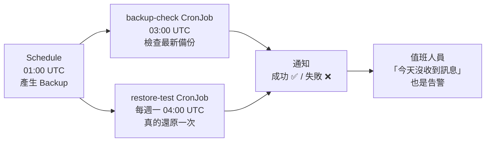

# 單元 9：建立每日備份與 Restore 驗證機制

> 備份不是一個動作，是一個**制度**：每天自動跑、有問題會叫人、定期證明能還原、
> 而且目標（RPO/RTO）是寫下來、有人簽核的。

## 目錄

1. [這座叢集的現況：兩個沒人發現的問題](#1-這座叢集的現況兩個沒人發現的問題)
2. [Velero Schedule](#2-velero-schedule)
3. [Backup TTL / Retention](#3-backup-ttl--retention)
4. [每日自動備份](#4-每日自動備份)
5. [Backup 成功通知](#5-backup-成功通知)
6. [Restore Test 的重要性（與自動化）](#6-restore-test-的重要性與自動化)
7. [RPO / RTO 與企業 DR Policy 的關係](#7-rpo--rto-與企業-dr-policy-的關係)
8. [講師操作：啟用整套機制](#8-講師操作啟用整套機制)
9. [練習](#9-練習)

```text
09-daily-backup-verification/
├── velero/
│   ├── schedule-daily-full.yaml         每日全叢集備份（線上排程的「建議改良版」）
│   └── schedule-critical-6h.yaml        關鍵應用每 6 小時 + sync hook
├── manifest/
│   ├── 00-namespace-rbac.yaml           dr-ops / dr-restore-test + 最小權限 RBAC
│   ├── 01-webhook-secret.yaml.example   通知 webhook（.example：apply 目錄時略過）
│   ├── 02-scripts-configmap.yaml        由 script/ 自動產生
│   ├── 03-cronjob-backup-check.yaml     每日檢查 + 通知
│   └── 04-cronjob-restore-test.yaml     每週自動還原測試
└── script/
    ├── notify.sh                        webhook 通知（{"text": ...}）
    ├── backup-check.sh                  檢查最新備份：存在、夠新、Completed、0 error
    └── restore-test.sh                  還原 → 資料驗證 → 清除 → 通知耗時
```

> 依課程決定，本單元的 Schedule 與 CronJob **只提供 yaml，撰寫時不套用**
> （server dry-run 驗證通過）。腳本本身已在真實叢集上實際執行過，結果如下。

---

## 1. 這座叢集的現況：兩個沒人發現的問題

在撰寫這個單元時，對線上的 `daily-full-backup` 做檢查，發現兩個真實問題——
正好說明這個單元為什麼存在。

### 問題 1：連續 5 天沒有備份，沒有任何告警

```text
$ kubectl -n velero get backups.velero.io -l velero.io/schedule-name=daily-full-backup \
    -o custom-columns=NAME:.metadata.name,PHASE:.status.phase,START:.status.startTimestamp,ITEMS:.status.progress.itemsBackedUp
NAME                               PHASE       START                  ITEMS
daily-full-backup-20260916010019   Completed   2026-09-16T01:00:19Z   1484
daily-full-backup-20260922010048   Completed   2026-09-22T01:00:48Z   1629
daily-full-backup-20260923010055   Completed   2026-09-23T01:00:55Z   1687
```

Schedule 從 09-15 就是 `Enabled`、TTL 30 天，應該要有每天一份——但
**09-17 ~ 09-21 完全沒有備份，也沒有失敗紀錄**。沒有「失敗」可以通知，
所以只做「失敗通知」的監控在這裡完全無效。原因沒有在本次查明
（同期間 Velero Pod 被重建過數次），但重點是：**五天內沒有任何人知道**。

### 問題 2：每日備份還原不回 PV 資料

用本單元的 `restore-test.sh` 對最新的每日備份做還原測試：

```text
使用備份：daily-full-backup-20260923010055
Restore restore-test-20260923171023：phase=PartiallyFailed warnings=1 errors=2
❌ [k8s-training] Restore Test 失敗（dr-demo ← daily-full-backup-20260923010055）

$ velero restore describe restore-test-20260923171023
Errors:
  Namespaces:
    dr-restore-test:  error preparing persistentvolumeclaims/dr-restore-test/postgres-data:
      ... fail get DataUploadResult for restore: ... multiple DataUpload result cms found with labels
      velero.io/pvc-namespace-name=dr-demo.postgres-data ...
```

原因：線上排程**沒有排除 `velero` namespace**，所以每份每日備份都把
`velero` namespace 裡的 **DataUpload 物件**（其他備份的上傳紀錄）也備份進去。
下載備份檔檢查，同一個 PVC 有 3 筆：

```text
$ velero backup download daily-full-backup-20260923010055
$ （列出備份內 datauploads.velero.io 中 dr-demo 的項目）
daily-full-backup-20260922010048-78srp  dr-demo/postgres-data  backup=daily-full-backup-20260922010048
dr-demo-backup-001-20268105070223-759rx dr-demo/postgres-data  backup=dr-demo-backup-001-20268105070223
daily-full-backup-20260923010055-pt5c8  dr-demo/postgres-data  backup=daily-full-backup-20260923010055
（shared-data 同樣 3 筆）
```

還原時 Velero 找到多筆同一個 PVC 的上傳結果，無法判斷該用哪一筆，
**PV 資料還原失敗**。同一份流程改用單元 3 的 `dr-course-backup-01`
（只備份 dr-demo）就完全正常：

```text
使用備份：dr-course-backup-01
Restore restore-test-20260923171119：phase=Completed warnings=1 errors=0
  [PASS] PVC postgres-data Bound
  [PASS] PVC shared-data Bound
  [PASS] disaster_test 查得到 DR-TEST-DB-001
  [PASS] dr-test.txt 含 DR-TEST-FS-001
已清除 dr-restore-test 中還原的資源
✅ [k8s-training] Restore Test 通過：dr-demo ← dr-course-backup-01，資料驗證 PASS，耗時 1 分鐘
```

**這三份每日備份每一份都顯示 `Completed`、0 errors、0 warnings。** 如果今天
真的需要用它們救資料，會在最緊張的時候才發現救不回來——這就是
「Restore Test 的重要性」最好的實例。修正方式見第 2 節（排除 `velero` namespace）。

---

## 2. Velero Schedule

Schedule 是「定時產生 Backup 的範本」：

```bash
velero schedule get                         # ✅
kubectl -n velero get schedules.velero.io   # ✅
kubectl -n velero get schedules             # ❌ 本叢集會拿到 Fleet 的 schedules.fleet.cattle.io（空的）！
```

> ⚠️ 本叢集裝了 Rancher Fleet，它也有一個叫 `schedules` 的 CRD。
> `kubectl get schedules` 會回傳 Fleet 的（空清單），讓人誤以為 Velero
> 沒有排程——本課程撰寫時就被這個誤導過一次。**所有腳本一律寫完整名稱
> `schedules.velero.io`、`backups.velero.io`。**

線上現況 vs. 建議（[velero/schedule-daily-full.yaml](velero/schedule-daily-full.yaml)）：

| 欄位 | 線上 `daily-full-backup` | 建議 | 原因 |
|---|---|---|---|
| `schedule` | `0 1 * * *` | 同 | 01:00 UTC（台灣 09:00） |
| `includedNamespaces` | （全部） | `["*"]` | |
| `excludedNamespaces` | **無** | `kube-system`、`kube-public`、`kube-node-lease`、**`velero`**、`rook-ceph` | **排除 `velero` 修正問題 2**；其他由各自安裝程序重建 |
| `excludedResources` | 無 | VolumeSnapshot/Content、Event | 還原沒有意義的暫時性物件 |
| `snapshotMoveData` | `true` | 同 | 資料必須搬出叢集 |
| `ttl` | `720h` | 同 | 30 天 |
| `useOwnerReferencesInBackup` | `false` | 同 | `true` 會讓「刪除 Schedule」連帶刪除所有備份 |

等價 CLI：

```bash
velero schedule create daily-full-backup --schedule="0 1 * * *" \
  --exclude-namespaces kube-system,kube-public,kube-node-lease,velero,rook-ceph \
  --snapshot-move-data --ttl 720h
```

常用操作：

```bash
velero schedule pause daily-full-backup       # 維護期間暫停（別忘了恢復！backup-check 會抓到）
velero schedule unpause daily-full-backup
velero backup create --from-schedule daily-full-backup   # 立刻用排程的設定跑一次
```

---

## 3. Backup TTL / Retention

- `ttl` 到期後，Velero **自動**刪除：Backup CR、S3 上的備份檔、kopia 中不再被
  引用的資料、還原紀錄。
- **分級保留**是常見做法——不同頻率的排程配不同 TTL：

| 排程 | 頻率 | TTL | 同時保留份數 | 用途 |
|---|---|---|---|---|
| `critical-6h` | 每 6 小時 | 7 天 | 28 | 關鍵應用，RPO 6 小時 |
| `daily-full-backup` | 每天 | 30 天 | 30 | 全叢集，RPO 24 小時 |
| `weekly-full`（練習題） | 每週 | 90 天 | 13 | 發現資料被「慢慢改壞」時回溯 |
| `monthly-archive`（練習題） | 每月 | 365 天 | 12 | 稽核 / 法規 |

- 容量估算：kopia 會**去重**，每日備份的增量通常遠小於全量。實測 dr-demo 的
  PV 資料約 47.8MB，kopia 在 S3 上占用約 37MB（`velero/kopia/dr-demo/`）。
- 保留的陷阱：
  1. TTL 太短 + 問題太晚發現 → 所有備份都已經包含錯誤資料。
  2. 備份停了（問題 1），TTL 仍會照常刪舊備份 → 停得夠久，**連最後一份好的也會被刪**。
     監控「最新成功備份距今多久」比設定 TTL 更重要。
- 手動刪除一律用 `velero backup delete <name>`（同時清 S3）；
  `kubectl delete backup` 只刪 CR，下次同步又會長回來。

---

## 4. 每日自動備份

一個可靠的每日備份，需要三層：



| 層 | 回答的問題 | 本單元 |
|---|---|---|
| 產生 | 有沒有在跑？ | Velero Schedule |
| 檢查 | 最新一份存在、夠新、成功嗎？ | `backup-check`（每日） |
| 驗證 | 真的能還原、資料對嗎？ | `restore-test`（每週） |

---

## 5. Backup 成功通知

Velero 本身**沒有**內建通知。本單元用一支 CronJob（`backup-check.sh`）檢查
並呼叫 webhook（Slack / Mattermost / Google Chat 都接受 `{"text": "..."}`）。

**檢查項目**（任何一項失敗 → ❌ 通知 + Job Failed）：

| 檢查 | 為什麼 |
|---|---|
| BSL 是 `Available` | 否則接下來所有備份都會失敗 |
| Schedule `Enabled` 且沒有 `paused` | 維護時暫停後忘了恢復，是很常見的「無聲失敗」 |
| 找得到 Completed 備份 | |
| **最新 Completed 備份距今 ≤ 26 小時** | 抓得到問題 1（沒有產生備份） |
| 最新成功備份 errors = 0 | |
| 最新一次備份（不論狀態）不是 Failed / PartiallyFailed | |

實測（2026-09-23，對線上排程）：

```text
$ ./script/backup-check.sh
BSL: default=Available
Schedule daily-full-backup: Enabled paused=
最新 Completed：daily-full-backup-20260923010055 完成於 2026-09-23T01:07:06Z（8h 前）errors=0 warnings=0 items=1687/1687
✅ [k8s-training] Velero 備份正常：daily-full-backup-20260923010055（8h 前完成，items 1687/1687，warnings 0）

$ MAX_AGE_HOURS=1 ./script/backup-check.sh          # 模擬「備份太舊」
❌ [k8s-training] Velero 備份檢查失敗（schedule: daily-full-backup）
- 最新成功備份 daily-full-backup-20260923010055 已經 8 小時（上限 1h）

$ SCHEDULE_NAME=nope ./script/backup-check.sh       # 模擬「排程不見了」
❌ [k8s-training] Velero 備份檢查失敗（schedule: nope）
- Schedule nope 狀態異常：Error from server (NotFound): schedules.velero.io "nope" not found
- 找不到任何 Completed 的 nope 備份
```

**為什麼成功也要通知？** 如果只在失敗時通知，那「檢查程式自己沒跑」
（CronJob 被刪、節點資源不足排不上、webhook 失效）就會被當成「一切正常」。
每天固定收到一則 ✅，**某天沒收到**就是訊號（dead man's switch）。更進一步
可以接 Healthchecks.io / Uptime Kuma 這類「沒收到心跳就告警」的服務。

> 注意：第 1 節的問題 2（每日備份還原不回 PV 資料）`backup-check` **抓不到**——
> 那份備份的每一個狀態欄位都是完美的。只有 Restore Test 抓得到。

---

## 6. Restore Test 的重要性（與自動化）

| 驗證方式 | 能發現什麼 | 第 1 節兩個問題抓得到嗎 |
|---|---|---|
| 看 UI / `velero backup get` | Phase、errors | ❌ ❌ |
| `backup-check`（每日） | 沒產生、太舊、失敗 | ✅ 問題 1 / ❌ 問題 2 |
| **自動 Restore Test（每週）** | 還原流程、PV 資料、應用資料 | ✅ ✅ |
| 人工 DR 演練（每季 / 每半年） | runbook、人員、權限、RTO、跨團隊協作 | ✅ ✅ + 流程問題 |

`restore-test.sh` 的流程：

1. 找出排程最新一份**包含目標 namespace** 的 Completed 備份。
2. 建立 Restore：`dr-demo` → `dr-restore-test`（namespaceMapping，不碰正在運作的應用）。
3. 等 Restore 結束；不是 `Completed` 直接失敗。
4. 等所有 Deployment Ready。
5. 執行 `check-data.sh dr-restore-test`（查 `DR-TEST-DB-001` 與 `DR-TEST-FS-001`）。
6. 通過 → 依 `velero.io/restore-name` label 清除**這次還原出來的資源**；
   失敗 → 保留現場供除錯。
7. 通知結果與耗時。

設計重點：

- **固定目的地 + namespace 內的 Role**：`dr-restore-test` 事先建立，RBAC 只在
  那個 namespace 給 exec / 建 Pod / 刪除權限（`00-namespace-rbac.yaml`），
  Job 不需要叢集層級的危險權限。
- **只刪自己還原的東西**：Velero 會替每個還原出來的資源貼上
  `velero.io/restore-name=<名稱>`，清除時用這個 label，不會誤刪其他東西。
- **驗證資料，不是驗證狀態**：驗證腳本就是單元 4 的 `check-data.sh`——同一支
  腳本，人工演練與自動化共用。
- 可指定備份：`BACKUP_NAME=<name> ./restore-test.sh` 用於手動演練。

---

## 7. RPO / RTO 與企業 DR Policy 的關係

- **RPO（Recovery Point Objective）**：最多能接受**遺失多久**的資料。
  由**備份頻率**決定。每日備份 → RPO 最差 24 小時（加上問題 1 那種斷掉 5 天，實際 RPO = 5 天）。
- **RTO（Recovery Time Objective）**：從出事到恢復服務，最多能接受**多久**。
  由**還原流程**決定：偵測 + 決策 + 還原 + 驗證 + 切換。

```text
         最後一次成功備份          災難發生                  服務恢復
─────────────●───────────────────────✖──────────────────────────●──────▶ 時間
             │←──── 資料遺失 = RPO ───→│←──────── 停機 = RTO ────────→│
```

本課程實測可以作為 RTO 的參考下限：

| 情境 | 實測耗時 | 來源 |
|---|---|---|
| dr-demo 還原到新 namespace（約 48MB 資料） | Restore 55 秒；含驗證約 1 分鐘 | 單元 4、`restore-test.sh` |
| dr-demo 備份 | 98 秒 | 單元 3 |
| 全叢集每日備份（1687 個物件） | 約 6 分鐘 | 線上 `daily-full-backup` |
| etcd 還原（3 台） | 未實測（runbook） | 單元 7 |
| 整座叢集重建 | 未實測（runbook）；通常以小時計 | 單元 8 |

**DR Policy** 把這些變成公司的承諾。建議至少包含：

| 項目 | 範例（依應用分級） |
|---|---|
| 應用分級 | Tier 1（營收 / 對外）、Tier 2（內部重要）、Tier 3（可重建） |
| RPO / RTO | Tier 1：RPO 1h / RTO 4h；Tier 2：RPO 24h / RTO 1 天；Tier 3：RPO 7 天 / RTO 盡力 |
| 備份方式 | Tier 1：Velero 每小時 + 資料庫原生備份（WAL / binlog）；Tier 2：每日 Velero |
| 保存 | 叢集外 S3 + 異地副本；保留天數；誰能刪除 |
| 監控與通知 | 每日 backup-check；通知對象；未收到通知的處理 |
| 驗證 | 每週自動 Restore Test；每季人工演練；演練紀錄存查 |
| 角色 | 誰宣告災難、誰執行、誰驗收（應用負責人）、誰對外溝通 |
| Runbook | 單元 4 / 7 / 8 的文件，放在叢集外、離線可取得 |
| 檢討 | 每次演練 / 事件後更新 RPO/RTO 實測值與 runbook |

> RPO/RTO **不是技術人員自己決定**的數字，而是業務方根據「停機 / 遺失資料
> 的代價」決定、IT 負責做到並用演練證明。**沒有演練過的 RTO 只是一個願望。**

---

## 8. 講師操作：啟用整套機制

> 以下會修改線上狀態（改排程、建立 CronJob），請講師確認後操作。

```bash
cd dr/09-daily-backup-verification

# 1. 修正每日排程（排除 velero 等 namespace → 修正問題 2）
kubectl apply -f velero/schedule-daily-full.yaml     # schedule.velero.io/daily-full-backup configured
velero backup create --from-schedule daily-full-backup --wait     # 立刻產生一份新的

# 2.（可選）關鍵應用高頻排程
kubectl apply -f velero/schedule-critical-6h.yaml

# 3. 檢查與還原測試
kubectl apply -f manifest/                            # .example 會被略過
kubectl -n dr-ops create secret generic backup-notify --from-literal=WEBHOOK_URL='https://...'

# 4. 立刻各跑一次，不用等排程
kubectl -n dr-ops create job --from=cronjob/backup-check backup-check-manual
kubectl -n dr-ops create job --from=cronjob/restore-test restore-test-manual
kubectl -n dr-ops logs -f job/restore-test-manual
# 預期：用剛剛那份新的每日備份，Restore Completed、4 項 PASS
```

修改腳本後，重新產生 ConfigMap：

```bash
kubectl -n dr-ops create configmap backup-verify-scripts \
  --from-file=script/notify.sh --from-file=script/backup-check.sh \
  --from-file=script/restore-test.sh --from-file=../script/check-data.sh \
  --dry-run=client -o yaml | kubectl apply -f -
```

---

## 9. 練習

1. 為你們公司的 3 個應用填寫 DR Policy 表格（分級、RPO、RTO、備份方式、驗證頻率）。
2. 寫一個 `weekly-full` Schedule：每週日、TTL 90 天。它跟 `daily-full-backup`
   同時存在時，S3 容量大約會增加多少？（提示：kopia 去重）
3. 把 `backup-check` 接到 Healthchecks.io 或 Uptime Kuma 的 push monitor，
   做出真正的「沒收到心跳就告警」。
4. 修改 `restore-test.sh`，讓它對 `dr-pitfall` 做還原測試，驗證條件是
   `ORDER-1001` 存在（單元 5 練習 4 的腳本）。
5. 第 1 節問題 2：修正排程之後，**已經存在的**三份每日備份還能用嗎？
   如果今天就需要從 09-22 的備份還原 dr-demo 的資料，你會怎麼處理？
