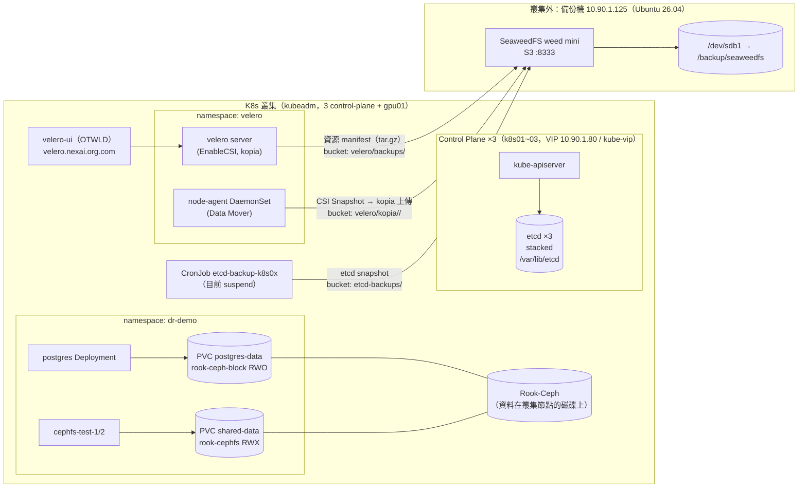

# k8s-training — Kubernetes 備份、復原與災難復原演練

> 從 Application Backup 開始，逐步理解 Kubernetes 資源、PV 資料、etcd 與
> 整個叢集的復原方式。

這個單元跟前面 7 個產品不同：它不是「部署一個應用」，而是**把應用弄壞，再
救回來**。所有 Velero 備份/還原步驟都在真實叢集上實際跑過（2026-09-23），
文件裡的輸出是當時真實擷取的結果；etcd 還原與整座叢集重建因為會影響共用
叢集上的其他租戶，**只提供 runbook，不在這座叢集上執行**，文件中會明確標示。

## 目錄

1. [課程地圖](#課程地圖)
2. [演練環境架構](#演練環境架構)
3. [目錄結構](#目錄結構)
4. [這座叢集的備份相關事實](#這座叢集的備份相關事實)
5. [快速開始](#快速開始)
6. [演練後清理](#演練後清理)

---

## 課程地圖

| # | 單元 | 核心問題 | 是否實機操作 |
|---|---|---|---|
| 1 | [Kubernetes 備份與復原概念](01-concepts/) | 「備份 Kubernetes」到底要備份什麼？ | 觀念 + 唯讀觀察 |
| 2 | [建立外部 Backup Storage](02-backup-storage/) | 備份為什麼一定要放叢集外？怎麼確認真的寫出去了？ | ✅ SeaweedFS + BSL |
| 3 | [第一次 Backup：備份 Application](03-first-backup/) | 用 Velero UI 建立備份，怎麼判斷「真的完成」？ | ✅ 實測 |
| 4 | [第一次 Restore：把 Application 救回來](04-first-restore/) | 怎麼證明資料真的救回來，而不是只有 Pod Running？ | ✅ 實測 |
| 5 | [Backup 的陷阱](05-backup-pitfalls/) | 備份顯示 Completed，為什麼還是救不回來？ | ✅ 5 個情境全部實測重現 |
| 6 | [建立 etcd 備份與還原策略](06-etcd-strategy/) | etcd snapshot 跟 Velero 差在哪？什麼時候用哪個？ | yaml + 講師操作 |
| 7 | [Control Plane Disaster：etcd 還原](07-etcd-restore/) | API Server 起不來時怎麼從 snapshot 救？ | 📘 runbook（勿在共用叢集執行） |
| 8 | [Cluster Disaster：整個叢集消失](08-cluster-rebuild/) | 叢集整個不見，要照什麼順序重建？ | 📘 runbook |
| 9 | [每日備份與 Restore 驗證機制](09-daily-backup-verification/) | 怎麼讓備份每天自動跑、失敗會通知、而且定期驗證能還原？ | yaml（講師現場套用） |

建議上課節奏：1 → 2 → 3 → 4 是一條完整的「第一次救援」主線；5 在學員對
「Completed 就是成功」產生信心之後立刻打破它；6/7/8 往下一層到 control
plane 與整座叢集；9 收尾成可以帶回公司的制度。

---

## 演練環境架構

* 如不支援顯示 mermaid 圖，可貼到 [Mermaid Live Editor](https://mermaid.live/) 顯示


三條備份路徑、一個共同原則：**最後都要落到叢集外的 Object Storage**。
Ceph 跟叢集住在同一批節點上，CSI Snapshot 只存在 Ceph 裡，叢集整個消失
時快照也一起消失——所以本叢集的 Velero 一律開 `snapshotMoveData`（Data
Mover），把快照內容真正搬出叢集。

---

## 目錄結構

```text
dr/
├── README.md                      ← 本檔：課程總覽
├── manifest/                      dr-demo 受害者應用（00~05，逐欄位中文註解）
├── dr-all-in-one.yaml             與 manifest/ 內容完全一致的合併版
├── script/
│   ├── baseline.sh                演練前留存叢集基準紀錄
│   ├── write-postgres.sh          寫入 DB 驗證資料（可重複執行）
│   ├── check-data.sh              用實際資料驗證還原（PASS/FAIL + 結束碼）
│   └── app-disaster.sh            模擬應用災難（先確認有備份才允許刪除）
├── seaweedfs/                     叢集外備份機：SeaweedFS 安裝、HTTPS、防火牆
├── velero-ui/                     OTWLD Velero UI 安裝與 HTTPRoute
├── etcdctl/                       etcdctl / etcdutl 安裝與常用指令
├── 01-concepts/                   單元 1
├── 02-backup-storage/             單元 2（含 velero install、BSL、credentials 範本）
├── 03-first-backup/               單元 3（含 Backup CR 範例）
├── 04-first-restore/              單元 4（含 Restore CR 範例）
├── 05-backup-pitfalls/            單元 5（含陷阱 lab manifest + hook 範例）
├── 06-etcd-strategy/              單元 6（含 etcd 備份 CronJob）
├── 07-etcd-restore/               單元 7（runbook + 安全檢查清單）
├── 08-cluster-rebuild/            單元 8（runbook + 重建順序）
└── 09-daily-backup-verification/  單元 9（Schedule、通知、自動 Restore Test）
```

---

## 這座叢集的備份相關事實

以下都是 2026-09-23 直接用 `kubectl` / `velero` 查到的，不是假設：

| 項目 | 實際狀態 |
|---|---|
| Kubernetes | v1.35.7，kubeadm，3 台 control-plane（k8s01~03）+ gpu01，kube-vip VIP `10.90.1.80` |
| etcd | 3.6.6，**stacked**（跑在每台 control-plane 上的 static Pod），資料目錄 `/var/lib/etcd` |
| Secret 靜態加密 | API Server 有 `--encryption-provider-config=/etc/kubernetes/encryption-config.yaml` → **etcd 還原時必須同時有這把金鑰**（見單元 6/7） |
| Velero | v1.18.2（用 `velero install` CLI 安裝，非 Helm），`--features=EnableCSI`，uploader = kopia，plugin `velero-plugin-for-aws:v1.14.2` |
| node-agent | DaemonSet，4 個節點都有（Data Mover 靠它把快照內容上傳） |
| BackupStorageLocation | `default`，`s3Url: http://10.90.1.125:8333`，bucket `velero`，`s3ForcePathStyle: true`，狀態 `Available` |
| VolumeSnapshotClass | `csi-rbdplugin-snapclass`（RBD）、`csi-cephfsplugin-snapclass`（CephFS） |
| Velero UI | OTWLD `velero-ui` 0.10.2，`https://velero.nexai.org.com`（掛在 `admin-gateway`，不是 `dev-gateway`） |
| 既有排程 | `daily-full-backup`（每天 01:00 UTC、全 namespace、TTL 30 天，**Enabled**）。但只找得到 09-16、09-22、09-23 三份，**09-17 ~ 09-21 連續 5 天沒有任何備份紀錄**，也沒有人發現；而且**每日備份因為夾帶 `velero` namespace，實測還原不回 PV 資料**（Restore PartiallyFailed）→ 單元 9 的主題 |
| ⚠️ 名稱衝突 | `kubectl get schedules` 會拿到 **Fleet** 的 `schedules.fleet.cattle.io`（空的），不是 Velero 的！一律寫 `schedules.velero.io` 或用 `velero schedule get` |
| etcd 備份 | `etcd-backup` namespace 有 3 支 CronJob（每台 control-plane 一支），上傳到 bucket `etcd-backups`，**目前 suspend** |

---

## 快速開始

```bash
# 0. 前置：外部 Backup Storage 與 Velero 已就緒（單元 2）
velero backup-location get          # PHASE 要是 Available

# 1. 部署受害者應用並寫入驗證資料
kubectl apply -f dr/manifest/
kubectl -n dr-demo rollout status deploy/postgres
./dr/script/write-postgres.sh
./dr/script/check-data.sh           # 3 項全 PASS

# 2. 備份（UI 操作見單元 3；等價 CLI 如下）
velero backup create dr-demo-backup-01 --include-namespaces dr-demo --snapshot-move-data --wait

# 3. 災難
./dr/script/app-disaster.sh

# 4. 還原 + 用資料驗證
velero restore create --from-backup dr-demo-backup-01 --wait
./dr/script/check-data.sh
```

---

## 演練後清理

本次實測留在叢集上的教學物件（刻意保留，方便講師/學員對照）：

| 物件 | 用途 | 清除方式 |
|---|---|---|
| namespace `dr-demo-restore` | 單元 4：還原到新 namespace 的成果 | `kubectl delete ns dr-demo-restore` |
| namespace `dr-pitfall` + StorageClass `rook-ceph-block-legacy` | 單元 5 陷阱 lab 的來源 | `kubectl delete ns dr-pitfall && kubectl delete sc rook-ceph-block-legacy` |
| Backup `dr-course-backup-01`、`pitfall-*` | 單元 3/5 的備份 | `velero backup delete <name>`（30 天 TTL 到期也會自動刪） |

> ⚠️ 刪除 namespace = 刪除 PV 資料（reclaimPolicy: Delete）。
> `velero backup delete` 會同時刪掉 Object Storage 裡的備份檔，**不要**用
> `kubectl delete backup`（那只刪叢集內的 CR，下次同步又會長回來）。
